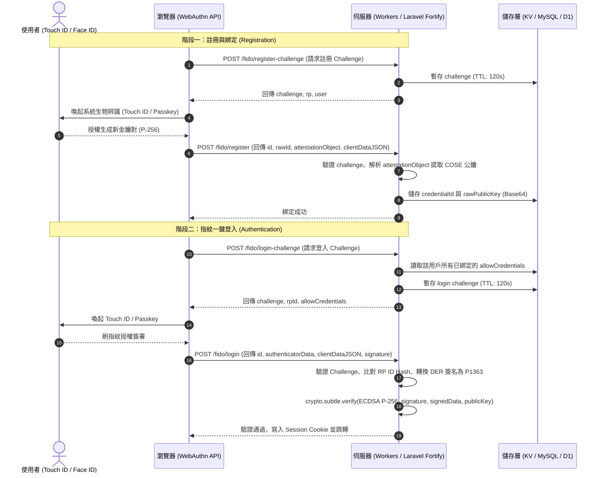

# FIDO2, WebAuthn & Touch ID Passkey 実戰指南與踩坑經驗 (FIDO2 & WebAuthn Implementation Guide)

本手冊彙整了在 **Serverless 邊緣環境（Cloudflare Workers、V8 Engine、Node.js）**、**全端框架生態（PHP Laravel Fortify 等）** 與現代瀏覽器中實作 **WebAuthn / FIDO2 生物辨識（Mac Touch ID、iPhone Face ID、Windows Hello、Passkey）** 的核心密碼學原理、完整流程架構、以及在跨瀏覽器與邊緣運行時中的所有**關鍵技術細節與避坑指南**。

---

## ⚖️ 0. 架構選型決策準則 (Framework-First vs. Edge Custom Implementation)

在評估 Passkey / WebAuthn 實作方案時，請務必遵循以下決策矩陣：

| 開發場景 / 生態系 | 推薦實作策略 | 核心原則與理由 |
| :--- | :--- | :--- |
| **成熟全端框架**<br>(PHP Laravel, Rails, Django, ASP.NET) | 🌟 **框架原生套件優先**<br>(如 Laravel Fortify + `laravel/passkeys`) | **嚴禁自刻密碼學！** 官方套件已內建完整的 User Handle 雜湊、Challenge 生命週期、Passkey 路由、密碼確認中間件、以及跨版本 Migration，自刻只會徒增安全漏洞與維護成本。 |
| **邊緣無伺服器 / 微服務**<br>(Cloudflare Workers, V8 Isolates) | ⚡ **零依賴 Web Crypto 原生實作**<br>(純 `crypto.subtle` + P-256) | 邊緣環境嚴格限制 Bundle 體積與 Node.js 原生 C++ 模組依賴，需自行精確處理 ASN.1 DER 轉碼、COSE 解析與 Session 簽發。 |
| **Node.js / Express / NestJS** | 📦 **標準成熟套件**<br>(如 `@simplewebauthn/server` & `/browser`) | 使用經安全審計的標準庫，避免手動處理複雜的 CBOR 與 DER 轉碼。 |

---

## 🏗️ 1. WebAuthn 核心認證架構與流程

WebAuthn 採用非對稱公私鑰密碼學（Asymmetric Cryptography），主要使用 **ECDSA P-256 (ES256, COSE Alg -7)** 演算法：
- **私鑰（Private Key）**：安全儲存於客戶端硬體安全模組中（Apple Secure Enclave、Windows TPM、Android Keystore），**永不外洩至網路或伺服器**。
- **公鑰（Public Key）**：在裝置綁定（Registration / Attestation）時發送給伺服器，儲存於資料庫或 KV。
- **認證（Authentication / Assertion）**：每次登入時伺服器簽發隨機且具時效性的 `challenge`，客戶端以指紋/Face ID 授權私鑰簽章，伺服器使用公鑰驗證簽名。



---

## ⚡ 2. 邊緣運算（Cloudflare Workers）零依賴原生實作

在 Cloudflare Workers / Edge 環境中，傳統大型 Node.js 套件（如依賴 `crypto` 模組或大型 CBOR 套件）容易導致 Bundle 過大或相容性問題。純原生 Web Crypto API (`crypto.subtle`) 是最高效、最穩定的選擇。

### 核心演算法規格
- **金鑰演算法**：`ECDSA`，`namedCurve: 'P-256'` (secp256r1 / prime256v1)
- **雜湊演算法**：`SHA-256`
- **COSE Algorithm ID**：`-7` (ES256)

---

## 🚨 3. 關鍵踩坑記錄與必備解法 (Top Pitfalls & Solutions)

### 坑 1：簽名格式不相容（ASN.1 DER vs. IEEE P1363）💥
- **問題**：瀏覽器（Safari、Chrome 等）在 WebAuthn Assertion 階段回傳的 `signature` 是 **ASN.1 DER 編碼**（格式為 `0x30 [len] 0x02 [r_len] [r] 0x02 [s_len] [s]`，長度可能為 70~72 bytes）。
- **致命陷阱**：Web Crypto API 的 `crypto.subtle.verify({ name: 'ECDSA', hash: 'SHA-256' }, ...)` **嚴格要求 IEEE P1363 格式**（固定 64 bytes：32 bytes 的 `r` + 32 bytes 的 `s`）。如果直接將瀏覽器回傳的 signature 傳入 `crypto.subtle.verify()`，會一律拋出驗證失敗或格式錯誤！
- **解法**：實作 DER 轉 P1363 轉碼器：
```javascript
export function derToP1363(derBytes) {
    let offset = 0;
    if (derBytes[offset++] !== 0x30) throw new Error('Invalid DER signature sequence');
    let seqLen = derBytes[offset++];
    if (seqLen & 0x80) offset += (seqLen & 0x7f);

    if (derBytes[offset++] !== 0x02) throw new Error('Expected integer marker for r');
    let rLen = derBytes[offset++];
    let r = derBytes.slice(offset, offset + rLen);
    offset += rLen;

    if (derBytes[offset++] !== 0x02) throw new Error('Expected integer marker for s');
    let sLen = derBytes[offset++];
    let s = derBytes.slice(offset, offset + sLen);

    // 移除正負號補零 (0x00 prefix) 或左側補零至 32 bytes
    if (r.length === 33 && r[0] === 0x00) r = r.slice(1);
    if (s.length === 33 && s[0] === 0x00) s = s.slice(1);

    const p1363 = new Uint8Array(64);
    p1363.set(r, 32 - r.length);
    p1363.set(s, 64 - s.length);
    return p1363;
}
```

---

### 坑 2：簽名驗證資料的正確拼接方式 💥
- **問題**：WebAuthn Assertion 的簽章並不是直接對 raw content 簽名。
- **解法**：被簽署的資料（Signed Payload）必須是：
  $$\text{SignedData} = \text{authenticatorData} \parallel \text{SHA-256}(\text{clientDataJSON})$$
```javascript
const clientDataHash = await crypto.subtle.digest('SHA-256', clientDataJsonBytes);
const signedData = new Uint8Array(authDataBytes.length + 32);
signedData.set(authDataBytes, 0);
signedData.set(new Uint8Array(clientDataHash), authDataBytes.length);

const isValid = await crypto.subtle.verify(
    { name: 'ECDSA', hash: 'SHA-256' },
    cryptoKey,
    p1363Signature,
    signedData
);
```

---

### 坑 3：RP ID Hash 與 User Flags 驗證 💥
- `authenticatorData` 的前 32 個 bytes 必須等於 `SHA-256(rpId)`（確保此憑證確實屬於本網站，防止中間人攻擊或跨站憑證偽造）。
- 第 33 個 byte 是 `flags`：
  - `flags & 0x01`（UP, User Present）：必須為 1（確保使用者在場操作）。
  - `flags & 0x04`（UV, User Verified）：建議為 1（已通過指紋/Face ID 生物辨識驗證）。

---

### 坑 4：Chrome 與 Safari 密碼金鑰庫（Keystore）隔離問題 💥
- **現象**：在 Mac 上用 **Chrome** 綁定 Touch ID 成功，但在 **Safari** 打開登入時，Safari 提示「*你沒有為此網站儲存任何通行密鑰，請掃描行動條碼*」。
- **原因**：
  - Chrome 預設會將 Passkey 存入 **Google 密碼管理工具 (Google Password Manager)**，其金鑰儲存於 Chrome Profile / Google 雲端。
  - Safari 則唯獨讀取 **Apple 系統鑰匙圈 (iCloud Keychain)**。
  - 當伺服器在 `allowCredentials` 中傳遞了 Chrome 產生的憑證 ID 時，Safari 在本機 Apple 鑰匙圈中找不到對應 ID，因而引導使用者掃描 QR Code。
- **解法**：
  1. **前端強制指定 Platform Authenticator**：
     在 `navigator.credentials.create()` 的 `authenticatorSelection` 中加入 `authenticatorAttachment: 'platform'`：
     ```javascript
     authenticatorSelection: {
         authenticatorAttachment: 'platform', // 強制綁定本機硬體安全模組 (Apple Secure Enclave / Windows Hello)
         userVerification: 'preferred',
         residentKey: 'preferred'
     }
     ```
  2. **多裝置/多瀏覽器架構**：
     後台資料庫或 KV 必須設計為支援**一對多憑證（1 User $\rightarrow$ N Passkey Devices）**，允許使用者在 Chrome 綁定一次、在 Safari 也綁定一次，伺服器在登入時將該用戶所有的 Credential IDs 全部放入 `allowCredentials`。

---

### 坑 5：RP ID (Relying Party ID) 設定規範 💥
- `rpId` **嚴禁帶有 Protocol (`https://`)、Port (`:443`) 或 Path (`/`)**。
- 正確格式：`wiki.david888.com` 或 `david888.com`（若需支援子網域共用 Passkey，設為 Apex Domain `david888.com` 即可）。
- 本地測試：必須使用 `localhost`，瀏覽器在純 IP（如 `127.0.0.1`）下會拒絕 WebAuthn 請求。

---

### 坑 6：Challenge 生命週期與防重放攻擊（Replay Attack）💥
- `challenge` 必須使用加密安全的隨機字串（`crypto.getRandomValues(new Uint8Array(32))`）。
- Challenge 儲存於 KV / Cache 時必須具備 TTL（建議 60~120 秒），且**一旦驗證過必須立即原子刪除（Consume-once）**，防止重放攻擊。

---

## 🐘 4. PHP / Laravel 生態實戰最佳實踐 (Laravel Fortify Passkeys SOP)

在 PHP / Laravel 專案中，**強烈建議直接採用 Laravel Fortify 原生 Passkeys 支援（基於 `laravel/passkeys`），切忌自行手刻 WebAuthn 加密**。

### 🌟 實作分段標準流程 (7-Step Delivery Pipeline)

#### 1. 啟用 Features 與 Model 介面實作
在 `config/fortify.php` 啟用 Passkeys：
```php
'features' => [
    Features::registration(),
    Features::resetPasswords(),
    Features::emailVerification(),
    Features::updateProfileInformation(),
    Features::updatePasswords(),
    Features::twoFactorAuthentication(),
    Features::passkeys(), // 啟用 Passkeys 支援
],
```
在 `User.php` Model 中加入介面與 Trait：
```php
use Laravel\Fortify\Contracts\PasskeyUser;
use Laravel\Fortify\Traits\PasskeyAuthenticatable;

class User extends Authenticatable implements PasskeyUser
{
    use PasskeyAuthenticatable;
    // ...
}
```

#### 2. 發布 Migration 與資料庫結構
執行 Migration 發布並建立 `passkeys` 憑證資料表：
```bash
php artisan vendor:publish --tag=fortify-migrations
php artisan migrate
```
資料表結構會包含 `user_id`, `name`, `credential_id`, `public_key`, `user_handle` 等欄位。

#### 3. 環境變數設定（關鍵防雷）
在 `.env` 設定 RP 與 User Handle Secret：
```env
# 必須為純 domain（無 https://，無 port）
PASSKEYS_RELYING_PARTY_ID=your-domain.com
PASSKEYS_ALLOWED_ORIGINS=https://your-domain.com

# ⚠️ 極重要：必須設定固定且持久的金鑰，跨環境或更新時嚴禁變動，否則現有 Passkeys 全數失效
PASSKEYS_USER_HANDLE_SECRET=base64:YourFixedRandomSecretStringHere=
```

#### 4. 登入頁面整合 Passkey 一鍵登入
前端透過 `@github/webauthn-json` 或 Fortify 提供的輔助函式發起認證：
- 呼叫 Fortify 原生端點 `GET /passkeys/login-options` 取得 Challenge 與 `allowCredentials`。
- 呼叫 `POST /login` 提交 WebAuthn Assertion 簽名完成身分驗證。

#### 5. 個人資料頁（Profile）Passkey 註冊、命名與安全刪除
- 使用者可在會員中心註冊新裝置（呼叫 `GET /passkeys/register-options` 與 `POST /passkeys`）。
- **安全防護**：註冊新 Passkey 或刪除既有 Passkey 前，必須掛載 `password.confirm` 中間件，確保是本人在已知主密碼的情況下操作。

#### 6. Pest 自動化測試矩陣
撰寫完善的 Pest / PHPUnit 測試案例：
```php
test('user can authenticate via passkey', function () {
    // 模擬 WebAuthn Assertion 驗證並斷言轉址至 dashboard
});

test('suspended or banned user cannot login with passkey', function () {
    // 驗證即使 Passkey 簽名合法，停權帳號仍會被 AuthenticateSession 中間件阻擋
});

test('passkey management requires password confirmation', function () {
    // 驗證未確認密碼時訪問 /passkeys 會被重導至 password.confirm
});
```

#### 7. UAT / Production 網域與 HTTPS 檢核
- 驗證 WebAuthn 僅在 HTTPS（或 `localhost`）下工作。
- 檢查 Staging / UAT / Prod 各自的 `PASSKEYS_RELYING_PARTY_ID` 是否與存取網域完全一致。

---

## 💻 5. 模組化程式碼參考實作 (Edge Web Crypto Reference)

### 後端 WebAuthn 驗證核心 (`fido_auth.mjs`)

```javascript
export function base64UrlToBytes(base64url) {
    const base64 = base64url.replace(/-/g, '+').replace(/_/g, '/');
    const pad = base64.length % 4 === 0 ? '' : '='.repeat(4 - (base64.length % 4));
    const binary = atob(base64 + pad);
    const bytes = new Uint8Array(binary.length);
    for (let i = 0; i < binary.length; i++) bytes[i] = binary.charCodeAt(i);
    return bytes;
}

export function bytesToBase64Url(bytes) {
    let binary = '';
    for (let i = 0; i < bytes.byteLength; i++) binary += String.fromCharCode(bytes[i]);
    return btoa(binary).replace(/\+/g, '-').replace(/\//g, '_').replace(/=+$/, '');
}

export async function verifyFidoAssertion({
    publicKeyRawBase64,
    authenticatorDataBase64,
    clientDataJsonBase64,
    signatureBase64,
    expectedChallenge,
    expectedOrigin,
    expectedRpId
}) {
    const clientDataBytes = base64UrlToBytes(clientDataJsonBase64);
    const clientData = JSON.parse(new TextDecoder('utf-8').decode(clientDataBytes));

    if (clientData.type !== 'webauthn.get') throw new Error('Invalid clientData type');
    if (clientData.challenge !== expectedChallenge) throw new Error('Challenge mismatch');
    if (expectedOrigin && clientData.origin !== expectedOrigin) throw new Error('Origin mismatch');

    const authDataBytes = base64UrlToBytes(authenticatorDataBase64);
    if (expectedRpId) {
        const rpIdHash = new Uint8Array(await crypto.subtle.digest('SHA-256', new TextEncoder().encode(expectedRpId)));
        for (let i = 0; i < 32; i++) {
            if (authDataBytes[i] !== rpIdHash[i]) throw new Error('RP ID hash mismatch');
        }
    }

    const flags = authDataBytes[32];
    if (!(flags & 0x01)) throw new Error('User Presence flag not set');

    const clientDataHash = await crypto.subtle.digest('SHA-256', clientDataBytes);
    const signedData = new Uint8Array(authDataBytes.length + 32);
    signedData.set(authDataBytes, 0);
    signedData.set(new Uint8Array(clientDataHash), authDataBytes.length);

    const publicKeyBytes = base64UrlToBytes(publicKeyRawBase64);
    const cryptoKey = await crypto.subtle.importKey(
        'raw',
        publicKeyBytes,
        { name: 'ECDSA', namedCurve: 'P-256' },
        false,
        ['verify']
    );

    const derSig = base64UrlToBytes(signatureBase64);
    const p1363Sig = derToP1363(derSig);

    const isValid = await crypto.subtle.verify(
        { name: 'ECDSA', hash: 'SHA-256' },
        cryptoKey,
        p1363Sig,
        signedData
    );

    if (!isValid) throw new Error('ECDSA Cryptographic Signature Invalid');
    return true;
}
```

---

## 📋 6. 快速檢核清單 (Implementation Checklist)

- [ ] **選型審查**：全端框架（Laravel 等）使用官方套件；邊緣無伺服器（Workers）使用零依賴 Web Crypto。
- [ ] 伺服器端產生隨機 32-byte Base64URL Challenge，TTL 設定 120s。
- [ ] 註冊時在 `authenticatorSelection` 設定 `authenticatorAttachment: 'platform'`。
- [ ] 註冊時解析 Attestation Object 並持久化儲存 COSE Raw P-256 公鑰。
- [ ] 登入時伺服器正確組裝 `allowCredentials` 清單。
- [ ] 登入驗證時將 DER 簽名轉為 64-byte IEEE P1363 格式。
- [ ] 登入驗證時比對 `clientData.challenge`、`clientData.origin` 與 `rpIdHash`。
- [ ] 登入成功後原子刪除已使用的 Challenge 並核發 Session Cookie。
- [ ] Laravel 專案已固定設定 `PASSKEYS_USER_HANDLE_SECRET` 並掛載 `password.confirm`。
