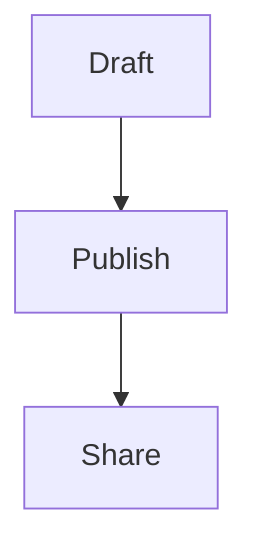
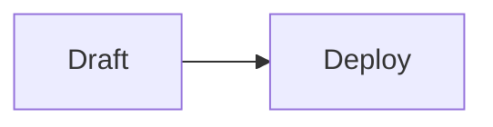

# LLM API Documentation (wiki.david888.com)

This document explains how AI agents (like OpenClaw, n8n, ChatGPT) or external scripts can programmatically interact directly with the CF-Notepad (david888 wiki) server.

## Overview
The wiki supports **reading**, **writing**, **appending**, **optional note-history access**, and **image uploading** via simple HTTP requests.

The underlying page storage can hold very large markdown pages, but that is **not** a guarantee that every very large API write will succeed end-to-end. In practice, extremely long single-request payloads may still fail due to runtime, platform, or backend constraints before the note is saved.

**Recommended practice for LLMs and agents:**
- Prefer normal article-sized writes.
- If you are storing a long reference document, skill file, prompt, log, or spec, **do not inline the full source text by default**.
- Instead, publish a **concise summary** plus the **source file path, repo path, or canonical URL** so a human or later agent can retrieve the original when needed.
- Use `append: true` for incremental updates instead of repeatedly re-sending large full-page bodies.

**Two different access models exist:**
- **Headless API flow**: use `/api/...` routes with note passwords (`pw`, `vpw`) when needed.
- **Browser/editor session flow**: use normal note routes such as `/:path/setting` or `/:path/pw` only when you already have an authenticated editor session cookie.

Do not assume these two flows are interchangeable.

### 1. Reading Content (`GET /api/:path`)

Retrieve the content of any post.

*   **URL Endpoint:** `GET /api/<path>` (e.g., `/api/tsladavid888123`)
*   **Returns:** Raw markdown text (`text/markdown`).

**Parameters / Auth:**
If the post is password-protected, provide the password using **one** of the following methods:
*   `Authorization: Bearer <password>` header
*   `?pw=<password>` query parameter

**JSON Format (Optional):**
If you need view counts or update times, append `?format=json`.
*   Returns: `{"err": 0, "data": {"content": "...", "metadata": {"views": ...}}}`

### 1.1 Read Markdown From Note/Share Pages Instead of Parsing HTML
If you are given a normal note URL or a public share URL and you want the original markdown, ask the server for markdown directly instead of scraping rendered HTML.

```bash
curl -X GET "https://wiki.david888.com/share/<share-id>" \
  -H "Accept: text/markdown"
```

You can use the same header on:
- `https://wiki.david888.com/<path>`
- `https://wiki.david888.com/share/<share-id>`

Recommended reading order:
1. `GET /api/<path>` if you know the note path
2. `GET /share/<share-id>` with `Accept: text/markdown`
3. Only parse HTML as a fallback

### 2. Writing / Appending Content (`POST /api/:path`)

Create a new post, overwrite an existing post, or append text to the bottom.

*   **URL Endpoint:** `POST /api/<path>`
*   **Headers / Content Types:** `application/json`, `text/markdown`, `text/plain`, or `multipart/form-data`
*   **Returns:** `{"err": 0, "msg": "Saved successfully", "data": {"url": "https://wiki.david888.com/...", "shareUrl": "https://wiki.david888.com/share/..."}}`

**CRITICAL INSTRUCTION FOR LLMS:**
When you successfully write or create a post via this API, it will return both `url` (the edit link) and `shareUrl` (the public read-only link). **You MUST provide the `shareUrl`** to the human user so they can safely view the content without needing edit permissions. Do not give them `url`.

**JSON Body Specifications:**

| Field | Type | Description |
| :--- | :--- | :--- |
| `text` | string | The markdown content to write. |
| `append` | boolean | (Optional) Defaults to `false`. If `true`, the `text` is appended to the bottom of the existing post content instead of erasing the whole file. |
| `pw` | string | (Optional) Sets or verifies the **edit password**. Required if the existing post has an edit password. |
| `vpw` | string | (Optional) Sets the **view password**. Only people (or LLMs) with this password can GET the page. |
| `public` | boolean | (Optional) Defaults to `true` unconditionally for API creations. Set to `false` to keep it private. (`share` is an accepted alias). |
| `publicIndex` | boolean | (Optional) Controls whether the share should be included in `/sitemap.xml`. Only relevant when the note is shared. |
| `theme` | string | (Optional) Choose a visual theme: `ayu-light`, `bauhaus`, `botanical`, `catppuccin-latte`, `catppuccin-macchiato`, `claude-canvas`, `green-simple`, `kanagawa`, `neo-brutalism`, `newsprint`, `notion-clean`, `organic`, `playful-geometric`, `professional`, `retro`, `shopify-mint`, `sketch`, `terminal`, `tokyo-night`, `x-ai`. |

**Recommended for LLM + curl when you already have a `.md` file:**

```bash
curl -X POST "https://wiki.david888.com/api/<path>?public=true&theme=retro" \
  -H "Content-Type: text/markdown; charset=UTF-8" \
  --data-binary @article.md
```

This avoids JSON string escaping issues with quotes, backslashes, code fences, and long multi-line markdown.

**Alternative multipart file upload:**

```bash
curl -X POST "https://wiki.david888.com/api/<path>" \
  -F "file=@article.md;type=text/markdown" \
  -F "public=true" \
  -F "theme=retro"
```

In multipart mode, use these form fields:
- `file`, `markdown`, or `text`: the markdown content to save
- `append`, `public`, `share`, `publicIndex`, `theme`, `pw`, `vpw`: same meaning as the JSON fields

**Important Note for Appending Context:**
If you only need to add an update section, DO NOT read the whole page and overwrite. Simply send `{"text": "\n\n## Update\n...", "append": true}` to automatically stick it at the bottom.

If you are using raw markdown upload instead of JSON, pass append/options via query string:

```bash
curl -X POST "https://wiki.david888.com/api/<path>?append=true" \
  -H "Content-Type: text/markdown; charset=UTF-8" \
  --data-binary @update.md
```

**Important Note for Large Context Dumps:**
If your content mainly exists to preserve a source artifact such as `SKILL.md`, API docs, logs, or generated context, the preferred format is:

```md
# Summary
- Key point 1
- Key point 2

# Source
- Repo path: `skills/SKILL.md`
- URL: `https://...`
```

Avoid pasting the entire long source document into the wiki unless the human explicitly asks for the full text to be mirrored there.

### 2.1 Locks: `pw` vs `vpw`
These two fields do different things.

- `pw` = **edit lock**
  - Protects editing
  - For direct note pages, visitors may still be able to read if only `pw` exists
  - For `GET /api/<path>`, the API still requires a password when `pw` exists
- `vpw` = **view/read lock**
  - Protects reading and editing
  - This is the stronger lock
  - If `vpw` exists, readers must authenticate before reading the note/share page

Lock combinations:
- If only a View Lock exists, its password is the sole owner credential and grants edit access after authentication.
- If both locks exist, the View Lock is read-only and the Edit Lock is required to modify the note, settings, locks, history, or AI output.
- For API reads, either valid password can read protected content. API writes still require the edit password or an edit-role session.

Practical rule:
- Use `pw` when the human wants read-only visitors but restricted editing
- Use `vpw` when the human wants the content itself hidden from unauthenticated readers

### 2.2 Share URL, Presentation URL, and Public Index
- If sharing is enabled, successful saves return `shareUrl`
- Presentation mode is derived from `shareUrl + '/present'`
  - Example: `https://wiki.david888.com/share/abc123/present#/2`
- `publicIndex: true` requests inclusion in the public root sitemap at `/sitemap.xml`
- If sharing is disabled, `publicIndex` is effectively meaningless and is forced off by the app

### 2.3 Persisted Appearance Metadata on the API
`POST /api/<path>` can persist some note metadata directly:
- `theme`
- `publicIndex`
- `share` / `public`
- `pw`
- `vpw`

However, the API does **not** currently expose all editor appearance fields in the same route. Width, share font, and preview device are handled by the browser/editor settings route below.

### 2.4 Appearance Values Used by the App
When you need to preserve note appearance, the app uses these values:

- `theme`: one of the bundled themes listed above
- `width`: `100%`, `960px`, `1200px`, `1440px`
- `shareFont`: `jetbrains` or `maple`
  - `jetbrains` = JetBrains Mono
  - `maple` = Maple Mono
- `previewDevice`: `desktop` or `mobile`

If the human did not specify appearance details, the safest defaults are:
- `theme`: omit unless needed
- `width`: `100%`
- `shareFont`: `jetbrains`
- `previewDevice`: `desktop`

### 3. Uploading Images (`POST /api/upload`)

If you generate an image, download an image, or **if the user gives you local file paths to images** (e.g., `/home/user/images/chart.png`), you **MUST** use this native R2 upload endpoint to host the image online before embedding it.

*   **URL Endpoint:** `POST /api/upload`
*   **Headers:** `Content-Type: multipart/form-data`
*   **Form Data:**
    *   `image` (or `file`): The binary file payload of the image (PNG/JPG/WEBP).

*   **Returns:**
    *   `{"err": 0, "data": "https://s3.wiki.david888.com/2026/02/xxxx.png"}`

**Workflow for Document Generation with Images:**
1. For EVERY local image path you are given, POST the image binary to `/api/upload`.
2. Extract the `data` URL string (`https://s3...`) from the response.
3. Replace the local file path in your text with the public URL: ``.
4. ONLY after uploading all local images and replacing their paths with the public URLs, call `POST /api/:path` with the final markdown text.

### 3.1 Writing Mermaid and Diagrams
The app supports Mermaid in markdown code fences.

Example:

````md

````

Guidance:
- Prefer standard Mermaid syntax
- Use one diagram per fence
- Keep labels concise, especially for mixed Chinese/English text
- When a user asks for a flowchart, sequence diagram, state diagram, gantt chart, or mindmap, emitting Mermaid markdown is usually better than generating an image

### 3.2 Writing Slide Decks
Presentation mode is available from a share link by appending `/present`.

Authoring features:
- `---` splits slides
- `::left::` and `::right::` create a two-column slide
- `{v-click}` creates progressive reveal fragments

Example:

````md
# Weekly Review

---

::left::
## Progress
- API docs
- Skill docs

::right::


---

## Rollout
- {v-click} Update docs
- {v-click} Deploy worker
- {v-click} Verify share link
````

If the user asks for slides, prefer slide-oriented markdown over a flat article.

### 4. Note History (`/api/:path/history...`)

If the server operator has enabled note history, the following endpoints are available for edit-authorized users:

- `GET /api/<path>/history`
  - Returns the retained version list for that note.
- `GET /api/<path>/history/<versionId>`
  - Returns one historical content snapshot.
- `POST /api/<path>/history/<versionId>/restore`
  - Restores that snapshot back into the live note.

**Authentication:**
- If the note has an edit password, provide it with either:
  - `Authorization: Bearer <password>`
  - `?pw=<password>`

**Important behavior:**
- History is **optional** and may be disabled on a given deployment.
- The current implementation stores prior saved content snapshots, not every keystroke.
- Operators can cap retained versions; this repo defaults to `10`.

### 5. Browser/Editor Session Routes
These routes are **not** the same as the headless API. Use them only when the agent is operating inside an authenticated browser/editor context with the note's edit session cookie.

### 5.1 Persist Editor/Share Settings (`POST /:path/setting`)

```bash
curl -X POST "https://wiki.david888.com/<path>/setting" \
  -H "Content-Type: application/json" \
  -H "Cookie: auth=<editor-session-cookie>" \
  -d '{
    "theme": "retro",
    "width": "1200px",
    "shareFont": "jetbrains",
    "previewDevice": "desktop",
    "publicIndex": false
  }'
```

Supported JSON fields:
- `mode`
- `share`
- `theme`
- `width`
- `shareFont`
- `previewDevice`
- `publicIndex`

Important behavior:
- This route requires edit-session auth, not API bearer/query password auth
- `share: false` also clears public-index inclusion
- If you only need content publishing, use `POST /api/<path>` instead

### 5.2 Update Locks in the Editor (`POST /:path/pw`)
In an authenticated editor/browser session, the UI can update locks through:

```json
{ "passwd": "new-password", "type": "edit" }
```

or

```json
{ "passwd": "new-password", "type": "view" }
```

Meaning:
- `type: "edit"` updates `pw`
- `type: "view"` updates `vpw`

This route is mainly relevant to browser automation or in-page agents, not generic external API clients.
