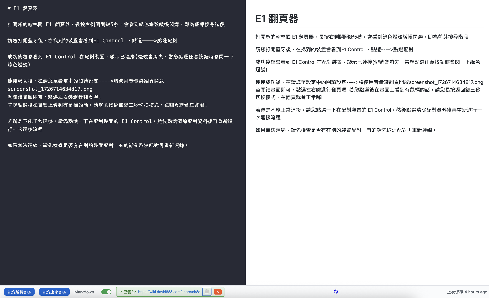
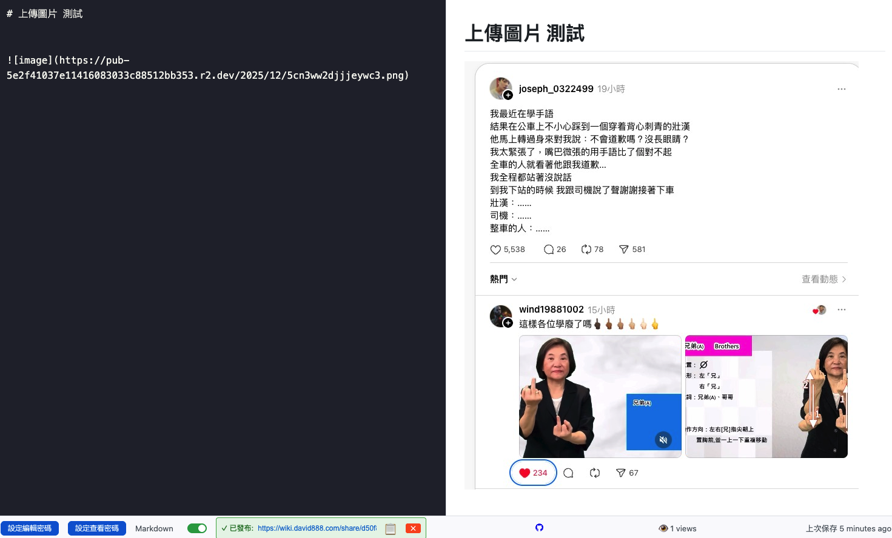
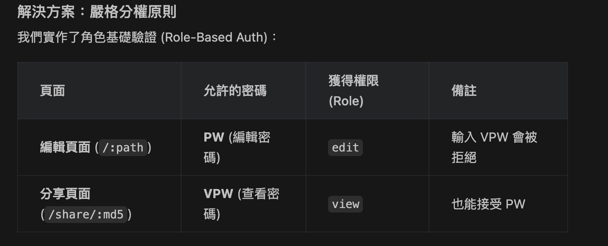

# Cloud Notepad - 基於 Cloudflare Workers 的無伺服器記事本

是一個運行在 Cloudflare Workers 上的輕量級雲端記事本。

它支援 Markdown 預覽、密碼保護、分享功能，以及一個隱藏的超級管理員介面。

## 功能特色

- **輕量快速**：基於 Cloudflare Edge Network，全球存取速度極快。
- **Markdown 支援**：內建 Markdown 渲染 (marked.js) 與 DOMPurify 安全過濾。
- **隱私保護**：可為個別筆記設定密碼 (Salted MD5 雜湊儲存)。
- **分享功能**：可產生唯讀的分享連結。
- **超級管理員介面**：
  - 檢視所有筆記列表。
  - 查看筆記的瀏覽次數 (View Tracking)。
  - 檢查是否設定了密碼。
  - **直接刪除**違規或過期的筆記。
- **[NEW] LLM & AI Agent API (無頭 CMS)**：
  - 完全支援外部 App 或 AI Agent (如 OpenClaw, n8n) 透過 REST API (`/api/:path`) 進行讀寫與接續撰寫 (Append)。
  - 支援 API 原生圖片上傳 (`/api/upload`) 與 Markdown 連結。
  - 詳細請參閱：[LLM_API_DOCS.md](./LLM_API_DOCS.md)。
- 現在用戶可以：
  - 在任何地方複製圖片（截圖、文件等）
  - 在筆記編輯器中按 Cmd+V (Mac) 或 Ctrl+V (Windows)
  - 預覽窗格立即顯示上傳的圖片
```
  - 看到  臨時文本
  - 圖片上傳完成後，自動替換為 
```

demo 
https://wiki.david888.com/share/d50f8d1c1f297069770369e9cc26b828



## 部署教學

### 前置準備

- 已安裝 **Node.js** 與 **npm**。
- 擁有 Cloudflare 帳號 (需開通 Workers 與 KV)。
- 安裝 Wrangler CLI：
  ```bash
  npm install -g wrangler
  ```

### 1. 初始化專案

複製 `wrangler.toml.example` 為 `wrangler.toml`：

```bash
cp wrangler.toml.example wrangler.toml
```

### 2. 建立 KV Namespaces

你需要建立兩個 KV 用來儲存筆記與分享連結：

```bash
wrangler kv:namespace create "NOTES"
wrangler kv:namespace create "SHARE"
```

執行後會得到兩個 ID，請填入 `wrangler.toml` 對應位置：

```toml
kv_namespaces = [
  { binding = "NOTES", id = "你的_NOTES_ID" },
  { binding = "SHARE", id = "你的_SHARE_ID" }
]
```

### 3. 設定環境變數與密鑰

為了安全性與管理功能，請在 Cloudflare Dashboard 設定以下環境變數 (Environment Variables)，或使用 `wrangler secret put`：

**必要變數：**

> *建議：`SCN_SALT` 與 `SCN_SECRET` 可使用 `uuidgen` 或隨機亂碼生成，建議長度至少 16-32 字元，越長越安全。*

```bash
# 1. 密碼加鹽 (任意隨機字串)
wrangler secret put SCN_SALT

# 2. JWT 加密密鑰 (任意隨機字串)
wrangler secret put SCN_SECRET

# 3. 超級管理員後台路徑 (建議設為隱密路徑，例如 /super-admin-999)
wrangler secret put SCN_ADMIN_PATH

# 4. 超級管理員密碼
wrangler secret put SCN_ADMIN_PW

# 5. 隨機網址長度 (預設為 3)
wrangler secret put SCN_SLUG_LENGTH

# 6. 啟用 R2 圖片上傳功能 (為了圖片保存)
# 設為 "1" 開啟，設為 "0" 關閉 (預設關閉)
wrangler secret put SCN_ENABLE_R2

# 7. R2 Bucket 公開網域 (若開啟功能則必須)
# 例如: https://images.your-domain.com
wrangler secret put SCN_R2_DOMAIN
```

*注意：`SCN_ADMIN_PATH` 預設為 `/admin`，但強烈建議修改以避免被掃描。*

### 6. R2 圖片上傳設定 (選用)

若要像 HackMD 一樣直接貼上圖片，請先在 Cloudflare 建立 R2 Bucket，並開啟 Public Access 或綁定網域。

1. 修改 `wrangler.toml` (解除註解並填入 Bucket Name):
   ```toml
   [[r2_buckets]]
   binding = "IMAGES"
   bucket_name = "<你的_BUCKET_NAME>"
   ```
2. 設定 `SCN_ENABLE_R2` 為 `1`。
3. 設定 `SCN_R2_DOMAIN` 為該 Bucket 的公開網址。

### 4. 部署
DEV
```
npx wrangler dev --local 2>&1 | head -n 50

npm start
```

正式區
```bash
npm install
wrangler deploy
```

部署完成後，你的記事本即可使用！

### 5. 使用管理員介面

訪問你設定的 `SCN_ADMIN_PATH` (例如 `https://your-worker.workers.dev/super-admin-999`)，輸入 `SCN_ADMIN_PW` 即可登入後台進行管理與刪除操作。

---

# Cloud Notepad - Serverless Deployment with Cloudflare Workers

This project is a fork of [s0urcelab/serverless-cloud-notepad](https://github.com/s0urcelab/serverless-cloud-notepad), a lightweight cloud notepad running on Cloudflare Workers.

It supports Markdown preview, password protection, sharing, and a hidden Super Admin interface.

## Features

- **Lightweight & Fast**: Powered by Cloudflare Edge Network.
- **Markdown Support**: Built-in rendering (marked.js) and sanitation (DOMPurify).
- **Privacy**: Password protection for individual notes (stored as Salted MD5 hash).
- **Sharing**: Generate read-only share links.
- **Super Admin Interface**:
  - List all notes.
  - Track view counts.
  - Check password status.
  - **Delete** notes directly from the dashboard.

## Deployment Guide

### Prerequisites

- **Node.js** and **npm** installed.
- A Cloudflare account (Workers & KV enabled).
- Wrangler CLI installed:
  ```bash
  npm install -g wrangler
  ```

### 1. Initialize Project

Copy the config example:

```bash
cp wrangler.toml.example wrangler.toml
```

### 2. Create KV Namespaces

Create two KV namespaces for notes and share links:

```bash
wrangler kv:namespace create "NOTES"
wrangler kv:namespace create "SHARE"
```

Replace the `id` values in your `wrangler.toml` with the output from above:

```toml
kv_namespaces = [
  { binding = "NOTES", id = "YOUR_NOTES_ID" },
  { binding = "SHARE", id = "YOUR_SHARE_ID" }
]
```

### 3. Set Environment Secrets

Set the following secrets using `wrangler secret put` or via the Cloudflare Dashboard:

**Required Secrets:**

> *Tip: Generate `SCN_SALT` and `SCN_SECRET` using `uuidgen` or random strings. Recommended length: 16-32+ characters for better security.*

```bash
# 1. Salt for password hashing (random string)
wrangler secret put SCN_SALT

# 2. JWT Secret (random string)
wrangler secret put SCN_SECRET

# 3. Super Admin Path (Set to a secret path, e.g., /secret-admin)
wrangler secret put SCN_ADMIN_PATH

# 4. Super Admin Password
wrangler secret put SCN_ADMIN_PW

# 5. Random Slug Length (Default: 3)
wrangler secret put SCN_SLUG_LENGTH

# 6. Enable R2 Image Upload
# Set to "1" to enable, "0" to disable (Default: 0)
wrangler secret put SCN_ENABLE_R2

# 7. R2 Bucket Public Domain (Required if R2 enabled)
# Example: https://images.your-domain.com
wrangler secret put SCN_R2_DOMAIN
```

*Note: `SCN_ADMIN_PATH` defaults to `/admin` if not set, but changing it is highly recommended.*

### 6. R2 Image Upload (Optional)

To enable "Paste to Upload" (like HackMD):

1. Create an R2 Bucket in Cloudflare and allow public access or bind a domain.
2. Edit `wrangler.toml` (Uncomment and set Bucket Name):
   ```toml
   [[r2_buckets]]
   binding = "IMAGES"
   bucket_name = "<YOUR_BUCKET_NAME>"
   ```
3. Set `SCN_ENABLE_R2` to `1`.
4. Set `SCN_R2_DOMAIN` to the public URL of your bucket.

### 4. Deploy

```bash
npm install
wrangler deploy
```

### 5. Admin Interface

Visit your configured `SCN_ADMIN_PATH` (e.g., `https://your-worker.workers.dev/secret-admin`), enter your `SCN_ADMIN_PW` to manage and delete notes.


---
本專案 fork 自 [s0urcelab/serverless-cloud-notepad](https://github.com/s0urcelab/serverless-cloud-notepad)，

---

20251229 開發日誌

修復的關鍵問題：

環境變數在模塊加載時無法訪問 → 改用 getter 函數在運行時訪問
enableR2 數據結構不匹配 → 將其合併到 ext 對象中

### 核心穩定性修復 (v2.0)
1. **資料丟失修復 (Data Loss Prevention)** 🛡️
   - **問題**: 舊邏輯在讀取頁面 (GET) 時會同時寫回 View Count，導致若與保存動作 (POST) 並發，舊內容會覆蓋新內容。
   - **解決**: 實作 **讀寫分離 (Read-Write Separation)**。瀏覽計數移至獨立的 `SHARE` KV (Key: `views::{path}`)，讀取頁面時只更新計數，**絕不**寫入筆記內容。

2. **密碼驗證優化 (Auth Separation)** 🔒
   - **問題**: 舊邏輯無法區分管理者與訪客，導致輸入查看密碼 (VPW) 無法登入。
   - **解決**: 實作 **角色基礎驗證**。
     - **編輯頁面 (`/:path`)**: 嚴格只認 **編輯密碼 (PW)**，取得 `edit` 權限。
     - **分享頁面 (`/share/:...`)**: 接受 **查看密碼 (VPW)** 或 **編輯密碼**，取得 `view` 權限。

3. **顯示修復 (Rendering Fix)** 🖼️
   - **問題**: Share 頁面因腳本載入順序問題導致一片空白。
   - **解決**: 強制在 Share 模式下正確載入 `marked.js` 與 `DOMPurify`。

4. **瀏覽計數優化 (View Tracking)** 👁️
   - 此版本導入 `visitor_id` Cookie，針對獨立訪客計數，不再重複計算同一用戶的刷新。
 - 

### 5. 高級圖表支援 (Advanced Diagrams) 📊
本專案現已支援多種程式碼區塊圖表渲染，採用 **智慧懶加載 (Smart Lazy Loading)** 機制，僅在需要時才載入外部函式庫，保持頁面輕量。

#### 支援類型
1. **Mermaid** (` ```mermaid `)
   - 流程圖, 時序圖, 甘特圖, 類別圖, 狀態圖...
2. **Flowchart.js** (` ```flow `)
   - 簡單的文本流程圖
3. **JS Sequence Diagrams** (` ```sequence `)
   - 手繪風格時序圖
4. **Graphviz (Viz.js)** (` ```graphviz `)
   - 複雜的 DOT 語言圖形
5. **ABC.js** (` ```abc `)
   - 五線譜音樂符號

#### 使用範例

**Mermaid:**
\`\`\`mermaid
graph TD;
    A-->B;
    A-->C;
    B-->D;
    C-->D;
\`\`\`

**Flowchart:**
\`\`\`flow
st=>start: Start
e=>end: End
op1=>operation: My Operation
st->op1->e
\`\`\`

### 6. 其他增強功能 (Other Enhancements) 🛠️
- **可調整分割欄 (Resizable Split Pane)**: 編輯器與預覽視窗中間的分隔線現在支援拖曳調整寬度。
- **排程清理 (Scheduled Cleanup)**: 每日（UTC 01:00 / 台灣 09:00）自動執行 Cron Job，清理內容少於 10 字的空白筆記，保持資料庫整潔。