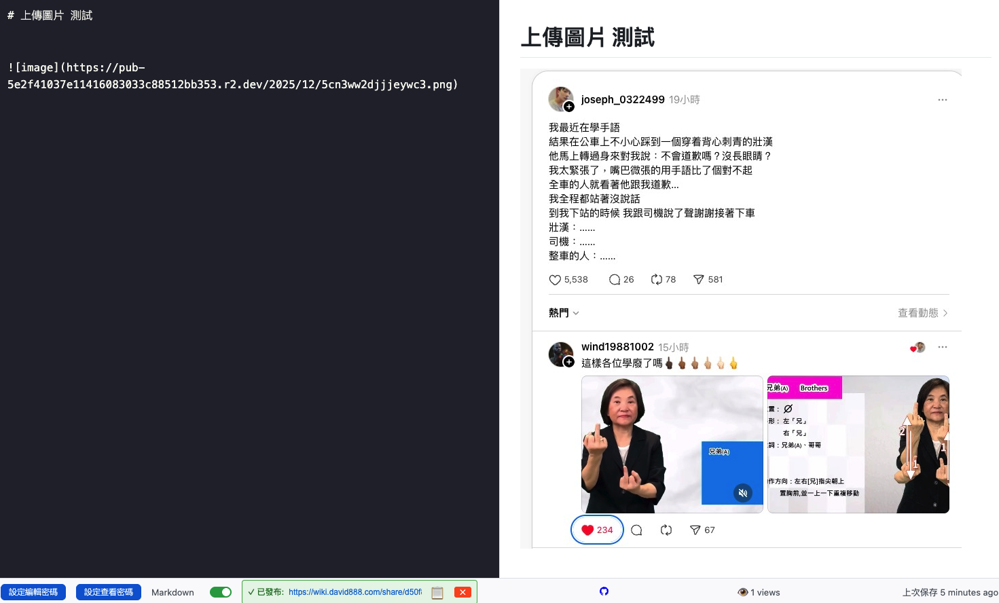
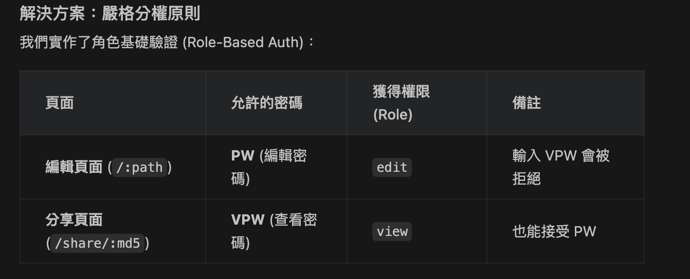

# Cloud Notepad - 基於 Cloudflare Workers 的無伺服器記事本


Cloud Notepad 是一個運行在 Cloudflare Workers 上的輕量級、極速且對 AI 友善的雲端記事本與無頭 CMS 平台。支援 Markdown 即時預覽、密碼保護、版本歷史、幻燈片簡報模式，並內建超級管理員後台、MCP 伺服器與 AI Agent 專屬 Skills。

👉 **⚠️ 給 AI 與開發者：若需使用 API 進行讀寫，請務必先閱讀完整規格表：[LLM_API_DOCS.md](./LLM_API_DOCS.md) ⚠️**

---

## 語言 / Languages

- [繁體中文 (Traditional Chinese)](#繁體中文)
- [English Version](#english-version)

---

# 繁體中文

## 🤖 AI Agent 與 LLM 生態整合

本專案原生支援被 AI 代理（如 Antigravity、Cursor、Claude Desktop、OpenClaw 或 n8n）當作「外部大腦」或「自動發文平台」使用。

### 1. 零安裝啟動 MCP 伺服器
我們提供了符合 Model Context Protocol (MCP) 的伺服器，可直接透過 Python `uv` 遠端執行，無須下載任何程式碼。
- **Cursor / Claude Desktop 設定**：
  - **Type**: `command`
  - **Command**: `uv run https://raw.githubusercontent.com/tbdavid2019/cf-notepad/main/mcp/server.py`
  - *(詳細說明請見 [mcp/README.md](./mcp/README.md))*

### 2. Antigravity AI Skills
本專案內建專屬技能 Prompt。只需將 `skills/` 資料夾下的內容複製到您的 `~/.gemini/antigravity/skills/` 目錄中即可。
- **自動發現**：Agent 亦可透過 `/.well-known/agent-skills/david888-wiki-publisher/SKILL.md` 自動探索載入。

### 3. 一鍵呼叫發文 (給 GPT/Claude 網頁版的 Prompt)
複製以下文字貼給 ChatGPT 或 Claude 網頁版，AI 即可自動為您寫作並發布至您的站點：
```text
這是一台架設好的 Wiki 記事本，具備無頭 CMS 的發文 API：`https://your-wiki-domain.com/api`。
請你擔任我的寫作助理，根據我的需求撰寫文章並發布。
操作指南請閱讀以下文件內容（請運用你的上網 / 執行工具讀取）：
👉 https://raw.githubusercontent.com/tbdavid2019/cf-notepad/main/LLM_API_DOCS.md
請你使用上述文件的 cURL/HTTP 請求，完成寫作後將內容存檔，並把最後發布的文章網址給我。
```

---

## ✨ 整合功能特色

### 🚀 1. 寫作與編輯體驗 (Writing & Editing)
- **精美字體與佈局**：編輯與預覽區預設使用 `Maple Mono` 與 `JetBrains Mono` 字體，提升程式碼與長文閱讀質感。Footer 內建寬度切換（Full / 960 / 1200 / 1440）與 20+ 款精美 CSS 預覽主題（預設為 `claude-canvas` 人文風格），且版面支援拖曳分割，雙擊可快速重設 50/50。
- **Footer 控制列**：預覽、發布、字型、語言、排列與裝置控制採用方形雙狀態 rail，分類與目前值直接顯示在控制元件內；寬度選項包含完整說明，避免額外佔用 footer 空間。
- **編輯器視圖設定**：`預覽`、`排列` 與 `裝置` 會集中在同一個視圖設定群組，方便快速調整編輯器佈局。
- **複製內容**：Footer 的 Markdown `匯出` 右側提供 `複製`，會同時寫入 rich HTML 與 Markdown/plain-text fallback；成功後顯示勾勾動畫與複製提示。
- **Theme 特色說明**：主題選單保留完整名稱，並依介面語言顯示繁中或英文風格描述，方便使用者依視覺特色挑選主題。
- **動態空白頁歡迎提示**：當新建或清空編輯器時，會自動載入一首隨機的泰戈爾詩歌，以及 `static/data/editor-tips.json` 中的一則雙語小訣竅；兩者會在漂鳥集下方以同步的**打字機動畫效果**出現。
- **AI 寫作特助**：
  - **AI 排版優化**：內建 Workers AI（`gpt-oss-20b`），一鍵優化 Markdown 排版、修正語法與標點符號。
  - **編輯器 AI 排版**：AI 排版除了位於 Footer，也可直接從上方 Markdown 工具列啟動。
  - **AI 編輯與生成**：採用 `gpt-oss-120b` 模型，提供指令式的段落插入、部分改寫或整篇筆記內容生成。
  - **選取文字 AI 捷徑**：在編輯器中選取任意文字時，會自動彈出「AI編輯」捷徑按鈕，可僅針對選取的特定區塊進行指令式修改，其餘內容原封不動。
- **Markdown 編輯工具列**：編輯區上方提供標題、粗體、斜體、刪除線、連結、引用、清單、行內程式碼、程式碼區塊、分隔線、表格、圖片、全螢幕、Undo / Redo 與 AI 排版。工具列會依目前語言顯示 placeholder 與提示文字。
- **圖片插入**：啟用 R2 後，可從工具列選擇圖片上傳，系統會自動插入 Markdown 圖片連結；未啟用 R2 時則插入可手動修改網址的圖片範本。
- **888box 附件上傳**：工具列提供附件按鈕，可將影片、音訊、文件、壓縮檔與一般檔案直接上傳到 `box.glsoft.ai`，並依檔案類型插入 `<video>`、`<audio>` 或 Markdown 連結。圖片仍維持使用內建 R2。
- **ECharts 圖表**：支援使用 `echarts` fenced code block 撰寫 JSON 圖表設定，編輯器會在預覽區動態載入並繪製圖表。
- **視圖快捷鍵**：`⌘-⌥-7` / `Ctrl-Alt-7` 切換所見即所得左右排列，`⌘-⌥-8` / `Ctrl-Alt-8` 切換純 Markdown，`⌘-⌥-9` / `Ctrl-Alt-9` 切換所見即所得上下排列。
- **鎖定邏輯**：`編輯鎖`限制修改，`閱讀鎖`限制閱讀；若只有閱讀鎖，該密碼會作為唯一的擁有者密碼，可完成驗證後編輯。兩種鎖同時存在時，閱讀鎖只能閱讀，編輯鎖才能修改。

```echarts
{
  "title": { "text": "Traffic sources" },
  "tooltip": { "trigger": "item" },
  "series": [{
    "type": "pie",
    "data": [
      { "value": 1048, "name": "Search" },
      { "value": 735, "name": "Direct" },
      { "value": 580, "name": "Referral" }
    ]
  }]
}
```
- **極致行動適應性**：
  - **摺疊工具列選單**：手機版底部工具列統一採用「Icon在上、說明字在下」雙行設計。預設僅展示第一排常用編輯按鈕與 `...` 按鈕，點選 `...` 會以平滑過場動畫向上展開外觀設定（含語系與主題切換）。隱藏了行動版不需要的資訊欄（GitHub/Skill/API）。
  - **行動自適應閱讀**：手機版表格支援自動換行與防溢出；長網頁滾動時會出現 `＾` 回到頂部按鈕。

我們來看看編輯與預覽的實際版面：


### 🔐 2. 隱私、版本控制與安全分享 (Privacy, Versioning & Sharing)
- **編輯鎖與閱讀鎖分離**：支援設定筆記密碼。`編輯鎖`僅限制未授權者的修改權，訪客仍可閱讀並透過左下角「編輯」按鈕輸入密碼解鎖；`閱讀鎖`則限制整篇筆記的閱讀與修改，密碼均經 Salted MD5 雜湊保護。英文介面使用 `Edit Lock` 與 `View Lock`。
- **D1 歷史版本快照**：透過 Cloudflare D1 資料庫自動儲存版本歷史。預設開啟 5 分鐘快照防刷節流，每篇保留最近 10 份快照，可在 Footer 「版本」選單中預覽、複製或一鍵還原。
- **簡報模式與 PDF 導出**：支援以標準 `---` 進行 Markdown 分頁，一鍵將 Markdown 轉為幻燈片全螢幕簡報。針對 `@media print` 進行版面優化，列印或導出為 PDF 時會自動隱藏所有工具列，解決內容被裁剪或高度限制的痛點。
- **發布控制與 SEO 優化**：支援生成唯讀分享頁，並提供 localStorage 分享紀錄。建立分享後可選擇是否加入公開網站地圖（`/sitemap.xml`）。分享頁支援 Open Graph 與 Twitter 社群預覽卡片。

以下是安全存取權限的整合規劃：


### 🤖 3. 無頭 CMS 與 AI Agent 生態 (Headless CMS & AI Agent Integration)
- **LLM & AI Agent API**：支援外部 App 透過 REST API (`/api/:path`) 讀寫與接續撰寫 (Append)。支援 JSON、`text/markdown` 與 `multipart/form-data` 多種格式，降低 LLM 寫長文時的跳脫字元失敗率。
- **原生圖片上傳**：支援 API 圖片上傳 (`/api/upload`) 與自動 Markdown 連結。
- **Discovery 發現端點**：部署完成後，站點會提供 `/.well-known/api-catalog`、`/.well-known/agent-skills/index.json` 等 AI 探索入口，支援 RFC 9727 格式。

---

## 🛠️ 部署教學

### 前置準備
- 已安裝 Node.js 與 npm。
- 擁有 Cloudflare 帳戶並安裝 Wrangler CLI：`npm install -g wrangler`

### 1. 初始化專案與建立 KV
```bash
cp wrangler.toml.example wrangler.toml
wrangler kv:namespace create "NOTES"
wrangler kv:namespace create "SHARE"
```
將生成的 ID 填入 `wrangler.toml` 的 `kv_namespaces` 部分。

### 2. 建立 D1 歷史版本資料庫（選用）
```bash
wrangler d1 create cloud-notepad-history
wrangler d1 execute cloud-notepad-history --file=./schema/note_history.sql
```
將生成的 `database_id` 填入 `wrangler.toml` 內 `[[d1_databases]]`。

### 3. 設定 R2 圖片上傳（選用）
在 Cloudflare 建立一個 R2 Bucket 並綁定公開網域：
- 於 `wrangler.toml` 中解除 `[[r2_buckets]]` 的註解並設定 `bucket_name`。
- 設定環境變數 `SCN_ENABLE_R2="1"` 與 `SCN_R2_DOMAIN="你的公開網址"`。

### 4. 設定環境密鑰 (Secrets)
請於 Cloudflare 網頁後台設定以下環境變數，或使用 `wrangler secret put <變數名稱>` 寫入：
- `SCN_SALT`: 加鹽字串（建議 UUID，越長越安全）
- `SCN_SECRET`: JWT 密鑰字串
- `SCN_ADMIN_PATH`: 後台管理路徑（例如 `/super-admin-777`）
- `SCN_ADMIN_PW`: 後台管理密碼
- `SCN_SLUG_LENGTH`: 隨機網址長度（預設為 `3`）
- `SCN_ENABLE_NOTE_HISTORY`: 設為 `"1"` 啟用 D1 版本紀錄
- `SCN_GA_MEASUREMENT_ID`: GA 追蹤碼（選用）

後台路徑與密碼會在每次 request 讀取 Cloudflare Worker bindings；修改 `SCN_ADMIN_PATH` 後重新部署，即可使用設定的路徑進入超級管理員後台。

超級管理員後台提供：URL 總數、發佈／Sitemap／鎖定摘要、標題／URL 搜尋、Markdown 全文搜尋、最後修改日期區間、點擊欄位排序、分頁、批次刪除、空白頁清理，以及 D1 保留版本數。`views` 僅顯示舊 metadata 中仍存在的累計值，目前不會被自動遞增。

### 5. 部署
```bash
npm install
npm run deploy
```

---

## 🔍 系統發現端點 (Discovery Endpoints)

部署完成後，站點會提供以下 Crawler-Friendly 與 Agent 友善端點：
- `GET /.well-known/api-catalog`：回傳 RFC 9727 格式 Linkset JSON。
- `GET /.well-known/agent-skills/index.json`：Agent Skills Discovery 索引。
- `GET /.well-known/agent-skills/david888-wiki-publisher/SKILL.md`：Agent 可直讀的 Skill 說明書。
- `GET /auth.md`：說明目前的 API 認證方式。
- `GET /robots.txt`：搜尋引擎與 AI 爬蟲（AI Crawler）的 Allow/Disallow 規則與偏好聲明。
- `Accept: text/markdown` 協商：當請求帶有此 Header 時，`/share/...` 或 `/:path` 將直接回傳原始 Markdown 文字而非 HTML。

---
---

# English Version

## 🤖 AI Agent & LLM Integration

This project natively supports being used by AI Agents (e.g., Antigravity, Cursor, Claude Desktop, OpenClaw, or n8n) as an "external brain" or "auto-publishing platform".

### 1. Zero-Install MCP Server
We provide a Python-based Model Context Protocol (MCP) server that runs remotely via Python `uv`:
- **Cursor / Claude Desktop Configuration**:
  - **Type**: `command`
  - **Command**: `uv run https://raw.githubusercontent.com/tbdavid2019/cf-notepad/main/mcp/server.py`
  - *(See details in [mcp/README.md](./mcp/README.md))*

### 2. Antigravity AI Skills
Copy the contents of the `skills/` directory to your `~/.gemini/antigravity/skills/` directory.
- **Auto-Discovery**: Agents can discover and load this skill at `/.well-known/agent-skills/david888-wiki-publisher/SKILL.md`.
- **Feature Coverage**: The published skill documents the browser editor toolbar, ECharts, bilingual startup tips, keyboard shortcuts, Copy, image insertion, 888box attachment uploads, view locks, and the admin dashboard. It is generated from `skills/SKILL.md`.
- **Freshness Rule**: Agents must fetch the canonical skill URL before every skill invocation with `Cache-Control: no-cache`; local or cached guidance is only a documented fallback when the website is unavailable.

### 3. One-Click Prompt (For ChatGPT / Claude Web)
Copy this prompt and paste it to ChatGPT or Claude to let them draft and auto-publish directly to your wiki:
```text
This is a deployed Wiki platform functioning as a Headless CMS publishing API: `https://your-wiki-domain.com/api`.
Please act as my writing assistant to draft and publish articles based on my requests.
For operational guidelines, please read the following document (use your web-browsing/execution tools to fetch it):
👉 https://raw.githubusercontent.com/tbdavid2019/cf-notepad/main/LLM_API_DOCS.md
Use the cURL/HTTP request tools detailed in that document to save the content once you finish writing, and give me the URL of the published article.
```

---

## ✨ Integrated Features

### 🚀 1. Writing & Editing Experience
- **Typography & Layout**: Replaces default fonts with `Maple Mono` and `JetBrains Mono` for a unified coding and reading experience. Features a `Width` selector (Full / 960 / 1200 / 1440), 20+ polished CSS themes (defaulting to the humanist `claude-canvas`), and a draggable pane layout (double-click to reset 50/50).
- **Compact Footer Controls**: Preview, publishing, font, language, layout, and device controls use square-corner two-state rails with the control name and current value inside the control. Width options include their own context so the footer stays compact.
- **Editor View Settings**: Preview, layout, and device controls are grouped together as one editor view-settings group for faster layout adjustments.
- **Copy Rendered Content**: The Footer places Copy beside Markdown Export and writes rich HTML plus Markdown/plain-text fallback for editors such as Notion and Jira. A check animation confirms successful copying.
- **Theme Descriptions**: Theme names remain complete and are paired with localized Traditional Chinese or English descriptions, with the selected theme's full description available through its tooltip.
- **Dynamic Welcome Tips**: On each new or empty editor load, a random bilingual tip from `static/data/editor-tips.json` is typed below the Tagore poem with the same synchronized **typewriter animation**.
- **AI-Assisted Writing**:
  - **AI Formatting**: Built-in "Format" button powered by Cloudflare Workers AI (`gpt-oss-20b`) to instantly clean up Markdown formatting, correct typos, and standardize punctuation with one click.
  - **Editor Toolbar AI Formatting**: The same AI formatting flow is also available from the top Markdown toolbar, while the footer button remains available.
  - **AI Editing & Generation**: Integrated "AI Edit" button leveraging the `gpt-oss-120b` model, allowing instruction-based section insertion, partial rewriting, or full-note copy refinement and content generation.
  - **Contextual Selection Shortcut**: Selecting text inside the editor triggers a floating "AI Edit" shortcut. Instruct the AI to modify or translate only the highlighted selection while keeping the rest of your note completely untouched.
- **Markdown Editor Toolbar**: Editable Markdown notes include headings, emphasis, strikethrough, links, quotes, lists, task lists, inline code, code blocks, horizontal rules, tables, image insertion, attachment upload, fullscreen editing, Undo / Redo, and AI formatting. Labels and placeholders follow the selected interface language.
- **Image Insertion**: With R2 enabled, choose an image from the toolbar to upload it and insert a Markdown image link automatically. Without R2, the toolbar inserts an editable Markdown image placeholder.
- **888box Attachment Uploads**: Use the toolbar attachment button to upload videos, audio, documents, archives, and generic files directly to `box.glsoft.ai`. The editor inserts `<video>` for videos, `<audio>` for audio, and Markdown links for files. Images continue to use the built-in R2 upload flow.
- **ECharts Charts**: Use fenced `echarts` blocks containing JSON chart options to render interactive charts in the preview.
- **View Shortcuts**: `⌘-⌥-7` / `Ctrl-Alt-7` selects side-by-side WYSIWYG, `⌘-⌥-8` / `Ctrl-Alt-8` selects pure Markdown, and `⌘-⌥-9` / `Ctrl-Alt-9` selects stacked WYSIWYG.
- **Lock Policy**: `Edit Lock` protects modifications and `View Lock` protects reading. When only a View Lock exists, its password is the sole owner credential and can unlock editing; when both locks exist, the View Lock is read-only and the Edit Lock is required to modify the note.

```echarts
{
  "title": { "text": "Traffic sources" },
  "tooltip": { "trigger": "item" },
  "series": [{
    "type": "pie",
    "data": [
      { "value": 1048, "name": "Search" },
      { "value": 735, "name": "Direct" },
      { "value": 580, "name": "Referral" }
    ]
  }]
}
```
- **Responsive Mobile Layout**: Redesigns the mobile footer with "Icon-on-Top, Text-on-Bottom" styling. Shows only the primary edit row by default alongside a `...` (More) toggle which reveals appearance settings. Unnecessary developer/info links (GitHub/Skill/API) are hidden on mobile.
- **Mobile-Friendly Reading**: Tables wrap cell texts and code snippets safely; long pages feature a smooth `＾` back-to-top button.

See the real editor and preview interface here:


## 🧭 開發維護 / Maintenance for Contributors and LLMs

新增或修改使用者可見功能時，請同步更新以下三個地方：

1. `CHANGELOG.md`：記錄本次變更。
2. `README.md`：補充功能說明與使用方式。
3. `static/data/editor-tips.json`：若功能值得在編輯器啟動時提醒使用者，加入 `id`、`zh-TW` 與 `en-US` 三個欄位。

When adding or changing a user-facing feature, update all three sources together: `CHANGELOG.md` for the release record, `README.md` for the feature documentation, and `static/data/editor-tips.json` when the feature deserves a startup tip. Keep every tip localized with both `zh-TW` and `en-US` fields.

Keep agent-facing guidance synchronized as well: update `skills/SKILL.md` for the published agent skill, `LLM_API_DOCS.md` for HTTP/API agents, and `mcp/README.md` plus MCP tool docstrings for MCP clients. Run `node scripts/generate-agent-skill.mjs` after changing either generated source document.

### 🔐 2. Privacy, Versioning & Secure Sharing
- **Access Control Separation**: Distinct "Edit Lock" and "View Lock" policies use Salted MD5 hashes and in-page password modals. An Edit Lock restricts writing; a View Lock restricts reading; with only a View Lock it is also the sole owner/edit credential, while with both locks the View Lock is read-only and the Edit Lock is required to write.
- **D1 Snapshot History**: Automatically saves content snapshots to Cloudflare D1 with a 5-minute cooldown and a max limit of 10 versions. Editors can preview, restore, or copy text from historical versions.
- **Presentation Mode & PDF Export**: Splice slides using standard `---` page breaks for fullscreen Slidev-like presentations. Custom `@media print` CSS hides controls, overrides page heights, and prevents text clipping during PDF exports.
- **Public Index Sitemap**: Opt-in public indexing allows you to choose which shared pages appear in `sitemap.xml`. Shared pages emit server-rendered Open Graph / Twitter metadata and prefer stronger human-readable titles when available.

This is the integrated diagram of our access control model:


### 🤖 3. Headless CMS & AI Agent Integration
- **LLM / API Publishing**: `POST /api/:path` supports JSON, raw `text/markdown`, and `multipart/form-data` uploads.
- **Native Image Upload**: The API supports image upload at `/api/upload` with automatic markdown image tags.
- **Discovery Endpoints**: The homepage emits standard Link headers, RFC 9727 Linksets, and sitemaps so AI agents can query API capabilities and documentation dynamically.

---

## 🛠️ Deployment Guide

### Prerequisites
- Node.js and npm installed.
- A Cloudflare account and Wrangler CLI: `npm install -g wrangler`

### 1. Initialize Project & Create KV
```bash
cp wrangler.toml.example wrangler.toml
wrangler kv:namespace create "NOTES"
wrangler kv:namespace create "SHARE"
```
Paste the IDs into the `kv_namespaces` array in `wrangler.toml`.

### 2. Create D1 Version History Database (Optional)
```bash
wrangler d1 create cloud-notepad-history
wrangler d1 execute cloud-notepad-history --file=./schema/note_history.sql
```
Paste the `database_id` into the `[[d1_databases]]` section of `wrangler.toml`.

### 3. Setup R2 Image Uploads (Optional)
Create an R2 Bucket in Cloudflare and allow public domain access:
- Uncomment `[[r2_buckets]]` and set `bucket_name` in `wrangler.toml`.
- Set secrets `SCN_ENABLE_R2="1"` and `SCN_R2_DOMAIN="https://your-r2-domain.com"`.

### 4. Set Environment Secrets
Set the following secrets in your Cloudflare dashboard or via `wrangler secret put <VAR_NAME>`:
- `SCN_SALT`: Password hashing salt (use a long random UUID).
- `SCN_SECRET`: JWT encryption key.
- `SCN_ADMIN_PATH`: Admin dashboard path (e.g., `/super-admin-777`).
- `SCN_ADMIN_PW`: Admin dashboard password.
- `SCN_SLUG_LENGTH`: Length of random share URLs (default is `3`).
- `SCN_ENABLE_NOTE_HISTORY`: Set to `"1"` to enable the D1 history panel.
- `SCN_GA_MEASUREMENT_ID`: Google Analytics tracking ID (Optional).

The admin path and password are resolved from Cloudflare Worker bindings per request. After changing `SCN_ADMIN_PATH`, redeploy the Worker before opening the configured super-admin route.

The super-admin dashboard includes URL totals, published/Sitemap/protected summaries, title/URL search, Markdown full-text search, modified-date filters, clickable column sorting, pagination, batch cleanup, and retained D1 version counts. `views` is shown only as a legacy metadata total; it is not currently incremented.

### 5. Deploy
```bash
npm install
npm run deploy
```

---

## 🔍 Discovery Endpoints

Once deployed, your wiki exposes these standard discovery entry points:
- `GET /.well-known/api-catalog`：RFC 9727 Linkset JSON detailing endpoints.
- `GET /.well-known/agent-skills/index.json`：Agent Skills Discovery index.
- `GET /.well-known/agent-skills/david888-wiki-publisher/SKILL.md`：Skill instructions for LLM ingestion.
- `GET /auth.md`：Authentication specification.
- `GET /robots.txt`：Allow/Disallow rules and preference declarations for AI crawlers.
- `Accept: text/markdown` Negotiation: When requested, `/share/...` or `/:path` pages directly return raw Markdown strings.

---

*Forked from [s0urcelab/serverless-cloud-notepad](https://github.com/s0urcelab/serverless-cloud-notepad).*

*See full developer logs in [CHANGELOG.md](./CHANGELOG.md).*

### API Write Demo:
```bash
curl -X POST "https://wiki.david888.com/api/api_test_demo_2" \
  -H "Content-Type: application/json" \
  -d '{
    "content": "## Headless API Write Test\nWritten via API."
  }'
```
