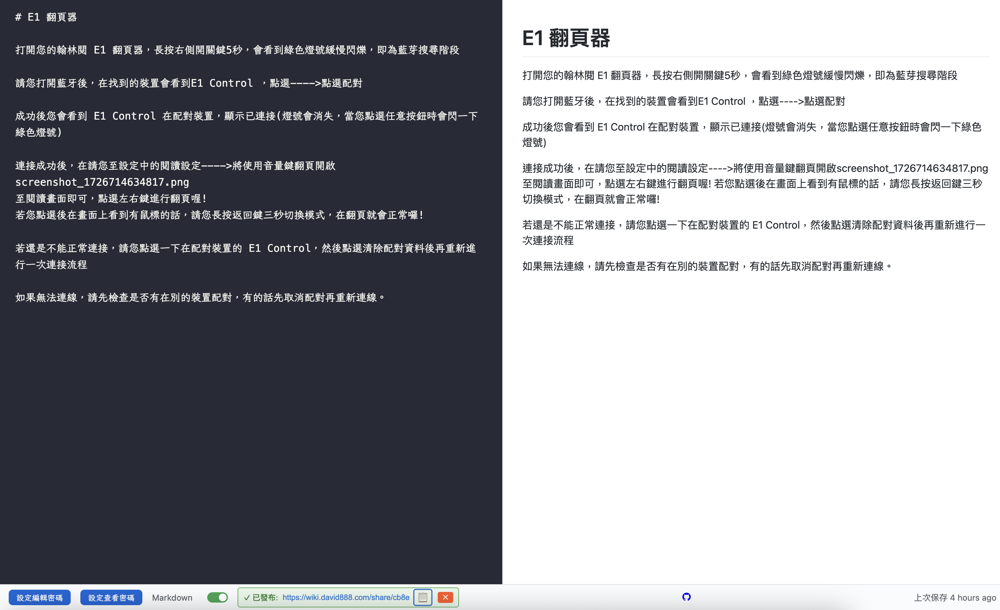

# Cloud Notepad - 基於 Cloudflare Workers 的無伺服器記事本



Cloud Notepad 是一個運行在 Cloudflare Workers 上的輕量級、極速且對 AI 友善的雲端記事本與無頭 CMS 平台。支援 Markdown 即時預覽、密碼保護、版本歷史、幻燈片簡報模式，並內建超級管理員後台、MCP 伺服器與 AI Agent 專屬 Skills。

👉 **⚠️ 給 AI 與開發者：若需使用 API 進行讀寫，請務必先閱讀完整規格表：[LLM_API_DOCS.md](./LLM_API_DOCS.md) ⚠️**

---

## 語言 / Languages

- [繁體中文 (Traditional Chinese)](#繁體中文)
- [English Version](#english-version)

---

# 繁體中文

## 🤖 AI Agent 與 LLM 生態整合

本專案原生支援被 AI 代理（如 Antigravity、Cursor、Claude Desktop、OpenClaw 或 n8n）當作「外部大腦」或「自動發文平台」使用。

### 1. 零安裝啟動 MCP 伺服器
我們提供了符合 Model Context Protocol (MCP) 的伺服器，可直接透過 Python `uv` 遠端執行，無須下載任何程式碼。
- **Cursor / Claude Desktop 設定**：
  - **Type**: `command`
  - **Command**: `uv run https://raw.githubusercontent.com/tbdavid2019/cf-notepad/main/mcp/server.py`
  - *(詳細說明請見 [mcp/README.md](./mcp/README.md))*

### 2. Antigravity AI Skills
本專案內建專屬技能 Prompt。只需將 `skills/` 資料夾下的內容複製到您的 `~/.gemini/antigravity/skills/` 目錄中即可。
- **自動發現**：Agent 亦可透過 `/.well-known/agent-skills/david888-wiki-publisher/SKILL.md` 自動探索載入。

### 3. 一鍵呼叫發文 (給 GPT/Claude 網頁版的 Prompt)
複製以下文字貼給 ChatGPT 或 Claude 網頁版，AI 即可自動為您寫作並發布至您的站點：
```text
這是一台架設好的 Wiki 記事本，具備無頭 CMS 的發文 API：`https://your-wiki-domain.com/api`。
請你擔任我的寫作助理，根據我的需求撰寫文章並發布。
操作指南請閱讀以下文件內容（請運用你的上網 / 執行工具讀取）：
👉 https://raw.githubusercontent.com/tbdavid2019/cf-notepad/main/LLM_API_DOCS.md
請你使用上述文件的 cURL/HTTP 請求，完成寫作後將內容存檔，並把最後發布的文章網址給我。
```

---

## ✨ 功能特色

### 1. 核心與效能
- **極速加載**：完全運行在 Cloudflare Edge 邊緣網路，全球存取速度極快。
- **Markdown & 安全性**：內建 Markdown 渲染與 DOMPurify 安全過濾，預防 XSS。
- **Mermaid 圖表**：針對 Mermaid 流程圖補強 CJK 字型與 SVG 邊界防溢出，大幅減少中英文混排被截斷的機率。
- **內建向量圖示**：Worker 自動輸出 `/icon.svg`、`/icon.png`、`/favicon.ico` 與社群預覽卡片圖示（OG Image）。

### 2. 編輯與閱讀體驗
- **精美字體**：編輯與預覽區預設使用 `Maple Mono` 與 `JetBrains Mono` 字體，提升程式碼與長文閱讀質感。
- **動態空白頁詩歌提示**：新建或清空編輯器時，會自動從飛鳥集 API 動態載入一首隨機的泰戈爾詩歌（並依瀏覽器語系切換中/英文），支援優雅的**打字機動畫效果**。
- **寬度與預覽主題**：Footer 內建 Width 切換（Full / 960 / 1200 / 1440）與 20+ 款精美預覽主題（預設使用 `claude-canvas` 人文風格）。
- **行動版工具列與收合選單**：手機上 Footer 統一採用「Icon 在上、說明字在下」雙行設計。預設僅展示第一排常用編輯按鈕與 `...`（更多）按鈕，點選 `...` 會以平滑動畫展開外觀設定（含語系與主題切換）。隱藏了行動版不需要的資訊欄（GitHub/Skill/API）。
- **長文輔助與自適應**：手機版表格支援自動換行與防溢出；長頁面滾動時會出現 `＾` 回到頂部按鈕。

### 3. 分享、隱私與內容生命週期
- **權限分離**：支援「編輯鎖（僅鎖定編輯）」與「閱讀鎖（鎖定閱讀與編輯）」，使用 Salted MD5 雜湊儲存密碼，頁內 Modal 輸入遮蔽。
- **D1 歷史版本**：支援備份快照至 Cloudflare D1 資料庫，可隨時預覽舊版、還原或複製內容，預設開啟 5 分鐘快照節流與最多 10 份版本上限。
- **公開索引與地圖**：提供 Opt-in 機制，僅有您明確同意的分享連結才會被編入站點 `/sitemap.xml`。
- **自動清理**：每日自動清理字數少於 10 字的空白筆記，保持資料庫整潔。

### 4. 展示、輸出與分析
- **幻燈片簡報模式**：支援標準 `---` 分頁與雙欄排版，一鍵將 Markdown 轉化為互動式 fullscreen 簡報。
- **PDF 列印優化**：預設 `@media print` 樣式，列印或另存 PDF 時會自動隱藏工具列，解決單頁高度限制與表格截斷問題。
- **GA4 分析**：設定 `SCN_GA_MEASUREMENT_ID` 後，編輯、分享與簡報頁會自動載入 Google Analytics。

---

## 🛠️ 部署教學

### 前置準備
- 已安裝 Node.js 與 npm。
- 擁有 Cloudflare 帳戶並安裝 Wrangler CLI：`npm install -g wrangler`

### 1. 初始化專案
```bash
cp wrangler.toml.example wrangler.toml
```

### 2. 建立 KV 空間
```bash
wrangler kv:namespace create "NOTES"
wrangler kv:namespace create "SHARE"
```
將生成的 ID 填入 `wrangler.toml` 的 `kv_namespaces` 部分。

### 3. 建立 D1 歷史版本資料庫（選用）
```bash
wrangler d1 create cloud-notepad-history
wrangler d1 execute cloud-notepad-history --file=./schema/note_history.sql
```
將生成的 `database_id` 填入 `wrangler.toml` 內 `[[d1_databases]]`。

### 4. 設定 R2 圖片上傳（選用）
在 Cloudflare 建立一個 R2 Bucket 並綁定公開網域：
- 於 `wrangler.toml` 中解除 `[[r2_buckets]]` 的註解並設定 `bucket_name`。
- 設定環境變數 `SCN_ENABLE_R2="1"` 與 `SCN_R2_DOMAIN="你的公開網址"`。

### 5. 設定環境密鑰 (Secrets)
請於 Cloudflare 網頁後台設定以下環境變數，或使用 `wrangler secret put <變數名稱>` 寫入：
- `SCN_SALT`: 加鹽字串（建議 UUID，越長越安全）
- `SCN_SECRET`: JWT 密鑰字串
- `SCN_ADMIN_PATH`: 後台管理路徑（例如 `/super-admin-777`）
- `SCN_ADMIN_PW`: 後台管理密碼
- `SCN_SLUG_LENGTH`: 隨機網址長度（預設為 `3`）
- `SCN_ENABLE_NOTE_HISTORY`: 設為 `"1"` 啟用 D1 版本紀錄
- `SCN_GA_MEASUREMENT_ID`: GA 追蹤碼（選用）

### 6. 部署
```bash
npm install
npm run deploy
```

---

## 🔍 系統發現端點 (Discovery Endpoints)

部署完成後，站點會提供以下 Crawler-Friendly 與 Agent 友善端點：
- `GET /.well-known/api-catalog`：回傳 RFC 9727 格式 Linkset JSON。
- `GET /.well-known/agent-skills/index.json`：Agent Skills Discovery 索引。
- `GET /.well-known/agent-skills/david888-wiki-publisher/SKILL.md`：Agent 可直讀的 Skill 說明書。
- `GET /auth.md`：說明目前的 API 認證方式。
- `GET /robots.txt`：搜尋引擎與 AI 爬蟲（AI Crawler）的 Allow/Disallow 規則與偏好聲明。
- `Accept: text/markdown` 協商：當請求帶有此 Header 時，`/share/...` 或 `/:path` 將直接回傳原始 Markdown 文字而非 HTML。

---
---

# English Version

## 🤖 AI Agent & LLM Integration

This project natively supports being used by AI Agents (e.g., Antigravity, Cursor, Claude Desktop, OpenClaw, or n8n) as an "external brain" or "auto-publishing platform".

### 1. Zero-Install MCP Server
We provide a Python-based Model Context Protocol (MCP) server that runs remotely via Python `uv`:
- **Cursor / Claude Desktop Configuration**:
  - **Type**: `command`
  - **Command**: `uv run https://raw.githubusercontent.com/tbdavid2019/cf-notepad/main/mcp/server.py`
  - *(See details in [mcp/README.md](./mcp/README.md))*

### 2. Antigravity AI Skills
Copy the contents of the `skills/` directory to your `~/.gemini/antigravity/skills/` directory.
- **Auto-Discovery**: Agents can discover and load this skill at `/.well-known/agent-skills/david888-wiki-publisher/SKILL.md`.

### 3. One-Click Prompt (For ChatGPT / Claude Web)
Copy this prompt and paste it to ChatGPT or Claude to let them draft and auto-publish directly to your wiki:
```text
This is a deployed Wiki platform functioning as a Headless CMS publishing API: `https://your-wiki-domain.com/api`.
Please act as my writing assistant to draft and publish articles based on my requests.
For operational guidelines, please read the following document (use your web-browsing/execution tools to fetch it):
👉 https://raw.githubusercontent.com/tbdavid2019/cf-notepad/main/LLM_API_DOCS.md
Use the cURL/HTTP request tools detailed in that document to save the content once you finish writing, and give me the URL of the published article.
```

---

## ✨ Features

### 1. Core & Performance
- **Edge Performance**: Powered entirely by Cloudflare Workers for ultra-fast global delivery.
- **Markdown & Security**: Integrated Markdown rendering and DOMPurify sanitization to block XSS.
- **Mermaid Diagram Protection**: Stricter CJK font constraints and SVG boundary protection prevent CJK diagram labels from clipping.
- **Vector Icons**: Custom note vector icons served directly at `/icon.svg`, `/icon.png`, and `/favicon.ico` (also used as OG social image).

### 2. Editing & Reading
- **Premium Typography**: Replaces default fonts with `Maple Mono` and `JetBrains Mono` for a unified coding and long-form reading experience.
- **Dynamic Stray Birds Placeholder**: Generates a random Tagore poem (in English or Chinese based on browser language) in the empty editor placeholder with a smooth **typewriter animation**.
- **Themes & Presets**: Footer selectors for `Width` (Full / 960 / 1200 / 1440) and 20+ polished CSS themes (defaulting to the humanist `claude-canvas`).
- **Responsive Mobile Layout**: Redesigns the mobile footer with "Icon-on-Top, Text-on-Bottom" styling. Shows only the primary edit row by default alongside a `...` (More) toggle which reveals appearance settings. Unnecessary developer/info links (GitHub/Skill/API) are hidden on mobile.
- **Mobile-Friendly Reading**: Tables wrap cell texts and code snippets safely; long pages feature a smooth `＾` back-to-top button.

### 3. Sharing, Privacy & Lifecycle
- **Granular Access Control**: Separation between "Edit Lock" (write protection) and "Read Lock" (read & write protection) using Salted MD5 hashes and in-page password modals.
- **D1 Snapshot History**: Automatically saves content snapshots to Cloudflare D1 with a 5-minute cooldown and a max limit of 10 versions. Editors can preview, restore, or copy text from historical versions.
- **Public Index Sitemap**: Opt-in public indexing allows you to choose which shared pages appear in `sitemap.xml`.
- **Automatic Cleanup**: A daily Cron job automatically deletes empty notes under 10 characters.

### 4. Presentation, Print & Analytics
- **Presentation Mode**: Splice slides using standard `---` page breaks and double-column layouts for fullscreen Slidev-like presentations.
- **Print Optimization**: `@media print` queries hide editor controls, clear scroll constraints, and preserve theme colors during PDF exports.
- **GA4 Analytics**: Automatically loads Google Analytics on editor, share, and slide pages when `SCN_GA_MEASUREMENT_ID` is set.

---

## 🛠️ Deployment Guide

### Prerequisites
- Node.js and npm installed.
- A Cloudflare account and Wrangler CLI: `npm install -g wrangler`

### 1. Initialize Project
```bash
cp wrangler.toml.example wrangler.toml
```

### 2. Create KV Namespaces
```bash
wrangler kv:namespace create "NOTES"
wrangler kv:namespace create "SHARE"
```
Copy the IDs and paste them into the `kv_namespaces` array in `wrangler.toml`.

### 3. Create D1 Version History Database (Optional)
```bash
wrangler d1 create cloud-notepad-history
wrangler d1 execute cloud-notepad-history --file=./schema/note_history.sql
```
Paste the `database_id` into the `[[d1_databases]]` section of `wrangler.toml`.

### 4. Setup R2 Image Uploads (Optional)
Create an R2 Bucket in Cloudflare and allow public domain access:
- Uncomment `[[r2_buckets]]` and set `bucket_name` in `wrangler.toml`.
- Set secrets `SCN_ENABLE_R2="1"` and `SCN_R2_DOMAIN="https://your-r2-domain.com"`.

### 5. Set Environment Secrets
Set the following secrets in your Cloudflare dashboard or via `wrangler secret put <VAR_NAME>`:
- `SCN_SALT`: Password hashing salt (use a long random UUID).
- `SCN_SECRET`: JWT encryption key.
- `SCN_ADMIN_PATH`: Admin dashboard path (e.g., `/super-admin-777`).
- `SCN_ADMIN_PW`: Admin dashboard password.
- `SCN_SLUG_LENGTH`: Length of random share URLs (default is `3`).
- `SCN_ENABLE_NOTE_HISTORY`: Set to `"1"` to enable the D1 history panel.
- `SCN_GA_MEASUREMENT_ID`: Google Analytics tracking ID (Optional).

### 6. Deploy
```bash
npm install
npm run deploy
```

---

## 🔍 Discovery Endpoints

Once deployed, your wiki exposes these standard discovery entry points:
- `GET /.well-known/api-catalog`：RFC 9727 Linkset JSON detailing endpoints.
- `GET /.well-known/agent-skills/index.json`：Agent Skills Discovery index.
- `GET /.well-known/agent-skills/david888-wiki-publisher/SKILL.md`：Skill instructions for LLM ingestion.
- `GET /auth.md`：Authentication specification.
- `GET /robots.txt`：Allow/Disallow rules and preference declarations for AI crawlers.
- `Accept: text/markdown` Negotiation: When requested, `/share/...` or `/:path` pages directly return raw Markdown strings.

---

*Forked from [s0urcelab/serverless-cloud-notepad](https://github.com/s0urcelab/serverless-cloud-notepad).*

*See full developer logs in [CHANGELOG.md](./CHANGELOG.md).*

### API Write Demo:
```bash
curl -X POST "https://wiki.david888.com/api/api_test_demo_2" \
  -H "Content-Type: application/json" \
  -d '{
    "content": "## Headless API Write Test\nWritten via API."
  }'
```
