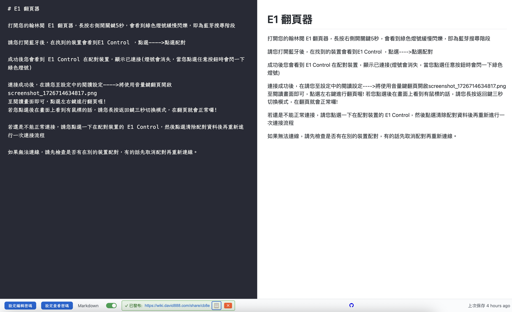

# Cloud Notepad - 基於 Cloudflare Workers 的無伺服器 Wiki 記事本



Cloud Notepad 是一個運行在 Cloudflare Workers 上的輕量級、極速且對 AI 友善的雲端記事本與無頭 CMS 平台。不僅支援 Markdown 即時預覽、密碼保護、D1 版本歷史與簡報模式，更整合了 **AI 寫作特助 (排版/改寫/翻譯)**、**剪貼簿直接貼圖與 R2 上傳**、**888box 大檔附件**、**ECharts 動態圖表**、**段落劃線討論**與 **MCP / AI Agent Skills** 生態。

👉 **⚠️ 給 AI 與開發者：若需使用 API 進行讀寫，請存取專屬 Skill 規格表：[SKILL.md](https://wiki.david888.com/.well-known/agent-skills/david888-wiki-publisher/SKILL.md) 或 [LLM_API_DOCS.md](./LLM_API_DOCS.md) ⚠️**

---

## 語言 / Languages

- [繁體中文 (Traditional Chinese)](#繁體中文)
- [English Version](#english-version)

---

# 繁體中文

## ⚡ 強大亮點功能一覽 (Feature Highlights)

### 🤖 1. AI 智慧寫作特助與 Agent 生態
- **AI 排版優化 (AI Format)**：採用 Workers AI（`gpt-oss-20b`），自動梳理 Markdown 標題、清單與空白，100% 保留原文語言與內容。支援圈選局部排版。
- **AI 輔助編輯與生成 (AI Edit & Draft)**：採用 `gpt-oss-120b` 模型，提供指令式的段落改寫、內容擴充或整篇文稿生成。
- **AI 翻譯／雙語生成 (AI Translate & Bilingual)**：一鍵將文章翻譯為指定目標語言，或產生排版完美的「原文 + 譯文」雙語對照版本。
- **選取文字浮動 AI 捷徑**：在編輯器中選取任意文字，自動彈出浮動選單，一鍵觸發排版、AI 編輯或翻譯。
- **Agent 生態 (MCP & Skills)**：提供符合 Model Context Protocol 的遠端 MCP 伺服器 (`uv run server.py`)，並發布 `/.well-known/agent-skills/david888-wiki-publisher/SKILL.md`，可直接作為 Antigravity、Cursor、Claude Desktop 或 n8n 的發文大腦。

```text
👉 ChatGPT / Claude 一鍵發文 Prompt：
這是一台架設好的 Wiki 記事本，具備無頭 CMS 的發文 API：`https://wiki.david888.com/api`。
請你擔任我的寫作助理，根據我的需求撰寫文章並發布。
操作指南請閱讀以下檔案內容（請運用你的上網 / 執行工具讀取）：
👉 https://wiki.david888.com/.well-known/agent-skills/david888-wiki-publisher/SKILL.md
請你使用上述檔案的 cURL/HTTP 請求，完成寫作後將內容存檔，並把最後發布的文章網址給我。
```

---

### 🎨 2. 極致寫作、媒體與排版體驗
- **剪貼簿直貼與 R2 圖片上傳**：支援剪貼簿直接貼圖 (Paste)、檔案拖曳 (Drag & Drop) 或工具列點選上傳至 Cloudflare R2，自動插入 Markdown 圖片語法。
- **888box 多媒體附件上傳**：工具列支援將影片、音訊、文件、壓縮檔等大檔上傳至 `box.david888.com`（具自動 fallback 機制），自動插入 `<video>`、`<audio>` 或下載連結。
- **ECharts 動態圖表渲染**：支援在 Markdown 中撰寫 ````echarts { JSON } ```` 程式碼區塊，即時渲染互動式餅圖、折線圖、柱狀圖等 ECharts 圖表。
- **自動 `[TOC]` 文章目錄**：插入 `[TOC]` 標籤自動掃描文件標題階層（`#` ~ `###`），生成可點擊平滑跳轉的索引目錄。
- **二欄／三欄多欄版面**：工具列一鍵圈選文字生成 `<div class="two-column-layout">` 或 `three-column-layout` 橫向多欄排版（手機自動切換單欄）。
- **多媒體網址自動預覽**：自動將 YouTube 連結轉為隱私保護播放器、PDF 轉為嵌入式閱覽器、MP4/MP3 轉為原生播放器。
- **HackMD 圖片尺寸標記**：支援 `` 設定精準響應式圖片大小。
- **雙軌筆記格式與建立入口**：Footer 最左側的「＋ 新增」可建立 [Markdown 筆記](/new/markdown) 或 [Block 筆記](/new/block)。建立後格式固定，Markdown 保持原始文字工作流；Block 則使用單欄 WYSIWYG 編輯器，兩者不互相轉換。
- **Notion-like Block 編輯體驗**：Block 筆記使用 BlockNote 的現成 Notion 式畫布，內建游標左側的 `＋`、拖曳把手、slash menu、浮動格式工具列與行動版介面。可插入圖片、連結、YouTube、PDF、檔案、Mermaid、ECharts 與 Raw HTML；嵌入區塊可直接編輯，網址與圖表 JSON 會先驗證。既有筆記仍以原本 Tiptap JSON 格式保存，分享頁與 API 完全相容。
- **可及性的對話視窗**：所有編輯器對話視窗都具備正確 dialog 語意、Tab 焦點鎖定、關閉後回到原觸發按鈕與 Escape 關閉行為；系統設定「減少動態效果」時，介面會停用不必要的動畫。
- **網址轉 Markdown 剪藏 (URL to Markdown Clipper)**：Footer「＋ 新增」選單內建「從網址匯入」功能。貼上任意公開網頁網址，即由 Worker 後端 API (`/api/url2md`，具備 `http://2md.aiurl.tw/` 主服務與 `2md.glsoft.ai` / `create360.ai` 三層 Failover 備援) 擷取文章標題與乾淨的 Markdown 內文，可選擇插入/取代目前編輯器或自動新建筆記。
- **瀏覽器端多格式文件匯入**：Markdown 編輯器的 Footer「匯入」與「＋ 新增」選單可直接讀取 Markdown、Word、PowerPoint、Excel、OpenDocument、RTF、EPUB、CSV 與文字型 PDF，於瀏覽器內轉為 Markdown。既有文章可選擇「插入游標處」、「取代內容」或取消；取消不會載入或執行轉檔器。轉檔使用同網域受控的 WebAssembly 靜態資產，文件內容不會上傳至 Wiki 伺服器。
- **命令列轉檔發布**：[`scripts/doc2wiki.sh`](./scripts/doc2wiki.sh) 可將本機文件轉為 Markdown 後發布到指定 Wiki path；預設為私有，僅在明確傳入 `true` 時公開，且只輸出可分享的 `shareUrl`。
- **新筆記歡迎引導**：新建 Markdown 筆記會顯示置中的《飛鳥集》與小訣竅逐字效果；在同一分頁重整前都會保留，開始輸入後自動隱藏。
- **字體與 20+ 款主題**：預設繁中 `GenJyuu Gothic` 與程式碼 `Maple Mono` / `JetBrains Mono`。Footer 提供 20+ 款 CSS 主題（預設 `claude-canvas`）與寬度切換；新筆記編輯器會隨機從桌面或手機預覽開始，方便作者先檢查窄版排版。
- **整合式發布設定與狀態列**：發布對話窗集中設定「發布、自動儲存、公開索引」，預設三項全開並記住這台裝置的選擇。發布後，Edit 預覽上方會顯示分享 URL、公開索引、保留版本、不重複瀏覽與最後儲存時間；深色介面下狀態列與底部控制列會使用一致的高對比冷色系，並以青藍、亮藍、靛藍與紫藍區分發布、版面、字體與語言操作。


---

### 🔐 3. 隱私、版本控制、簡報與劃線互動
- **雙重密碼鎖定 (Edit Lock vs View Lock)**：獨立設定「編輯鎖」（限制修改）與「閱讀鎖」（限制閱讀），均以 Salted MD5 雜湊保護。
- **D1 歷史版本快照**：Cloudflare D1 自動儲存 10 份版本快照（5 分鐘防刷節流），提供對比、還原與複製。
- **簡報模式 (Slide Presentation)**：使用 `---` 進行 Markdown 分頁，一鍵轉換為 16:9 全螢幕簡報模式（支援雙欄與動畫點擊）。
- **段落劃線註解與精準連結**：讀者可在分享頁劃線進行段落討論與「複製精準連結」，開啟時會自動跳轉並高亮指定段落。
- **PDF 匯出與列印優化**：`@media print` 徹底重置頁面與表格邊界，自動隱藏所有工具列，確保表格文字完全不被裁剪。
- **PWA 獨立應用與離線防護**：支援 Android / Mac / 桌面版瀏覽器安裝為 PWA 獨立 App；斷網時顯示離線防護頁面。


---

## 💾 儲存架構盤點

### Server / Cloudflare
| 儲存位置 | 保存內容 | 說明 |
| --- | --- | --- |
| `NOTES` KV | Markdown 文章內容與屬性 (`theme`, `width`, `shareFont`, `publicIndex`, `autosave`, `pw`/`vpw` 雜湊) | 未發布文章不保存內容；新開筆記時儲存初始主題 |
| `SHARE` KV | Share slug 到文章 path 的對照 | 不保存文章本文 |
| D1 `note_history` | 歷史版本快照 (path、舊內容、建立時間) | 留存最新 10 份歷史 |
| D1 `note_stats` | 文章瀏覽數、最後瀏覽時間、匿名裝置 UUID hash | Server 不留存原始 UUID，僅保存 SHA-256 hash |
| D1 `annotation_*` | 劃線段落錨點、原文摘錄、留言與回覆 | 原文修改後討論紀錄仍留存 |
| `IMAGES` R2 | 圖片上傳儲存桶 | 文章內僅保存公開圖片 URL |

### Browser (localStorage / Cookie)
| 類型 | Key | 用途 |
| --- | --- | --- |
| localStorage | `cf-notepad-preview-width` / `cf-notepad-preview-device` / `share-font` / `ui-theme` | 介面佈局與視覺偏好鏡像 |
| localStorage | `cf-notepad:publish-preferences` | 發布、自動儲存與公開索引的上次勾選偏好；首次預設全部開啟 |
| localStorage | `cf-notepad:share-history:*` / `annotation-author` | 本機近 20 筆分享紀錄與註解留言名稱 |
| Cookie | `auth` / `cn_device` / `admin_session` | 具 path scope 的驗證 JWT、匿名裝置 hash 與管理員 session |

---

## 🛠️ 部署教學

### 前置準備
- Node.js 與 npm
- Cloudflare 帳號與 Wrangler CLI: `npm install -g wrangler`

### 1. 初始化專案與建立 KV
```bash
cp wrangler.toml.example wrangler.toml
wrangler kv:namespace create "NOTES"
wrangler kv:namespace create "SHARE"
```
將生成的 KV ID 填入 `wrangler.toml` 的 `kv_namespaces` 欄位。

### 2. 建立 D1 資料庫 (選用)
```bash
wrangler d1 create cloud-notepad-history
wrangler d1 execute cloud-notepad-history --file=./schema/note_history.sql
```
將 `database_id` 填入 `wrangler.toml` 內的 `[[d1_databases]]`。

### 3. 設定 R2 圖片儲存桶 (選用)
在 Cloudflare 建立 R2 Bucket 並綁定公開網域，於 `wrangler.toml` 中設定 `bucket_name` 與環境變數 `SCN_ENABLE_R2="1"`、`SCN_R2_DOMAIN="https://s3.wiki.david888.com"`。

### 4. 設定環境密鑰 (Secrets)
透過 `wrangler secret put <變數名稱>` 或網頁後台設定：
- `SCN_SALT`: 加鹽 UUID
- `SCN_SECRET`: JWT 密鑰
- `SCN_ADMIN_PATH`: 超級管理員後台路徑 (如 `/admin333`)
- `SCN_ADMIN_PW`: 管理員密碼
- `SCN_SLUG_LENGTH`: 隨機網址長度 (預設 `4`)
- `SCN_ENABLE_NOTE_HISTORY`: 設為 `"1"` 啟用 D1 版本紀錄

### 5. 執行部署
```bash
npm install
npm run deploy
```

---

## 🔍 系統發現端點 (Discovery Endpoints)

部署完成後，站點提供以下自動化檢視端點：
- `GET /.well-known/api-catalog`：RFC 9727 Linkset JSON。
- `GET /.well-known/agent-skills/david888-wiki-publisher/SKILL.md`：LLM Agent Skill 規格書。
- `GET /auth.md`：API 認證說明規範。
- `GET /llms.txt`：面向 LLM 的精簡網站導覽，連結公開 Skill、API 文件與規格。
- `GET /llms-full.txt`：面向 LLM 的完整網站架構、API 規範與系統說明文件。
- `GET /robots.txt`：AI 爬蟲規則與聲明。
- `Accept: text/markdown` 標頭：請求 `/share/...` 或 `/:path` 時直接回傳原始 Markdown。

---
---

# English Version

## ⚡ Feature Highlights

### 🤖 1. AI Writing Assistant & Agent Ecosystem
- **AI Formatting (AI Format)**: Workers AI (`gpt-oss-20b`) restructures Markdown headings, lists, and whitespace while preserving original language and text. Supports selection-only formatting.
- **AI Editing & Drafting (AI Edit)**: `gpt-oss-120b` model provides instruction-based section rewrites, content expansion, or full article generation.
- **AI Translation & Bilingual Output**: Translate content to target languages or generate side-by-side bilingual documents.
- **Floating Selection AI Menu**: Selecting text in the editor automatically triggers floating AI Format, AI Edit, and Translate shortcuts.
- **Agent Ecosystem (MCP & Skills)**: Serves a remote Model Context Protocol server (`uv run server.py`) and standard Agent Skill at `/.well-known/agent-skills/david888-wiki-publisher/SKILL.md`.

```text
👉 One-Click Prompt for ChatGPT / Claude Web:
This is a deployed Wiki platform functioning as a Headless CMS publishing API: `https://wiki.david888.com/api`.
Please act as my writing assistant to draft and publish articles based on my requests.
For operational guidelines, please read the following document (use your web-browsing/execution tools to fetch it):
👉 https://wiki.david888.com/.well-known/agent-skills/david888-wiki-publisher/SKILL.md
Use the cURL/HTTP request tools detailed in that document to save the content once you finish writing, and give me the URL of the published article.
```

---

### 🎨 2. Rich Editing, Media & Layout
- **Direct Clipboard Paste & R2 Uploads**: Paste images directly from clipboard, drag-and-drop, or click the toolbar to upload to Cloudflare R2 with automatic Markdown image links.
- **888box Multimedia Attachments**: Upload videos, audio, documents, and archives directly to `box.david888.com` (with fallback nodes), inserting `<video>`, `<audio>`, or download links.
- **ECharts Interactive Charts**: Render interactive ECharts graphs directly from ````echarts { JSON } ```` code blocks in Markdown.
- **Automatic `[TOC]` Table of Contents**: Insert `[TOC]` to scan document heading hierarchy and render smooth-scrolling TOC jump links.
- **Two/Three-Column Layouts**: Wrap selected text in `<div class="two-column-layout">` or `three-column-layout` for multi-column presentation (stacks on mobile).
- **Auto Media Previews**: Automatically converts YouTube URLs to privacy-enhanced players, PDFs to embedded viewers, and MP4/MP3 links to native players.
- **HackMD Image Dimensions**: Supports `` responsive image sizing.
- **Two Fixed Note Formats & Creation Menu**: The leftmost Footer `+ New` menu creates either a [Markdown note](/new/markdown) or a [Block note](/new/block). The format is fixed after creation: Markdown retains its plain-text workflow, while Block uses a single-column WYSIWYG editor; the two formats are not converted between each other.
- **Notion-like Block Editing**: Block notes use BlockNote's ready-made Notion-style canvas, including the cursor-side `+`, drag handle, slash menu, floating formatting toolbar, and mobile UI. It supports images, links, YouTube, PDFs, files, Mermaid, ECharts, and raw HTML. Existing notes continue to serialize to the compatible Tiptap JSON format, so Share pages and APIs remain unchanged.
- **Accessible Dialogs**: Editor dialogs use proper dialog semantics, trap Tab focus, restore focus to their trigger when closed, and support Escape. The interface also honors the system `prefers-reduced-motion` setting.
- **Browser-side Multi-format Document Import**: The Markdown editor's Footer Import button and `+ New` menu accept Markdown, Word, PowerPoint, Excel, OpenDocument, RTF, EPUB, CSV, and text-based PDFs, then convert them to Markdown in the browser. Existing content can be inserted at the cursor, replaced, or left untouched by cancelling; cancelling does not load or run the converter. Conversion uses same-origin, version-locked WebAssembly static assets, so document bytes never upload to the Wiki server.
- **CLI Conversion and Publishing**: [`scripts/doc2wiki.sh`](./scripts/doc2wiki.sh) converts a local document and publishes the Markdown to a specified Wiki path. It defaults to private, requires explicit `true` to publish, and prints only the shareable `shareUrl`.
- **New-note Welcome**: A fresh Markdown note shows centered *Stray Birds* copy and a focused tip with a typewriter effect. It remains available across reloads in the same browser tab and disappears as soon as the author starts typing.
- **Typography & 20+ Themes**: Traditional Chinese defaults to `GenJyuu Gothic`; Latin text uses `Maple Mono` / `JetBrains Mono`. Features 20+ CSS preview themes (default `claude-canvas`) and width toggles. New editor notes randomly start in a desktop or mobile preview so authors can check narrow layouts early.
- **Unified Publishing & Status Strip**: One dialog controls Publish, Autosave, and Public Index; all three default on and the confirmed choices are remembered on this device. After publishing, the Edit preview shows the Share URL, index state, retained versions, unique views, and last-saved time; dark UI mode uses a consistent high-contrast cool palette, with teal-blue, blue, indigo, and violet-blue distinguishing publish, layout, font, and language actions.


---

### 🔐 3. Privacy, Versioning, Slides & Annotations
- **Edit Lock vs View Lock**: Separate Salted MD5 password controls for editing permissions versus reading permissions.
- **D1 Snapshot History**: Cloudflare D1 automatically backs up content (5-minute cooldown, retains 10 snapshots) for preview and restoration.
- **Slide Presentation Mode**: Splice notes using `---` dividers for 16:9 fullscreen slide presentations (supports two-column slides and click reveals).
- **Paragraph Annotations & Deep Links**: Highlight text on Share pages to start inline discussions, with copyable deep links that auto-scroll and highlight cited passages.
- **PDF Export & Print Optimization**: `@media print` rules hide UI overlays and reset table margins to prevent text clipping.
- **Installable PWA & Offline Guard**: Install as a standalone PWA app on Android, Mac, or desktop, with a clean offline fallback page.


---

## 💾 Storage Inventory

### Server / Cloudflare
| Storage | Data | Description |
| --- | --- | --- |
| `NOTES` KV | Markdown content & metadata (`theme`, `width`, `shareFont`, `publicIndex`, `autosave`, `pw`/`vpw` hashes) | Unpublished notes are browser-only; saves initial theme on note creation |
| `SHARE` KV | Share slug to note path mapping | Does not store article body |
| D1 `note_history` | Historical version snapshots (path, text, created time) | Retains latest 10 versions |
| D1 `note_stats` | View count, last view time, anonymous device UUID hash | Stores SHA-256 hash only |
| D1 `annotation_*` | Paragraph anchors, source quotes, comments & replies | Retains discussion threads after text edits |
| `IMAGES` R2 | Image upload bucket | Stores public image URLs |

### Browser (localStorage / Cookie)
| Type | Key | Description |
| --- | --- | --- |
| localStorage | `cf-notepad-preview-width` / `cf-notepad-preview-device` / `share-font` / `ui-theme` | Mirror of layout and visual preferences |
| localStorage | `cf-notepad:publish-preferences` | Last confirmed Publish, Autosave, and Public Index choices; all enabled on first use |
| localStorage | `cf-notepad:share-history:*` / `annotation-author` | Local history of 20 recent shares & author name |
| Cookie | `auth` / `cn_device` / `admin_session` | Path-scoped JWT, anonymous device hash & admin session |

---

## 🛠️ Deployment Guide

### Prerequisites
- Node.js and npm installed
- Cloudflare account & Wrangler CLI: `npm install -g wrangler`

### 1. Initialize Project & Create KV
```bash
cp wrangler.toml.example wrangler.toml
wrangler kv:namespace create "NOTES"
wrangler kv:namespace create "SHARE"
```
Paste the namespace IDs into `wrangler.toml`.

### 2. Create D1 Database (Optional)
```bash
wrangler d1 create cloud-notepad-history
wrangler d1 execute cloud-notepad-history --file=./schema/note_history.sql
```
Paste `database_id` into `wrangler.toml`.

### 3. Setup R2 Image Uploads (Optional)
Create an R2 Bucket in Cloudflare and enable public domain access. Set `bucket_name` in `wrangler.toml` and secrets `SCN_ENABLE_R2="1"` and `SCN_R2_DOMAIN="https://s3.wiki.david888.com"`.

### 4. Set Environment Secrets
Set secrets via `wrangler secret put <VAR>`:
- `SCN_SALT`: Password hashing salt UUID
- `SCN_SECRET`: JWT encryption secret
- `SCN_ADMIN_PATH`: Admin dashboard path (e.g., `/admin333`)
- `SCN_ADMIN_PW`: Admin dashboard password
- `SCN_SLUG_LENGTH`: Length of random share URLs (default `4`)
- `SCN_ENABLE_NOTE_HISTORY`: Set to `"1"` for D1 history

### 5. Deploy
```bash
npm install
npm run deploy
```

---

## 🔍 Discovery Endpoints

- `GET /.well-known/api-catalog`: RFC 9727 Linkset JSON.
- `GET /.well-known/agent-skills/david888-wiki-publisher/SKILL.md`: LLM Agent Skill spec.
- `GET /auth.md`: Authentication specification.
- `GET /llms.txt`: Concise LLM entry point linking to the public Skill, API docs, and specifications.
- `GET /llms-full.txt`: Comprehensive LLM site architecture, API specs, and extended system documentation.
- `GET /robots.txt`: AI Crawler rules.
- `Accept: text/markdown`: Requesting `/share/...` or `/:path` returns raw Markdown.

---

## 🧭 Maintenance for Contributors & LLMs

When adding or changing a user-facing feature, update these three files:
1. `CHANGELOG.md` for release records.
2. `README.md` for feature documentation.
3. `static/data/editor-tips.json` for bilingual startup tips (`zh-TW` and `en-US`).

Keep agent guidance synchronized across `skills/SKILL.md`, `LLM_API_DOCS.md`, and `mcp/README.md`. Run `node scripts/generate-agent-skill.mjs` after changing generated source documents.

`node scripts/generate-agent-skill.mjs` also copies the locked `@firecrawl/anydoc-wasm` JavaScript and `.wasm` files from `node_modules` to `static/wasm/`; this runs automatically before tests and deployment. Do not hand-edit those generated static files.

---
*See full developer logs in [CHANGELOG.md](./CHANGELOG.md).*
