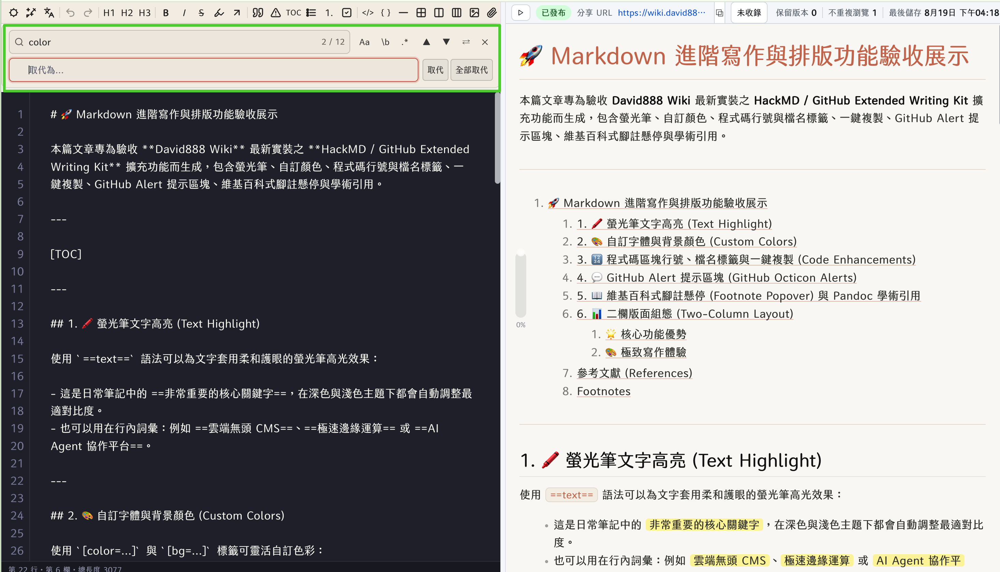
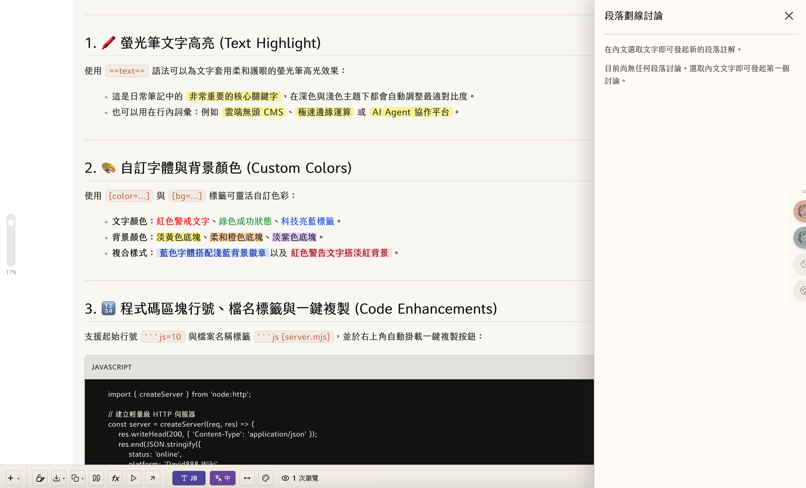
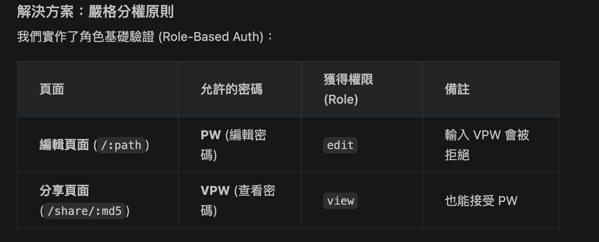

# Cloud Notepad - 基於 Cloudflare Workers 的無伺服器 Wiki 記事本

### Block Edit （類似Notion / Wordpress like 編輯器）


### Markdown Edit 編輯器







### 強大的匯入功能


這是一個運行在 Cloudflare Workers 上的輕量級、極速且對 AI 友善的雲端記事本與無頭 CMS 平台。不僅支援 Markdown 即時預覽、密碼保護、D1 版本歷史與簡報模式，更整合了 **AI 寫作特助 (排版/改寫/翻譯)**、**剪貼簿直接貼圖與 R2 上傳**、**888box 大檔附件**、**ECharts 動態圖表**、**段落劃線討論**與 **MCP / AI Agent Skills** 生態。

👉 **⚠️ 給 AI 與開發者：若需使用 API 進行讀寫，請存取專屬 Skill 規格表：[SKILL.md](https://wiki.david888.com/.well-known/agent-skills/david888-wiki-publisher/SKILL.md) 或 [LLM_API_DOCS.md](./LLM_API_DOCS.md) ⚠️**

---

## 語言 / Languages

- [繁體中文 (Traditional Chinese)](#繁體中文)
- [English Version](#english-version)

---

# 繁體中文

## ⚡ 強大亮點功能一覽 (Feature Highlights)

### 🤖 1. AI 智慧寫作特助與 Agent 生態

- **🎙️ 音訊匯入與語音轉逐字稿 (Groq whisper-large-v3 主力 + 多層級備援 + 原生時間戳記 `[mm:ss]`)**：點擊左下角「＋ 新增」選單，位於匯入區塊最上方，可直接上傳常見音訊檔案（`.mp3`, `.m4a`, `.wav`, `.aac`, `.ogg`, `.webm`, `.flac`, `.opus`, `.mp4` 等）。
  - **極速多層級 STT 引擎**：
    1. **主力模型 (Primary)**：**Groq `whisper-large-v3`**（超高速推論，秒級完成長篇語音轉錄，原生 `verbose_json` 時間段落）。
    2. **第一備援 (Fallback 1)**：**Groq `whisper-large-v3-turbo`**。
    3. **第二備援 (Fallback 2)**：Cloudflare Workers AI **`@cf/openai/whisper-large-v3-turbo`**（解析原生 WebVTT 字幕時間流）。
    4. **第三備援 (Fallback 3)**：Cloudflare Workers AI **`@cf/openai/whisper`**。
  - **原生時間戳記與自動分段**：解決純逐字稿擠成一整坨的痛點，依據語音停頓自動生成帶有 `**[00:15]**` 時間標記的獨立段落，兼顧 Markdown 預覽與 BlockNote 區塊編輯。
  - **雙模式自主切換**：
    1. **🎙️ 匯入音訊（逐字稿）**（**推薦預設**）：輸出 100% 原音忠實逐字稿附帶精確時間戳記，**零幻覺、零額外摘要、無多餘大綱腦補**，極速且純淨。
    2. **✨ 匯入音訊（智慧排版）**（**可選模式**）：Whisper 先產出結構化時間逐字稿，再由 LLM 釐清語句、整理重點與 Markdown 排版；不自行捏造原文沒有的事實。
- **AI 排版優化 (AI Format)**：採用 Workers AI（`gpt-oss-20b`），自動梳理 Markdown 標題、清單與空白，100% 保留原文語言與內容。支援圈選局部排版。
- **AI 輔助編輯與生成 (AI Edit &amp; Draft)**：採用 `gpt-oss-120b` 模型，提供指令式的段落改寫、內容擴充或整篇文稿生成。
- **AI 翻譯／雙語生成 (AI Translate &amp; Bilingual)**：一鍵將文章翻譯為指定目標語言，或產生排版完美的「原文 + 譯文」雙語對照版本。
- **選取文字浮動 AI 捷徑**：在編輯器中選取任意文字，自動彈出浮動選單，一鍵觸發排版、AI 編輯或翻譯。
- **Agent 生態 (MCP, WebMCP &amp; Skills)**：提供原生 HTTP JSON-RPC 2.0 端點（`/mcp`，完美相容 Cloudflare WebMCP 1-Click 整合與 Chrome 146+ `document.modelContext`）、遠端 Python FastMCP 伺服器 (`uv run server.py`)，並發布 `/.well-known/agent-skills/david888-wiki-publisher/SKILL.md`，可直接作為 Antigravity、Cursor、Claude Desktop 或 n8n 的發文大腦。

```text
👉 ChatGPT / Claude 一鍵發文 Prompt：
這是一台架設好的 Wiki 記事本，具備無頭 CMS 的發文 API：`https://wiki.david888.com/api`。
請你擔任我的寫作助理，根據我的需求撰寫文章並發布。
操作指南請閱讀以下檔案內容（請運用你的上網 / 執行工具讀取）：
👉 https://wiki.david888.com/.well-known/agent-skills/david888-wiki-publisher/SKILL.md
請你使用上述檔案的 cURL/HTTP 請求，完成寫作後將內容存檔，並把最後發布的文章網址給我。
```

---

### 🎨 2. 極致寫作、媒體與排版體驗

- **剪貼簿直貼與 R2 圖片上傳**：支援剪貼簿直接貼圖 (Paste)、檔案拖曳 (Drag &amp; Drop) 或工具列點選上傳至 Cloudflare R2，自動插入 Markdown 圖片語法。
- **888box 多媒體附件上傳**：工具列支援將影片、音訊、文件、壓縮檔等大檔上傳至 `box.david888.com`（具自動 fallback 機制），自動插入 `<video>`、`<audio>` 或下載連結。
- **📊 Mermaid 與圖表懸浮工具列與一鍵複製 PNG/代碼**：所有渲染後的 Mermaid 流程圖、架構圖、循序圖與 Flowchart/Sequence/Graphviz/ABC/ECharts 圖表右上角均自動掛載毛玻璃懸浮操作列，提供「🖼️ 複製 PNG（2x 高解析透明點陣圖，可直接貼入 Slack、Notion、PPT、Word）」、「📋 複製代碼」、「📐 複製 SVG」與「💾 下載 PNG」，具備即時動畫回饋與雙語 Toast 提示。
- **ECharts 動態圖表渲染**：支援在 Markdown 中撰寫 `echarts { JSON }`  程式碼區塊，即時渲染互動式餅圖、折線圖、柱狀圖等 ECharts 圖表。
- **自動 `[TOC]` 文章目錄**：插入 `[TOC]` 標籤自動掃描文件標題階層（`#` ~ `###`），生成可點擊平滑跳轉的索引目錄。
- **二欄／三欄多欄版面**：工具列一鍵圈選文字生成 `<div class="two-column-layout">` 或 `three-column-layout` 橫向多欄排版（手機自動切換單欄）。
- **多媒體網址自動預覽**：自動將 YouTube 連結轉為隱私保護播放器、PDF 轉為嵌入式閱覽器、MP4/MP3 轉為原生播放器。
- **HackMD 圖片尺寸標記**：支援 `` 設定精準響應式圖片大小。
- **雙軌筆記格式與建立入口**：Footer 最左側的「＋ 新增」可建立 [Markdown 筆記](/new/markdown) 或 [Block 筆記](/new/block)。建立後格式固定，Markdown 保持原始文字工作流；Block 則使用單欄 WYSIWYG 編輯器，兩者不互相轉換。
- **Notion-like Block 編輯體驗**：Block 筆記使用 BlockNote 的現成 Notion 式畫布，內建游標左側的 `＋`、拖曳把手、slash menu、浮動格式工具列與行動版介面。可插入圖片、連結、YouTube、PDF、檔案、Mermaid、ECharts 與 Raw HTML；嵌入區塊可直接編輯，網址與圖表 JSON 會先驗證。既有筆記仍以原本 Tiptap JSON 格式保存，分享頁與 API 完全相容。Block 編輯頁支援 PNG、HTML、PDF／列印導出；Markdown 導出保留在 Markdown 編輯頁。
- **可及性的對話視窗**：所有編輯器對話視窗都具備正確 dialog 語意、Tab 焦點鎖定、關閉後回到原觸發按鈕與 Escape 關閉行為；系統設定「減少動態效果」時，介面會停用不必要的動畫。
- **網址轉 Markdown 剪藏 (URL to Markdown Clipper)**：Footer「＋ 新增」選單內建「從網址匯入」功能。貼上任意公開網頁網址，即由 Worker 後端 API (`/api/url2md`，具備 `http://2md.aiurl.tw/` 主服務與 `2md.glsoft.ai` / `create360.ai` 三層 Failover 備援) 擷取文章標題與乾淨的 Markdown 內文，可選擇插入/取代目前編輯器或自動新建筆記。
- **瀏覽器端多格式文件匯入**：Markdown 編輯器的 Footer「匯入」與「＋ 新增」選單可直接讀取 Markdown、Word、PowerPoint、Excel、OpenDocument、RTF、EPUB、CSV 與文字型 PDF，於瀏覽器內轉為 Markdown。既有文章可選擇「插入游標處」、「取代內容」或取消；取消不會載入或執行轉檔器。轉檔使用同網域受控的 WebAssembly 靜態資產，文件內容不會上傳至 Wiki 伺服器。
- **命令列轉檔發布**：[`scripts/doc2wiki.sh`](./scripts/doc2wiki.sh) 可將本機文件轉為 Markdown 後發布到指定 Wiki path；預設為私有，僅在明確傳入 `true` 時公開，且只輸出可分享的 `shareUrl`。
- **🔍 編輯器全功能搜尋與取代 (Search & Replace)**：按 `Cmd+F` (Ctrl+F) 立即呼叫懸浮搜尋列，按 `Cmd+H` (Ctrl+H) 展開取代面板，亦可透過工具列「🔍」開啟；支援即時匹配筆數 (`3 / 15`)、`Enter` / `Shift+Enter` 上下筆導覽、大小寫區分 (`Aa`)、全字匹配 (`\b`)、正規表達式 (`.*`)、單筆取代與全部取代。
- **🖍️ 螢光筆高亮語法 (`==text==`)**：支援 HackMD 標準 `==螢光筆文字==` 語法，渲染為柔和黃色 `<mark class="markdown-highlight">` 標籤，適配 20 款深淺主題；工具列提供「🖍️ 螢光筆 (HL)」快捷按鈕。
- **🎨 自訂文字與背景顏色語法 (`[color=...]`, `[bg=...]`)**：支援 `[color=red]文字[/color]`、`[bg=yellow]文字[/bg]` 以及複合標籤 `[color=#3b82f6 bg=#eff6ff]文字[/color]`，靈活強調重點排版。
- **🔢 程式碼區塊行號與檔名標籤**：支援起始行號 ```` ```js= ```` (第 1 行起) 或 ```` ```js=10 ```` (指定行號起)，以及檔案名稱標籤 ```` ```js [app.js] ```` 或 ```` ```js=1 [server.mjs] ````，自動生成獨立行號槽與檔名 Header。
- **📋 程式碼區塊一鍵複製按鈕**：所有程式碼區塊自動掛載一鍵複製按鈕，點擊提供即時狀態反饋與 Toast 提示。
- **💬 GitHub Alert 提示區塊自動補完與工具列**：行首輸入 `> [!` 即時彈出 NOTE、TIP、IMPORTANT、WARNING、CAUTION 快速選單，支援鍵盤導覽與 Enter 插入；工具列同步提供「⚠️ GitHub 提示區塊」按鈕。
- **📖 書本模式 (Book Mode - `/share/:id/book`)**：在任何包含章節清單連結的筆記進入書本模式，自動解析左側樹狀目錄欄（支援章節搜尋過濾、層級收折、當前章節高亮），支援**滑鼠與觸控拖拉調整側邊欄寬度（Splitter Resizer）**，自動保存寬度偏好並支援雙擊重設（290px）；右側採用高規格原生嵌入渲染（`?embed=1`），零秒極速切換章節，頂部提供導覽列與快捷鍵（`[` 上一章、`]` 下一章），**支援 PWA 一鍵離線預抓快取整本書**與**三合一多格式匯出（合併 Markdown、單一離線 HTML 電子書、列印 PDF）**。
- **📽️ 簡報模式 2D 矩陣升級 (Vertical Sub-Slides `--` & YAML)**：橫向投影片使用 `---`，縱向深入子投影片使用 `--`；支援方向鍵四向導覽（`↑` `↓` `←` `→`）與大綱總覽（`O`）2D 矩陣縮圖，文首支援 YAML 宣告自訂轉場效果（`fade`, `slide`, `zoom` 等）。
- **📊 Excel / Google Sheets 複製貼上自動轉 Markdown 表格**：在編輯器直接貼上來自 Excel、Google Sheets、Numbers 或網頁選取的表格，自動秒轉為標準對齊的 Markdown 表格（`| ... |`）。
- **📝 論文級雙向註腳與毛玻璃預覽 (`[^1]` / `^[...]`)**：支援標準註腳 `[^1]` 與 Pandoc/HackMD 行內註腳 `^[說明]`，自動進行數字編號與文末清單聚合；游標懸浮註腳編號立即彈出毛玻璃卡片（Hover Popover）預覽註釋內容，點擊平滑雙向跳轉（`↩` 一鍵返回內文定位點），修復深層錨點與文章目錄 (`[TOC]`) 乾淨排版；工具列提供「插入註腳 ([^1])」快捷按鈕。
- **📂 多格式拖曳匯入與智慧分流 (Drag & Drop File Handling)**：直接將檔案拖曳進 Markdown 編輯器：
  - **PDF 文件**：彈窗智慧分流「📑 AnyDocs 本地轉檔為 Markdown」或「☁️ 上傳至 888box 作為附件連結」。
  - **音訊檔案**：彈窗提供三合一選項，預設「🎙️ 匯入音訊（逐字稿）」，亦可選擇「✨ 匯入音訊（智慧排版）」或「☁️ 上傳至 888box 嵌入 `<audio controls>` 播放器」。
  - **圖片檔案**：直傳 Cloudflare R2 並在游標處插入 ``。
  - **Office / Markdown 文件**：支援 DOCX/PPTX/XLSX WASM 本地轉檔或 888box 上傳；拖曳 `.md`/`.txt` 提示游標插入或全篇替換。
- **🔑 管理員 Touch ID / FIDO2 指紋一鍵登入 (Admin Passkey & Touch ID)**：後台登入介面支援 WebAuthn / FIDO2 生物辨識一鍵刷指紋進入；後台支援隨時綁定新裝置（Mac Touch ID、iPhone Face ID、Windows Hello）與管理憑證。
- **📐 自適應緊湊行號槽 (Adaptive Line Numbers Gutter)**：行號區塊採用動態寬度計算（1~99 行超緊湊 ~26px，並隨百行、千行、萬行平滑動態擴展），搭配 13px 輔助字號與垂直精準像素對齊，Textarea 左邊距從 72px 縮減至 42px，徹底解決傳統固定寬度過寬與喧賓奪主的問題。
- **🎨 全面深色模式 (Full Dark Mode for Modals & Badges)**：版本紀錄（`.note-history-modal`）、最近分享（`.share-history-modal`）、本機已存狀態標籤（`.sync-status-badge`）與系統確認對話窗皆完整支援深色模式，使用現代 Slate 深藍冷色調與高對比文字排版。
- **字體與 20+ 款主題**：預設繁中 `GenJyuu Gothic` 與程式碼 `Maple Mono` / `JetBrains Mono`。Footer 提供 20+ 款 CSS 主題（預設 `claude-canvas`）與寬度切換；編輯器預設固定為桌面預覽（100% 全寬度），並支援隨時切換左右/上下分割與桌面/手機模式。
- **整合式發布設定與狀態列**：發布對話窗集中設定「發布、自動儲存、公開索引」，預設三項全開並記住這台裝置的選擇。發布後，Edit 預覽上方會顯示分享 URL、公開索引、保留版本、不重複瀏覽與最後儲存時間；深色介面下狀態列與底部控制列會使用一致的高對比冷色系，並以青藍、亮藍、靛藍與紫藍區分發布、版面、字體與語言操作。

### 📚 3. 書本模式使用與製作指南 (Book Mode Guide)

任何包含**章節清單與超連結**的 Markdown 筆記，都能一秒變身為現代化的**線上雙欄電子書**！

#### 🛠️ 如何製作一本多章節電子書（語法範例）
只要在筆記內撰寫結構化的目錄清單（支援 H3 分組與層級縮排）：

````markdown
# 📚 雲端技術手冊與架構指南 (Cloud Architecture Book)

> 本手冊收錄系統核心設計、架構規格與進階擴充功能驗收。

## 📖 目錄與章節導覽 (Book Table of Contents)

### 第一部分：核心架構概論
- [01. 系統架構與設計概念](/share/qt7xmd)
- [02. 編輯器擴充與排版特性](/extended-writing-features-demo)
  - [02-1. 深入排版細節 (子章節)](/share/qt7xmd)

### 第二部分：進階功能驗收
- [03. Excel 與 Google Sheets 表格自動貼上驗證](/share/qt7xmd)
- [04. 2D 簡報模式垂直探索展示](/share/qt7xmd/present)
- [05. 外部參考文獻與協議規範](https://wiki.david888.com/mcp)
````

#### 🚀 進入與操作書本模式
1. **進入網址**：在任何分享頁後方加上 `/book`（例如 `https://wiki.david888.com/share/:shareId/book`）或編輯頁加上 `/book`。
2. **左側目錄與自訂寬度**：
   - 自動解析所有章節連結與分組標題，支援**章節即時搜尋過濾**。
   - **側邊欄拖拉調整寬度（Splitter Resizer）**：滑鼠懸停於側邊欄邊緣左右拖曳即可調整寬度（180px～65% 螢幕寬度），雙擊分隔把手一鍵重設為預設 290px，寬度偏好自動記憶於瀏覽器。
3. **右側極速原生渲染（`?embed=1`）**：
   - 點擊左側章節立即載入對應文章，零秒原生渲染，KaTeX 公式、程式碼行號、Alert 提示框、Mermaid 圖表與主題樣式全數支援。
4. **翻頁與導航**：
   - 頂部提供「← 上一章」與「下一章 →」切換按鈕，支援鍵盤快速鍵 `[`（上一章）與 `]`（下一章）以及手機左右滑動翻頁手勢。
   - 頂部 `↗` 按鈕可一鍵在新分頁開啟當前章節。
   - 左上角「`← 退出書本`」可精確返回標準閱讀或編輯模式。
5. **📥 一鍵離線快取整本書 (Offline Cache)**：
   - 點擊頂部「📥 離線快取」按鈕，背景自動並行預載整本書所有章節與插圖至 Service Worker Cache，斷網或飛行模式下依然能完整閱讀！
6. **📤 三合一電子書匯出 (Multi-Format Book Export)**：
   - **📄 合併 Markdown (.md)**：一鍵整合全書所有章節為單一完整的 Markdown 檔案。
   - **🌐 單一離線 HTML 電子書 (.html)**：匯出包含雙欄目錄與所有章節內容的獨立 HTML 檔案，離線雙擊即可瀏覽。
   - **🖨️ 匯出 PDF / 列印 (.pdf)**：自動將全書章節排版並加入分頁符號，一鍵列印為 PDF 手冊。

#### 🤖 AI Agent 4 步驟自動串書工作流 (Multi-Article Book Orchestration SOP for LLMs)
當要求 AI 撰寫一整套教學、技術文檔手冊或系列課程時，LLM 應依循標準 4 步驟自主發布電子書：
1. **大綱規劃**：規劃章節架構並為各章命名語意清晰的 Path Slug（如 `ts-ch01`, `ts-ch02`）。
2. **逐篇發布章節**：透過 `write_note` 或 API 逐篇寫入發布並收集各篇的 `shareUrl`（亦可在章節中混排 `/present` 簡報模式）。
3. **建立總目錄文章 (Manifest Hub Note)**：以 Markdown 列表將所有章節連結整合為目錄文章（支援 H3 分組與 2 格縮排子章節）。
4. **交付電子書連結**：取得總目錄文章之 `shareUrl` 並加上 `/book`，回傳如 `https://wiki.david888.com/share/<hub-id>/book` 給使用者。

---

#### 🔗 實例展示與功能驗收 (Live Demo & Feature Showcase)

- 📖 **書本模式極速體驗 (Book Mode)**：[https://wiki.david888.com/share/47eqhm/book](https://wiki.david888.com/share/47eqhm/book)
- ✏️ **書本目錄編輯頁面 (Book Editor Demo)**：[https://wiki.david888.com/book-and-2d-slides-demo](https://wiki.david888.com/book-and-2d-slides-demo)
- 📖 **公開閱讀與渲染頁面 (Share URL)**：[https://wiki.david888.com/share/qt7xmd](https://wiki.david888.com/share/qt7xmd)
- 🖥️ **全螢幕 2D 簡報模式 (2D Slide Presentation)**：[https://wiki.david888.com/share/qt7xmd/present](https://wiki.david888.com/share/qt7xmd/present)
- ✏️ **編輯器進階寫作展示 (Extended Writing Kit)**：[https://wiki.david888.com/extended-writing-features-demo](https://wiki.david888.com/extended-writing-features-demo)


| 功能項目 | 語法範例 / 操作方式 | 驗收方式與效果 |
| :--- | :--- | :--- |
| **1. 📖 書本模式與拖拉側邊欄** | `/share/:id/book` | 檢視 `/share/47eqhm/book`，左側拖曳把手調整寬度，點擊章節 0 秒無縫換頁。 |
| **2. 📽️ 2D 簡報模式** | `---` (橫向) / `--` (縱向) | 進入 `/share/qt7xmd/present`，支援四向方向鍵 `↑` `↓` `←` `→` 與 `O` 矩陣總覽。 |
| **3. 📊 Excel 表格自動貼上** | 複製 Excel/Sheets 直接貼上 | 在編輯器按 `Cmd+V`，自動將剪貼簿 HTML/TSV 表格轉換為 Markdown 表格。 |
| **4. 📝 行內註腳與工具列** | `^[行內註腳內容]` 或工具列 `[^1]` | 正文撰寫 `^[說明]`，自動在文末生成編號對應註腳，懸停浮層預覽。 |
| **5. 🖍️ 螢光筆高亮** | `==螢光筆文字==` | 呈現柔和黃色高光 `<mark>`，適配淺色與 20 款深色主題。 |
| **6. 🎨 自訂字體/背景色** | `[color=red]...[/color]`<br>`[bg=yellow]...[/bg]` | 支援 Hex, RGB, CSS 色彩與 `[color=... bg=...]` 複合標籤。 |
| **7. 🔢 行號與檔名標籤** | ```` ```js=1 [server.mjs] ```` | 程式碼頂部渲染檔名 Header，左側生成防圈選獨立行號槽。 |
| **8. 📋 程式碼一鍵複製** | 自動掛載於 Code Header | 點擊程式碼區塊右上角的「📋 複製」，顯示綠色打勾反饋。 |
| **9. 💬 GitHub Alert 提示** | `> [!NOTE]` / `> [!TIP]` 等 5 種 | 顯示 Note、Tip、Important、Warning、Caution 提示框。 |
| **10. 📖 維基百科腳註懸停** | `[^1]` 與 `[@lamport78]` | 滑鼠移至標號上方，即時就地彈出毛玻璃懸浮卡片。 |
| **11. 🔍 編輯器搜尋與取代** | `Cmd+F` (搜尋) / `Cmd+H` (取代) | 按下快捷鍵開啟懸浮面板，支援即時匹配計數、正則與單筆/全部取代。 |
| **12. ⚡ Alert 自動補完選單** | 行首鍵入 `> [!` | 自動彈出 5 種 Alert 類型下拉選單，方向鍵與 Enter 快速插入。 |

---

### 🔐 3. 隱私、版本控制、簡報與劃線互動

- **雙重密碼鎖定 (Edit Lock vs View Lock)**：獨立設定「編輯鎖」（限制修改）與「閱讀鎖」（限制閱讀），均以 Salted MD5 雜湊保護。
- **D1 歷史版本快照**：Cloudflare D1 自動儲存 10 份版本快照（5 分鐘防刷節流），提供對比、還原與複製。
- **簡報模式 (Slidev-Lite 2.0 演示)**：使用 `---` 進行 Markdown 分頁，一鍵轉換為 16:9 專業投影片簡報。支援 KaTeX 數學公式、Mermaid 流程圖、ECharts 圖表即時繪製；配備底部快捷懸浮導覽列（大綱 Overview、數位雷射筆 `L`、黑屏暫停 `B`、全螢幕 `F`、頁碼跳轉）；深度繼承 20 款主題色彩與字型；支援封面頁 (`<!-- layout: cover -->`)、雙欄/三欄版型、自訂背景與程式碼逐行高亮；支援一鍵導出 PDF 簡報與單張 Slide 圖片。
- **全能導出與多目標複製矩陣 (`[ ⭳ 匯出 ▾ ]` & `[ 📋 複製 ▾ ]`)**：
  - **檔案導出 (`[ ⭳ 匯出 ▾ ]`)**：
    - **長圖導出 (.png)**：動態載入 `html2canvas`，以 2x Retina 高解析度輸出完整文章長圖。
    - **純 Markdown 檔案 (.md)**：一鍵下載原始 Markdown。
    - **單一離線 HTML 網頁 (.html)**：打包當前選定樣式與 KaTeX 字型，收件者隨點隨看。
    - **另存 PDF / 列印預覽**：最佳化 A4 列印排版與無邊界 PDF 輸出。
  - **多目標剪貼簿複製 (`[ 📋 複製 ▾ ]`)**：
    - **一般富文字 (Rich Text)**：內嵌排版樣式與表格，可直接貼入 Word、Google Docs、Apple Notes、Email。
    - **純 Markdown**：乾淨原始碼，適合貼入 Obsidian、VS Code、GitHub、ChatGPT。
    - **Notion 相容格式**：公式相容 `$$...$$`，貼上自動轉為 Notion 區塊。
    - **Jira / Confluence**：自動轉換為 Jira Wiki 標記語法（`h1.`、`{code}`、`{quote}`、`||` 表格）。
    - **飛書 / Lark**：相容飛書雲文檔排版與公式結構。
    - **複製長圖 (Image)**：2x 高解析度透明 PNG 寫入剪貼簿。
    - **學術與文獻引用 (Cite)**：一鍵產生並複製 **APA (7th)**、**IEEE**、**BibTeX (LaTeX/Zotero)**、**MLA (9th)**、**Markdown 超連結/腳註** 或 **Chicago (17th)** 引用代碼。
- **📜 學術與技術文獻引用產生器 (Cite Modal)**：
  - 在分享頁底欄提供獨立「引用」按鈕與「複製」選單捷徑，彈出專屬 Cite Modal。
  - 即時抓取文章標題、作者、網站與發表時間，支援 6 大主流學術格式一鍵切換與複製。
- **📖 維基百科式腳註懸停預覽 (Footnote Popover) 與 Pandoc 引用語法 (`[@key]`)**：
  - **懸停預覽**：滑鼠懸停於正文腳註 `[^1]`、`[^key]` 或引用標籤 `[@key]`，就地彈出毛玻璃卡片即時閱讀文獻內容，無須跳頁滾動。
  - **Pandoc 語法**：支援 `[@smith04]`、`[@doe2023, p. 42]`、`[@key1; @key2]` 與 `@smith04 [p. 10]`，自動對應腳註、BibTeX 或文獻清單。
- **KaTeX 數學公式點擊複製 (7 種格式)**：
  - 點擊分享頁或預覽中的任一 KaTeX 數學公式即刻複製到剪貼簿。
  - 提供專屬設定選單（`fx` 按鈕），支援 7 種格式：自動判斷 (Auto)、LaTeX (含 $)、LaTeX 純文字 (無 $，適合 Desmos/WolframAlpha)、Notion (雙 $)、MathML (貼入 Word 轉為原生方程式)、PNG 圖片、SVG 向量。
- **Share 模式圈選文字浮動工具列與 AI 原位小卡**：
  - 讀者在分享頁圈選任意文字，即刻彈出流暢的毛玻璃膠囊浮動工具列（`.selection-action-toolbar`）。
  - **📋 複製**：一鍵複製選取內容至剪貼簿。
  - **🌐 翻譯**：自動辨識語系進行中英雙向 AI 翻譯，並在原位小卡（Inline Popover）展示譯文與一鍵複製。
  - **✨ 詢問 AI**：提供「🔍 解釋概念」、「💡 重點摘要」、「📐 公式推導」、「💻 程式碼解析」4 大快捷晶片與自訂問題輸入框，針對選取段落直接對答。
  - **💬 註解**：一鍵開啟段落劃線討論側邊欄。
- **段落劃線註解與就地預覽 (Inline Popover & Deep Link)**：
  - 讀者可在分享頁劃線進行段落討論與「複製精準連結」，開啟時會自動跳轉並高亮指定段落。
  - **桌機 Hover 預覽**：滑鼠懸停劃線段落即時彈出迷你浮層（Tooltip），快速瀏覽最新留言與作者。
  - **手機 Tap 喚起**：觸控輕點劃線段落彈出原位小卡或一鍵拉起底部抽屜討論區，並自動滾動與閃爍聚焦對應卡片。
  - **🗑️ 留言自行刪除與作者管理**：訪客可自行刪除自己在此裝置發布的留言（HMAC Token 鑑權，無法刪除他人留言）；文章擁有者（持有編輯權限）具備全域管理刪除權限。
- **PDF 匯出與列印優化**：`@media print` 徹底重置頁面與表格邊界，自動隱藏所有工具列，確保表格文字完全不被裁剪。
- **PWA 獨立應用、Web Share Target、跨裝置檔案關聯、衝突比對與全功能離線工作站 (PWA Offline Workstation)**：
  - **可安裝與桌面無縫整合 (Standalone & Window Controls Overlay)**：支援 macOS、Windows、iOS、Android 瀏覽器安裝為獨立 PWA 應用程式，桌面版支援 Window Controls Overlay 沉浸式頂部整合。
  - **跨裝置與 Android 檔案關聯 (File Handling & WebAPK Intent)**：作業系統（macOS Finder、Windows 檔案總管）或 Android 檔案管理員中點擊 `.md` / `.markdown` / `.txt` 檔案，可直接以 `wiki.david888.com` 開啟並載入編輯！
  - **Web Share Target API**：可在手機或電腦的其他 App（如瀏覽器、社群媒體、檔案管理器）透過系統「分享」選單，直接將網頁連結與文字一鍵分享至 david888 wiki 建立新筆記。
  - **雲端版本衝突可視化比對 (Visual 3-Way Conflict Diff)**：連線同步時若偵測到雲端已被其他裝置修改，自動彈出 Diff 對照視窗，提供「保留本機（覆蓋雲端）」、「採用雲端版本」與「另存衝突副本」三種彈性選擇。
  - **全功能雙欄 Markdown 離線工作站 (`/_pwa-offline`)**：斷網時自動啟用獨立離線工作站，提供「✏️ 編輯 / 🌗 雙欄 / 👁️ 預覽」模式切換、Dark/Light/Tokyo Night/Dracula/Nord 主題切換、即時搜尋過濾、筆記管理與一鍵 JSON 備份/匯入。
  - **Service Worker v5 智慧快取與圖片多媒體庫 (Stale-While-Revalidate & Image Cache)**：預先快取核心 Markdown 渲染管道（marked、purify、toolbar、extensions）與樣式，並建立 `david888-wiki-images-v1` 專屬圖片快取庫，離線閱讀圖文筆記零破圖。
  - **平滑重連與背景自動同步 (Graceful Background Sync)**：支援 Service Worker 原生 `sync-pending-notes`；網路恢復時自動將離線待同步草稿依序上傳至雲端，無需重新整理頁面中斷打字體驗。
  - **混合儲存架構**：元數據同步儲存於 `localStorage`，完整內文與歷史儲存於 `IndexedDB`（`CloudNotepadOfflineDB`），支援 memory fallback 降級備援。
  - **快捷鍵支援**：
    - `Cmd/Ctrl + S`：編輯模式即時存入 IndexedDB 與雲端（顯示存檔 Toast）；分享/檢視模式一鍵下載 `.md` 檔案。
    - `Cmd/Ctrl + O`：編輯模式快速選擇本機 Markdown 檔案載入。
    - `Cmd/Ctrl + E`：離線工作站快速切換編輯/雙欄/預覽檢視。



---

## 💾 Local-First 儲存架構與可插拔後端驅動 (Storage Architecture)

本專案採用現代化的 **Local-First（本地優先）** 混合儲存機制：
1. **本機 0ms 即時保存**：編輯時擊鍵即時存入客戶端 **IndexedDB (`CloudNotepadOfflineDB`)**，狀態顯示 `🟢 本機已存`，享受原生桌面級無延遲寫作體驗。
2. **智慧低頻雲端同步**：停止輸入 3.5 秒、定期週期性間隔、或關閉分頁（透過 `visibilitychange` / `keepalive`）時自動向 Cloudflare 同步，**大幅節省 90% 以上的雲端寫入請求**，完美規避 Cloudflare KV 每天 1,000 次 Writes 的免費額度硬上限！
3. **可插拔後端驅動 (KV / D1 / Auto Dual)**：
   - 開發者可透過環境變數 `SCN_STORAGE_DRIVER` 自由選擇後端儲存方案：
     - `auto` (預設/相容模式)：優先讀寫 D1，若未在 D1 則自動無縫 Fallback 讀取舊有 KV 文章，並於儲存時自動雙寫同步。
     - `kv`：純 Cloudflare KV 儲存（零資料庫依賴）。
     - `d1`：純 Cloudflare D1 儲存（SQLite 高效關聯式儲存，每日 10 萬次免費寫入）。

### Server / Cloudflare

| 儲存位置              | 保存內容                                                                                       | 說明                                 |
| ----------------- | ------------------------------------------------------------------------------------------ | ---------------------------------- |
| `NOTES` KV        | Markdown 文章內容與屬性 (`theme`, `width`, `shareFont`, `publicIndex`, `autosave`, `pw`/`vpw` 雜湊) | 未發布文章不保存內容；新開筆記時儲存初始主題             |
| `SHARE` KV        | Share slug 到文章 path 的對照                                                                    | 不保存文章本文                            |
| D1 `notes`        | (選用) 文章全量內容與 JSON 元數據                                                             | 透過 `schema/notes_d1.sql` 建立，提供高達 10 萬次/日寫入額度 |
| D1 `shares`       | (選用) Share slug 與 path 對照表                                                              | 透過 `schema/notes_d1.sql` 建立         |
| D1 `note_history` | 歷史版本快照 (path、舊內容、建立時間)                                                                     | 留存最新 10 份歷史                        |
| D1 `note_stats`   | 文章瀏覽數、最後瀏覽時間、匿名裝置 UUID hash                                                                | Server 不留存原始 UUID，僅保存 SHA-256 hash |
| D1 `annotation_*` | 劃線段落錨點、原文摘錄、留言與回覆                                                                          | 原文修改後討論紀錄仍留存                       |
| `IMAGES` R2       | 圖片上傳儲存桶                                                                                    | 文章內僅保存公開圖片 URL                     |


### Browser (localStorage / IndexedDB / Cookie)

| 類型           | Key / Database                                                                       | 用途                                          |
| ------------ | ------------------------------------------------------------------------------------ | ------------------------------------------- |
| IndexedDB    | `CloudNotepadOfflineDB` (`notes` store)                                              | 本機完整 Markdown 文章內容、離線草稿與歷史快照（大容量非同步儲存，0ms 延遲）  |
| localStorage | `cf-notepad:notes-metadata`                                                          | 本機快取筆記元數據清單（path、title、updatedAt、size、syncStatus） |
| localStorage | `cf-notepad-preview-width` / `cf-notepad-preview-device` / `share-font` / `ui-theme` | 介面佈局與視覺偏好鏡像                                 |
| localStorage | `cf-notepad:publish-preferences`                                                     | 發布、自動儲存與公開索引的上次勾選偏好；首次預設全部開啟                |
| localStorage | `cf-notepad:share-history:*` / `annotation-author`                                   | 本機近 20 筆分享紀錄與註解留言名稱                         |
| Cookie       | `auth` / `cn_device` / `admin_session`                                               | 具 path scope 的驗證 JWT、匿名裝置 hash 與管理員 session |

### 📊 文章瀏覽次數統計與去重架構 (Unique View Stats & Deduplication)

系統採用**基於筆記路徑（`path`）的不重複訪客計算模型**，而非個別版本獨立計算：

#### 1. 以「筆記路徑（`path`）」為計算核心
* **持續累計**：瀏覽次數記錄在 Cloudflare D1 的 `note_stats` 表中（以 `path` 為 Primary Key），無論作者修改發布了幾次新版本或回退歷史版本，該篇筆記的累積瀏覽次數均會完整保留並繼續累計。
* **裝置記錄**：D1 的 `note_view_devices` 表以 `(path, device_hash)` 為複合主鍵，記錄造訪過的每台裝置。

#### 2. 不重複訪客（Unique Views）匿名去重機制
為避免讀者重新整理（F5）或重複瀏覽導致計數灌水，系統採用隱私友善的裝置指紋機制：
1. **核發裝置 Cookie**：讀者首次造訪時，伺服器配發長效（365 天）、安全（`HttpOnly` + `Secure` + `SameSite=Lax`）的 `cn_device` Cookie（UUID 格式）。
2. **SHA-256 匿名雜湊**：伺服器將裝置 UUID 經由 SHA-256 雜湊轉換為匿名 `device_hash`，完全不留存使用者原始識別資訊。
3. **資料庫去重判定**：
   * 同一台裝置在 365 天內重複開啟同篇筆記：`(path, device_hash)` 衝突被忽略，`view_count` **不重複累計**。
   * 不同裝置（或不同瀏覽器/無痕視窗）首次造訪：成功記錄新裝置，`view_count` **自動 +1**。

#### 3. 計數過濾規則

| 存取方式 | 是否計入瀏覽次數 | 說明 |
| :--- | :---: | :--- |
| **一般公開分享頁（HTML GET）** |  **會** | 真人讀者透過瀏覽器正常閱覽文章。 |
| **簡報模式（`/present`）** | ❌ 不會 | 演講/展示模式不重複計算。 |
| **嵌入模式（`?embed=1`）** | ❌ 不會 | 作為 iframe 嵌入時不計入。 |
| **AI Agent / Markdown 協商請求** | ❌ 不會 | 標頭帶有 `Accept: text/markdown` 的 API 抓取不計入。 |
| **同一台裝置重複瀏覽** | ❌ 不會 | 365 天內由 Cookie 去重。 |

---

## 🛠️ 部署教學

### 前置準備

- Node.js 與 npm
- Cloudflare 帳號與 Wrangler CLI: `npm install -g wrangler`

### 1. 初始化專案與建立 KV

```bash
cp wrangler.toml.example wrangler.toml
wrangler kv:namespace create "NOTES"
wrangler kv:namespace create "SHARE"
```

將生成的 KV ID 填入 `wrangler.toml` 的 `kv_namespaces` 欄位。

### 2. 建立 D1 資料庫 (選用)

```bash
wrangler d1 create cloud-notepad-history
wrangler d1 execute cloud-notepad-history --file=./schema/note_history.sql
```

將 `database_id` 填入 `wrangler.toml` 內的 `[[d1_databases]]`。

### 3. 設定 R2 圖片儲存桶 (選用)

在 Cloudflare 建立 R2 Bucket 並綁定公開網域，於 `wrangler.toml` 中設定 `bucket_name` 與環境變數 `SCN_ENABLE_R2="1"`、`SCN_R2_DOMAIN="https://s3.wiki.david888.com"`。

### 4. 設定環境密鑰 (Secrets)

透過 `wrangler secret put <變數名稱>` 或網頁後台設定：

- `GROQ_API_KEY`: Groq API 金鑰（**推薦設定**，驅動極速 STT 語音轉逐字稿 `whisper-large-v3`，可於 [Groq Console](https://console.groq.com/) 免費取得）
- `SCN_SALT`: 加鹽 UUID
- `SCN_SECRET`: JWT 密鑰
- `SCN_ADMIN_PATH`: 超級管理員後台路徑 (如 `/admin333`)
- `SCN_ADMIN_PW`: 管理員密碼
- `SCN_SLUG_LENGTH`: 隨機網址長度 (預設 `4`)
- `SCN_ENABLE_NOTE_HISTORY`: 設為 `"1"` 啟用 D1 版本紀錄

```bash
wrangler secret put GROQ_API_KEY
```

### 5. 執行部署

```bash
npm install
npm run deploy
```

---

## 🔍 系統發現端點 (Discovery Endpoints)

部署完成後，站點提供以下自動化檢視端點：

- `GET /mcp` / `POST /mcp`：原生 Model Context Protocol (MCP) JSON-RPC 2.0 端點，支援 Cloudflare WebMCP 橋接與外部 Agent。
- `GET /.well-known/api-catalog`：RFC 9727 Linkset JSON。
- `GET /.well-known/agent-skills/david888-wiki-publisher/SKILL.md`：LLM Agent Skill 規格書。
- `GET /auth.md`：API 認證說明規範。
- `GET /llms.txt`：面向 LLM 的精簡網站導覽，連結公開 Skill、API 文件與規格。
- `GET /llms-full.txt`：面向 LLM 的完整網站架構、API 規範與系統說明文件。
- `GET /robots.txt`：AI 爬蟲規則與聲明。
- `Accept: text/markdown` 標頭：請求 `/share/...` 或 `/:path` 時直接回傳原始 Markdown。

### 🛠️ Markdown 轉換與無狀態工具 API

- `POST /api/markdown/render`：傳入 Markdown 渲染為包含主題樣式的 HTML。
- `POST /api/markdown/parse`：傳入 HTML 字串或網頁 URL 轉換為乾淨 Markdown。
- `POST /api/markdown/extract`：提取 Markdown 純文字、文章標題、標題大綱清單、超連結與字數統計。
- `POST /api/markdown/lint`：檢查 Markdown 語法問題（未閉合程式碼區塊、缺少空白標題、損毀連結、未加引號之 Mermaid 節點）並輸出修復後的 Markdown。
- `POST /api/audio/transcribe`：語音轉文字 API，支援 `multipart/form-data`、二進位音訊串流或 Base64 JSON，輸出包含精確時間標記 `[mm:ss]` 的 Markdown 段落，可傳入 `?format=smart` 讓 Whisper 逐字稿再經 LLM 釐清整理與 Markdown 排版。

### 💬 劃線註解與討論串 API

- `GET /api/shares/:shareId/annotations`：獲取公開分享頁面的所有劃線討論串。
- `POST /api/shares/:shareId/annotations`：對特定段落新增劃線討論串。
- `POST /api/shares/:shareId/annotations/:threadId/messages`：回覆特定劃線討論串。
- `DELETE /api/shares/:shareId/annotations/:threadId/messages/:messageId`：刪除特定註解留言（需留言者 `deleteToken` 或文章作者權限）。
- `DELETE /api/shares/:shareId/annotations/:threadId`：刪除整個劃線討論串（需發起者 `deleteToken` 或文章作者權限）。
- `POST /api/shares/:shareId/ai-assistant`：針對文章或劃線段落向 AI 提問。

---

---

# English Version

## ⚡ Feature Highlights

### 🤖 1. AI Writing Assistant &amp; Agent Ecosystem

- **🎙️ Audio Transcription with Native Timestamps &amp; Smart Formatting (`[mm:ss]`)**: Upload audio files (`.mp3`, `.m4a`, `.wav`, `.aac`, `.ogg`, `.webm`, `.flac`, `.opus`, `.mp4`) via the `+ New` menu or Footer Import button.
  - **Multi-tier STT Engine**: Primary Groq `whisper-large-v3` (`verbose_json`), Fallback 1 Groq `whisper-large-v3-turbo`, Fallback 2 Cloudflare Workers AI `@cf/openai/whisper-large-v3-turbo` (WebVTT parsing), and Fallback 3 `@cf/openai/whisper`.
  - **Timestamped Paragraph Segmentation**: Eliminates single-block text walls by automatically grouping spoken cues into structured paragraphs prefixed with `**[mm:ss]**` timestamps.
  - **Dual Modes**: **Transcript Only** (100% faithful verbatim transcription with timestamps) or **Smart Layout** (LLM clarifies wording, organizes headings, and structures Markdown).
- **AI Formatting (AI Format)**: Workers AI (`gpt-oss-20b`) restructures Markdown headings, lists, and whitespace while preserving original language and text. Supports selection-only formatting.
- **AI Editing &amp; Drafting (AI Edit)**: `gpt-oss-120b` model provides instruction-based section rewrites, content expansion, or full article generation.
- **AI Translation &amp; Bilingual Output**: Translate content to target languages or generate side-by-side bilingual documents.
- **Floating Selection AI Menu**: Selecting text in the editor automatically triggers floating AI Format, AI Edit, and Translate shortcuts.
- **Agent Ecosystem (MCP, WebMCP &amp; Skills)**: Serves a native HTTP JSON-RPC 2.0 MCP endpoint (`/mcp`, fully compatible with Cloudflare WebMCP 1-Click toggle and Chrome 146+ `document.modelContext`), a remote Python FastMCP server (`uv run server.py`), and standard Agent Skill at `/.well-known/agent-skills/david888-wiki-publisher/SKILL.md`.

```text
👉 One-Click Prompt for ChatGPT / Claude Web:
This is a deployed Wiki platform functioning as a Headless CMS publishing API: `https://wiki.david888.com/api`.
Please act as my writing assistant to draft and publish articles based on my requests.
For operational guidelines, please read the following document (use your web-browsing/execution tools to fetch it):
👉 https://wiki.david888.com/.well-known/agent-skills/david888-wiki-publisher/SKILL.md
Use the cURL/HTTP request tools detailed in that document to save the content once you finish writing, and give me the URL of the published article.
```

---

### 🎨 2. Rich Editing, Media &amp; Layout

- **Direct Clipboard Paste &amp; R2 Uploads**: Paste images directly from clipboard, drag-and-drop, or click the toolbar to upload to Cloudflare R2 with automatic Markdown image links.
- **888box Multimedia Attachments**: Upload videos, audio, documents, and archives directly to `box.david888.com` (with fallback nodes), inserting `<video>`, `<audio>`, or download links.
- **📊 Mermaid &amp; Diagram Floating Toolbar (Copy PNG / Code / SVG / Download)**: All rendered Mermaid flowcharts, sequence diagrams, architecture graphs, and Flowchart/Sequence/Graphviz/ABC/ECharts charts automatically mount a glassmorphic floating action toolbar in the top-right corner, offering one-click "🖼️ Copy PNG" (2x high-resolution transparent image for Slack, Notion, PPT, Word), "📋 Copy Code", "📐 Copy SVG", and "💾 Download PNG" with animated feedback and bilingual toast notifications.
- **ECharts Interactive Charts**: Render interactive ECharts graphs directly from `echarts { JSON }`  code blocks in Markdown.
- **Automatic `[TOC]` Table of Contents**: Insert `[TOC]` to scan document heading hierarchy and render smooth-scrolling TOC jump links.
- **Two/Three-Column Layouts**: Wrap selected text in `<div class="two-column-layout">` or `three-column-layout` for multi-column presentation (stacks on mobile).
- **Auto Media Previews**: Automatically converts YouTube URLs to privacy-enhanced players, PDFs to embedded viewers, and MP4/MP3 links to native players.
- **HackMD Image Dimensions**: Supports `` responsive image sizing.
- **Two Fixed Note Formats &amp; Creation Menu**: The leftmost Footer `+ New` menu creates either a [Markdown note](/new/markdown) or a [Block note](/new/block). The format is fixed after creation: Markdown retains its plain-text workflow, while Block uses a single-column WYSIWYG editor; the two formats are not converted between each other.
- **Notion-like Block Editing**: Block notes use BlockNote's ready-made Notion-style canvas, including the cursor-side `+`, drag handle, slash menu, floating formatting toolbar, and mobile UI. It supports images, links, YouTube, PDFs, files, Mermaid, ECharts, and raw HTML. Existing notes continue to serialize to the compatible Tiptap JSON format, so Share pages and APIs remain unchanged. Block edit pages support PNG, standalone HTML, PDF, and print export; Markdown export remains available in Markdown edit pages.
- **Accessible Dialogs**: Editor dialogs use proper dialog semantics, trap Tab focus, restore focus to their trigger when closed, and support Escape. The interface also honors the system `prefers-reduced-motion` setting.
- **Browser-side Multi-format Document Import**: The Markdown editor's Footer Import button and `+ New` menu accept Markdown, Word, PowerPoint, Excel, OpenDocument, RTF, EPUB, CSV, and text-based PDFs, then convert them to Markdown in the browser. Existing content can be inserted at the cursor, replaced, or left untouched by cancelling; cancelling does not load or run the converter. Conversion uses same-origin, version-locked WebAssembly static assets, so document bytes never upload to the Wiki server.
- **CLI Conversion and Publishing**: [`scripts/doc2wiki.sh`](./scripts/doc2wiki.sh) converts a local document and publishes the Markdown to a specified Wiki path. It defaults to private, requires explicit `true` to publish, and prints only the shareable `shareUrl`.
- **New-note Welcome**: A fresh Markdown note shows centered *Stray Birds* copy and a focused tip with a typewriter effect. It remains available across reloads in the same browser tab and disappears as soon as the author starts typing.
- **Academic &amp; Technical Citations (Cite Modal)**: Dedicated standalone "Cite" button in Share footer and Edit mode to instantly generate and copy **APA (7th)**, **IEEE**, **BibTeX (LaTeX/Zotero)**, **MLA (9th)**, **Markdown**, or **Chicago (17th)** citation formats.
- **Academic Footnotes, Glassmorphic Popovers &amp; Pandoc Citations (`[^1]` / `^[...]` / `[@key]`)**:
  - **Footnote Popovers & Smooth Jump**: Hovering over any footnote reference (`[^1]`, `[^key]`) or citation badge (`[@key]`) immediately reveals an in-place glassmorphic tooltip with full citation details, avoiding disruptive scrolling. Clicking jumps smoothly with bidirectional backlink return (`↩`) and clean, non-polluted `[TOC]` heading anchors.
  - **Pandoc Citations**: Supports bracketed citations `[@smith04]`, locators `[@doe2023, p. 42]`, multiple citations `[@key1; @key2]`, author suppression `[-@key]`, and in-text `@key [locator]`, automatically mapping to footnotes, BibTeX blocks, or bibliography lists.
- **🔍 Full-Featured Search &amp; Replace**: Press `Cmd+F` (Ctrl+F) to summon the floating search bar or `Cmd+H` (Ctrl+H) for the replace panel; includes live match counters (`3 / 15`), Next/Prev navigation, match case (`Aa`), whole words (`\b`), regex (`.*`), and one-click replace all.
- **🖍️ Text Highlighting (`==text==`)**: HackMD-compliant `==highlighted text==` rendered as `<mark class="markdown-highlight">` with soft yellow glow across 20 dark and light themes, plus a dedicated toolbar button (`HL`).
- **🎨 Custom Font and Background Colors (`[color=...]`, `[bg=...]`)**: Supports `[color=red]text[/color]`, `[bg=yellow]text[/bg]`, and combined `[color=#3b82f6 bg=#eff6ff]text[/color]` with strict sanitization.
- **🔢 Code Block Line Numbers &amp; Filename Tabs**: Specify starting line numbers with ```` ```js= ```` (start from line 1) or ```` ```js=10 ````, and title headers with ```` ```js [app.js] ```` or ```` ```js=1 [server.mjs] ````.
- **📋 Code Block One-Click Copy**: Automatically mounts an instant copy button on every code block with animated state feedback.
- **💬 GitHub Alert Autocomplete &amp; Toolbar Button**: Typing `> [!` on a new line immediately summons a popup menu to choose `NOTE`, `TIP`, `IMPORTANT`, `WARNING`, or `CAUTION` with keyboard navigation and Enter insertion; also available via toolbar button (`⚠️`).
- **📖 Book Mode (`/share/:id/book`)**: Dual-pane reading shell with collapsible sidebar TOC, real-time chapter search filtering, active progress indicator, smooth native embed chapter loading (`?embed=1`), draggable sidebar resizer with local storage persistence and double-click reset, next/prev chapter flip cards, keyboard navigation (`[` and `]`), **PWA one-click offline pre-caching for the entire book**, and **3-in-1 multi-format export (Combined Markdown, Standalone Offline HTML eBook, and Print PDF)**.
- **📽️ 2D Vertical Sub-Slides (`--`) &amp; YAML Frontmatter**: Use `---` for horizontal slides and `--` for deep-dive vertical sub-slides with 2D arrow navigation (`↑` `↓` `←` `→`) and overview matrix (`O`); customize transitions (`fade`, `slide`, `zoom`) via top YAML frontmatter.
- **📊 Excel &amp; Google Sheets Paste Auto-Conversion**: Pasting rich tabular data (`Cmd+V` / `Ctrl+V`) from Excel, Google Sheets, or web tables into the editor automatically converts them to clean Markdown tables (`| ... |`).
- **📂 Multi-Format Drag & Drop Import & Smart Choice Modal**: Drag files directly into the Markdown editor:
  - **PDF Documents**: Modal provides choices between "📑 AnyDocs Local Markdown Conversion" and "☁️ Upload to 888box as Attachment Link".
  - **Audio Files**: Modal provides a 3-way choice matching the menu, defaulting to "🎙️ Import audio (Transcript)", with options for "✨ Import audio (Smart format)" or "☁️ Upload to 888box Embedded `<audio controls>` Player".
  - **Images**: Direct upload to Cloudflare R2 and inserts `` at cursor.
  - **Office Documents & Markdown**: WASM AnyDocs conversion for DOCX/PPTX/XLSX or 888box attachment; dragging `.md`/`.txt` prompts insert at cursor or replace whole note.
- **🔑 Admin Touch ID / WebAuthn FIDO2 Biometric Login**: Admin login screen features one-click Touch ID / Passkey authentication using zero-dependency Web Crypto ECDSA P-256; admin dashboard allows binding and managing authenticators (MacBook Touch ID, iPhone Face ID, Windows Hello).
- **📐 Adaptive &amp; Compact Line Numbers Gutter**: Dynamic digit-based gutter auto-sizing (~26px for 1-99 lines, smoothly expanding for hundreds/thousands of lines) with subtle 13px typography and pixel-perfect line-height matching, cutting total left margin from 72px down to 42px.
- **🎨 Full Dark Mode for Modals &amp; Badges**: Version history modal (`.note-history-modal`), recent shares modal (`.share-history-modal`), local autosave status badge (`.sync-status-badge`), and system dialogs fully adapt to dark mode with high-contrast Slate themes.
- **Unified Publishing &amp; Status Strip**: One dialog controls Publish, Autosave, and Public Index; all three default on and the confirmed choices are remembered on this device. After publishing, the Edit preview shows the Share URL, index state, retained versions, unique views, and last-saved time; dark UI mode uses a consistent high-contrast cool palette, with teal-blue, blue, indigo, and violet-blue distinguishing publish, layout, font, and language actions.
- **⚡ PWA Offline Workstation, Background Sync & Media Caching (`/_pwa-offline`)**:
  - **Full-Featured Markdown Workspace**: Standalone offline application supporting Edit, Split, and Preview view modes, 5 customizable color themes (Dark, Light, Tokyo Night, Dracula, Nord), live sidebar note search, draft management, and one-click JSON backup & restore.
  - **Visual 3-Way Conflict Diff Modal**: Protects offline edits from remote cloud overwrites with side-by-side Diff comparison (Local vs Remote) and 3 resolution actions: Keep Local, Adopt Remote, or Save as Conflict Copy.
  - **Zero-GET Keystroke Saving & Background Sync**: Keystrokes save locally to IndexedDB with 0ms delay and zero redundant network GET requests. Reconnecting to the network automatically registers Service Worker Background Sync (`sync-pending-notes`) to synchronize pending notes silently without disrupting user flow.
  - **LRU Media Caching**: Service Worker v5 automatically precaches Markdown rendering assets and maintains an LRU-managed image cache (max 60 items) for R2 media (`s3.wiki.david888.com`).
  - **Cross-Device File Associations & Web Share Target**: Directly open and edit `.md`, `.markdown`, and `.txt` files from Desktop and Android systems (WebAPK intent filters); share text and URLs directly into new Wiki notes via Web Share Target.


### 📚 3. Book Mode Guide (Multi-Chapter Documentation)

Any Markdown note containing a structured list of chapter hyperlinks instantly transforms into an interactive **dual-pane online eBook**!

#### 🛠️ How to Create an Online Book (Syntax Example)
Simply author a table of contents list with Markdown links (supports H3 group headers and sub-item indentation):

````markdown
# 📚 Cloud Architecture Book & Technical Guide

> This handbook compiles core system design, architecture specs, and feature verification.

## 📖 Book Table of Contents

### Part 1: Core Architecture Concepts
- [01. System Architecture & Design Concepts](/share/qt7xmd)
- [02. Extended Writing & Formatting Features](/extended-writing-features-demo)
  - [02-1. Deep Dive Layout Details (Sub-chapter)](/share/qt7xmd)

### Part 2: Advanced Feature Verification
- [03. Excel & Google Sheets Auto Table Paste](/share/qt7xmd)
- [04. 2D Slide Deck Vertical Exploration](/share/qt7xmd/present)
- [05. External References & API Specifications](https://wiki.david888.com/mcp)
````

#### 🚀 Accessing & Using Book Mode
1. **Access URL**: Append `/book` to any share link (e.g. `https://wiki.david888.com/share/:shareId/book`) or edit link.
2. **Left Sidebar & Draggable Resizer**:
   - Automatically parses all chapter links, sections, and nested items with **instant chapter search filtering**.
   - **Splitter Resizer**: Hover over the sidebar border to drag and resize width (180px to 65% viewport width); double-click to reset to default 290px. Preferences are remembered in browser `localStorage`.
3. **Right Content Native Embed (`?embed=1`)**:
   - Clicking a chapter loads content immediately via native Workers edge rendering with full KaTeX formulas, code block tabs, GitHub alerts, Mermaid diagrams, and CSS themes.
4. **Navigation & Shortcuts**:
   - Top bar provides "← Previous" and "Next →" buttons, with keyboard shortcuts `[` (previous) and `]` (next) as well as mobile touch swipe gestures.
   - Top `↗` button opens the current chapter in a new tab.
   - Left top "← Exit Book" returns precisely to standard reading or edit mode.
5. **📥 One-Click Offline Book Pre-caching (Offline Cache)**:
   - Click "📥 Offline Cache" on the top bar to automatically pre-load all chapters and media into Service Worker Cache, allowing 100% offline reading in flight or disconnected environments!
6. **📤 3-in-1 Multi-Format Book Export**:
   - **📄 Combined Markdown (.md)**: Merges all chapters into a single master `.full.md` document for LLMs or offline notes.
   - **🌐 Standalone HTML eBook (.html)**: Packages the complete dual-pane reader and all chapter contents into an offline `.html` file with instant zero-server switching.
   - **🖨️ Print / Export PDF (.pdf)**: Automatically formats all chapters with print page breaks for clean one-click PDF generation.

#### 🤖 AI Agent 4-Step Multi-Article Book Orchestration SOP (For LLMs)
When asked to author a tutorial series, documentation handbook, or comprehensive course, AI agents should follow this standard 4-step SOP:
1. **Outline Planning**: Structure chapters logically and assign clean path slugs (e.g. `ts-ch01`, `ts-ch02`).
2. **Iterative Chapter Publishing**: Publish each chapter via `write_note` or API and collect the returned `shareUrl` (supports mixing 2D slide decks `/share/id/present` as chapters).
3. **Author Manifest Hub Note**: Aggregate all chapter links in an index note with H3 section groupings and 2-space indented sub-chapters.
4. **Deliver Book Reader URL**: Append `/book` to the hub note's `shareUrl` and present `https://wiki.david888.com/share/<hub-id>/book` to the user.

---

#### 🔗 Live Demo & Feature Showcase

- 📖 **Book Mode Live Experience**: [https://wiki.david888.com/share/47eqhm/book](https://wiki.david888.com/share/47eqhm/book)
- ✏️ **Book Table of Contents Editor**: [https://wiki.david888.com/book-and-2d-slides-demo](https://wiki.david888.com/book-and-2d-slides-demo)
- 📖 **Public Reader View (Share URL)**: [https://wiki.david888.com/share/qt7xmd](https://wiki.david888.com/share/qt7xmd)
- 🖥️ **Fullscreen 2D Slide Presentation**: [https://wiki.david888.com/share/qt7xmd/present](https://wiki.david888.com/share/qt7xmd/present)
- ✏️ **Editor Extended Writing Kit**: [https://wiki.david888.com/extended-writing-features-demo](https://wiki.david888.com/extended-writing-features-demo)


| Feature | Syntax / Usage | Verification & Visual Behavior |
| :--- | :--- | :--- |
| **1. 📖 Book Mode & Resizer** | `/share/:id/book` | View `/share/47eqhm/book`, drag splitter to resize, click chapters for 0s seamless switch. |
| **2. 📽️ 2D Presentation** | `---` (horiz) / `--` (vert) | Open `/share/qt7xmd/present`, 4-way arrow keys `↑` `↓` `←` `→` & `O` matrix overview. |
| **3. 📊 Excel Table Auto-Paste** | Direct clipboard paste | Press `Cmd+V` in editor to auto-convert HTML/TSV table to Markdown table syntax. |
| **4. 📝 Inline Footnotes** | `^[inline footnote text]` | Write `^[note]`, auto-generates bottom numbered definitions and hover tooltip popover. |
| **5. 🖍️ Text Highlighting** | `==highlighted text==` | Rendered as soft yellow glow `<mark>` across light/dark themes. |
| **6. 🎨 Custom Font/BG Color** | `[color=red]...[/color]`<br>`[bg=yellow]...[/bg]` | Supports Hex, RGB, CSS colors and `[color=... bg=...]` composite badges. |
| **7. 🔢 Line Numbers & Tabs** | ```` ```js=1 [server.mjs] ```` | Title header tab on top, line numbers gutter on the left. |
| **8. 📋 One-Click Code Copy** | Mounted on Code Header | Click "📋 Copy" on code blocks to trigger instant green checkmark state. |
| **9. 💬 GitHub Alerts** | `> [!NOTE]` / `> [!TIP]` etc. | Renders Note, Tip, Important, Warning, Caution alert boxes. |
| **10. 📖 Footnote Hover Popover** | `[^1]` & `[@lamport78]` | Hover over markers to summon in-place glassmorphic popover card. |
| **11. 🔍 Search & Replace** | `Cmd+F` (Find) / `Cmd+H` (Replace) | Shortcut opens floating bar with match count, regex, and one-click replace all. |
| **12. ⚡ Alert Autocomplete** | Type `> [!` on a new line | Summons 5 alert options with arrow keys and Enter/Tab insertion. |


---

### 🔐 3. Privacy, Versioning, Slides &amp; Annotations

- **Edit Lock vs View Lock**: Separate Salted MD5 password controls for editing permissions versus reading permissions.
- **D1 Snapshot History**: Cloudflare D1 automatically backs up content (5-minute cooldown, retains 10 snapshots) for preview and restoration.
- **Slide Presentation Mode (Slidev-Lite 2.0)**: Splice notes using `---` dividers for 16:9 fullscreen slide presentations. Features KaTeX math, Mermaid diagrams, interactive ECharts, floating translucent toolbar (Overview `O`, Laser `L`, Blackout `B`, Fullscreen `F`), 20 theme color inheritances, and PDF/Slide export.
- **Paragraph Annotations & REST API**: Highlight text on Share pages for inline discussions and deep-linking, backed by Cloudflare D1 persistence and standard REST endpoints (`/api/shares/:shareId/annotations`).
- **Stateless Markdown Processing Utilities**:
  - `POST /api/markdown/render`: Markdown to HTML with 20 CSS theme choices.
  - `POST /api/markdown/parse`: HTML / Web URL to clean Markdown.
  - `POST /api/markdown/extract`: Extract plain text, heading hierarchy, links, and word/reading-time statistics.
  - `POST /api/markdown/lint`: Validate and auto-fix unclosed code fences, missing heading spaces, etc.
- **PDF Export & Print Optimization**: `@media print` rules hide UI overlays and reset table margins to prevent text clipping.
- **PWA Application, Web Share Target, Multi-Device File Handling, Conflict Diff & Offline Workstation**:
  - **Standalone & Window Controls Overlay**: Installs seamlessly on macOS, Windows, iOS, and Android; desktop versions support Window Controls Overlay for titlebar integration.
  - **Multi-Device & Android File Association (File Handling & WebAPK Intent)**: Click or open `.md` / `.markdown` / `.txt` files directly in macOS Finder, Windows Explorer, or Android file managers to launch and edit in `wiki.david888.com`.
  - **Web Share Target API**: Share text, links, or articles directly from any mobile or desktop app into david888 wiki to instantly create a new note.
  - **Visual 3-Way Conflict Diff Modal**: Detects remote server changes during sync and provides an interactive side-by-side Diff modal with "Keep Local", "Keep Remote", and "Save as Conflict Copy" actions.
  - **Full-Featured Dual-Pane Offline Workstation (`/_pwa-offline`)**: Work completely offline with Edit/Split/Preview views, multi-theme selector (Dark, Light, Tokyo Night, Dracula, Nord), full-text search & filtering, note management, and one-click JSON backup export/import.
  - **Service Worker v5 Resilient Caching & Image Cache (`david888-wiki-images-v1`)**: Precaches core Markdown rendering pipeline and caches R2 images and external media to prevent broken images while offline.
  - **Graceful Reconnection & Background Sync**: Automatically synchronizes pending offline notes to cloud in the background upon reconnection without disruptive page reloads.
  - **Local-First Hybrid Storage**: 0ms local saves to IndexedDB (`CloudNotepadOfflineDB`), synchronous metadata in `localStorage`, and smart background cloud sync with visible status badges (`🟢 Saved locally`, `☁️ Cloud synced`).
  - **Keyboard Shortcuts**:
    - `Cmd/Ctrl + S`: Instant save to IndexedDB & cloud in edit mode; download `.md` in share mode.
    - `Cmd/Ctrl + O`: Fast local Markdown file picker in edit mode.
    - `Cmd/Ctrl + E`: Toggle Edit / Split / Preview mode in offline workstation.


---

## 💾 Local-First Storage Architecture & Pluggable Drivers

1. **0ms Local Saves (IndexedDB)**: Keystrokes are immediately saved to client-side **IndexedDB (`CloudNotepadOfflineDB`)** with status `🟢 Saved locally`, providing desktop-grade fluid writing without network latency.
2. **Smart Cloud Sync**: Automatically syncs in the background upon 3.5s inactivity pause, periodic intervals, or page close (`visibilitychange` / `keepalive` / `sendBeacon`), **saving >90% of cloud write requests** and eliminating KV write limit concerns.
3. **Pluggable Backend Storage Drivers (`SCN_STORAGE_DRIVER`)**:
   - `auto` (Default / Hybrid): Reads D1 first with seamless fallback to legacy KV notes; dual-writes to migrate edited KV notes to D1.
   - `kv`: Pure Cloudflare KV storage (zero database dependency).
   - `d1`: Pure Cloudflare D1 storage (SQLite with 100,000 free writes/day).

### Server / Cloudflare

| Storage           | Data                                                                                                          | Description                                                              |
| ----------------- | ------------------------------------------------------------------------------------------------------------- | ------------------------------------------------------------------------ |
| `NOTES` KV        | Markdown content & metadata (`theme`, `width`, `shareFont`, `publicIndex`, `autosave`, `pw`/`vpw` hashes) | Unpublished notes are browser-only; saves initial theme on note creation |
| `SHARE` KV        | Share slug to note path mapping                                                                               | Does not store article body                                              |
| D1 `notes`        | (Optional) Full note content & JSON metadata                                                                  | Created via `schema/notes_d1.sql`, provides 100,000 writes/day           |
| D1 `shares`       | (Optional) Share slug to path mapping table                                                                   | Created via `schema/notes_d1.sql`                                        |
| D1 `note_history` | Historical version snapshots (path, text, created time)                                                       | Retains latest 10 versions                                               |
| D1 `note_stats`   | View count, last view time, anonymous device UUID hash                                                        | Stores SHA-256 hash only                                                 |
| D1 `annotation_*` | Paragraph anchors, source quotes, comments & replies                                                          | Retains discussion threads after text edits                              |
| `IMAGES` R2       | Image upload bucket                                                                                           | Stores public image URLs                                                 |

### Browser (localStorage / IndexedDB / Cookie)

| Type         | Key                                                                                  | Description                                                                          |
| ------------ | ------------------------------------------------------------------------------------ | ------------------------------------------------------------------------------------ |
| IndexedDB    | `CloudNotepadOfflineDB` (`notes` store)                                              | Complete Markdown note content, offline drafts & snapshots (0ms local-first storage) |
| localStorage | `cf-notepad:notes-metadata`                                                          | Fast synchronous note metadata list (path, title, updatedAt, size, syncStatus)        |
| localStorage | `cf-notepad-preview-width` / `cf-notepad-preview-device` / `share-font` / `ui-theme` | Mirror of layout and visual preferences                                              |
| localStorage | `cf-notepad:publish-preferences`                                                     | Last confirmed Publish, Autosave, and Public Index choices; all enabled on first use |
| localStorage | `cf-notepad:share-history:*` / `annotation-author`                                   | Local history of 20 recent shares & author name                                  |
| Cookie       | `auth` / `cn_device` / `admin_session`                                               | Path-scoped JWT, anonymous device hash & admin session                           |


---

## 🛠️ Deployment Guide

### Prerequisites

- Node.js and npm installed
- Cloudflare account &amp; Wrangler CLI: `npm install -g wrangler`

### 1. Initialize Project &amp; Create KV

```bash
cp wrangler.toml.example wrangler.toml
wrangler kv:namespace create "NOTES"
wrangler kv:namespace create "SHARE"
```

Paste the namespace IDs into `wrangler.toml`.

### 2. Create D1 Database (Optional)

```bash
wrangler d1 create cloud-notepad-history
wrangler d1 execute cloud-notepad-history --file=./schema/note_history.sql
```

Paste `database_id` into `wrangler.toml`.

### 3. Setup R2 Image Uploads (Optional)

Create an R2 Bucket in Cloudflare and enable public domain access. Set `bucket_name` in `wrangler.toml` and secrets `SCN_ENABLE_R2="1"` and `SCN_R2_DOMAIN="https://s3.wiki.david888.com"`.

### 4. Set Environment Secrets

Set secrets via `wrangler secret put <VAR>`:

- `SCN_SALT`: Password hashing salt UUID
- `SCN_SECRET`: JWT encryption secret
- `SCN_ADMIN_PATH`: Admin dashboard path (e.g., `/admin333`)
- `SCN_ADMIN_PW`: Admin dashboard password
- `SCN_SLUG_LENGTH`: Length of random share URLs (default `4`)
- `SCN_ENABLE_NOTE_HISTORY`: Set to `"1"` for D1 history

### 5. Deploy

```bash
npm install
npm run deploy
```

---

## 🔍 Discovery Endpoints

- `GET /.well-known/api-catalog`: RFC 9727 Linkset JSON.
- `GET /.well-known/agent-skills/david888-wiki-publisher/SKILL.md`: LLM Agent Skill spec.
- `GET /auth.md`: Authentication specification.
- `GET /llms.txt`: Concise LLM entry point linking to the public Skill, API docs, and specifications.
- `GET /llms-full.txt`: Comprehensive LLM site architecture, API specs, and extended system documentation.
- `GET /robots.txt`: AI Crawler rules.
- `Accept: text/markdown`: Requesting `/share/...` or `/:path` returns raw Markdown.

---

## 🧭 Maintenance for Contributors &amp; LLMs

When adding or changing a user-facing feature, update these three files:

1. `CHANGELOG.md` for release records.
2. `README.md` for feature documentation.
3. `static/data/editor-tips.json` for bilingual startup tips (`zh-TW` and `en-US`).

Keep agent guidance synchronized across `skills/SKILL.md`, `LLM_API_DOCS.md`, and `mcp/README.md`. Run `node scripts/generate-agent-skill.mjs` after changing generated source documents.

`node scripts/generate-agent-skill.mjs` also copies the locked `@firecrawl/anydoc-wasm` JavaScript and `.wasm` files from `node_modules` to `static/wasm/`; this runs automatically before tests and deployment. Do not hand-edit those generated static files.

---

*See full developer logs in [CHANGELOG.md](./CHANGELOG.md).*
