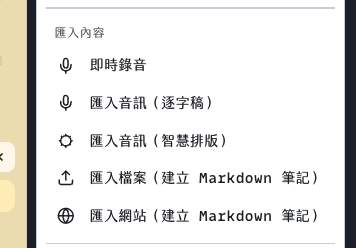
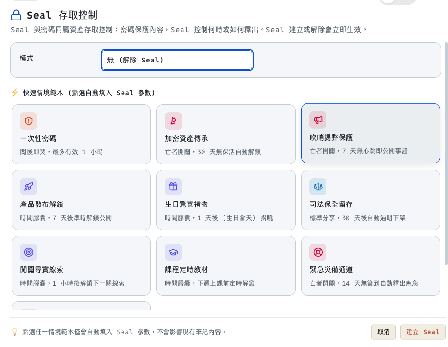

# 888wiki Usage Guide

[Project homepage](../README.md) · [Traditional Chinese](USAGE.zh-TW.md) · [Installation](INSTALLATION.md) · [Feature guide](FEATURES.md)

888wiki is Markdown-first. This guide starts with Markdown, then covers capture, the other three workspaces, publishing, and Seal release controls.

## 1. Create a note in the right format

Open **+ New** and choose **Markdown**, **Block**, **Canvas**, or **Whiteboard**. Each new note keeps its selected format. Choose Markdown for flowing text, Block for rearrangeable content sections, Canvas for connected cards, or Whiteboard for freeform drawings.

## 2. Write in Markdown

Create a [Markdown note](https://wiki.david888.com/new/markdown). The editor has a source pane and a rendered preview. Use the footer controls to change the layout and preview device. The toolbar and import menu help you insert common Markdown structures, files, images, audio, and links.

Markdown supports GFM, math, Mermaid and Graphviz diagrams, ECharts, citations and footnotes, GitHub-style alerts, and the project's extended formatting syntax. Use `Cmd/Ctrl+F` to search and `Cmd/Ctrl+H` to search and replace. Paste or drop an image to choose direct R2 upload, local OCR, or table recognition.

Choose from 20 colorful light and dark preview themes, then adjust font, width, and split layout from the editor footer. A Markdown note can also open as a book or slide presentation.

For audio, choose transcript import or smart formatting. The transcript can include timestamps. You can also record from the toolbar; review participant consent before recording.

### Capture audio, files, and web pages

Open **+ New → Import content** to use the capture options shown in the menu:

| Menu item | Result |
| --- | --- |
| **Live voice recording** | Saves WebM audio in browser IndexedDB and inserts a local player. When online, it sends the audio to the Worker transcription endpoint (Groq first, Workers AI fallback); publishing or syncing uploads the attachment to 888box. Recordings are limited to 25 MB; confirm participant consent first. |
| **Import audio (Transcript)** | Sends an audio file for transcription and adds the timestamped transcript to the note. Groq is tried first; Workers AI is the fallback when configured. |
| **Import audio (Smart format)** | Transcribes the audio, then uses the configured AI provider to organize the transcript into readable Markdown. |
| **Import file (creates a Markdown note)** | Imports Markdown, text, Office/OpenDocument files, CSV, RTF, EPUB, and supported PDFs. Supported document conversion runs in the browser. |
| **Import website (creates a Markdown note)** | Enter a publicly accessible URL to extract its title and article content as Markdown. |

When importing into a note that already has content, choose **Insert at Cursor** or **Replace All**. In Block mode the menu changes to **Import content (Blocks)**, and the imported text becomes editable blocks. Dragging a file onto the editor also offers an attachment upload option; images can be uploaded to R2.

## 3. Build a Block document

Create a [Block note](https://wiki.david888.com/new/block). Click the inline **+** to add a block, type `/` to search block types, and drag a block handle to reorder content. Use the floating formatting toolbar to style selected text.

Insert text, headings, lists, tables, images, files, links, YouTube, PDF, audio, Mermaid, ECharts, and supported embeds. Supported embedded blocks can be edited in place. Use the footer export actions for PNG, HTML, or PDF/print. Markdown export is available from Markdown notes.

## 4. Map ideas in Canvas

Create a [Canvas note](https://wiki.david888.com/new/canvas). A new Canvas starts empty.

1. Select **Add** in the bottom toolbar.
2. Choose a thought card: Problem, Benefit, Solution, Cause, Criterion, Detriment, Question, or Note.
3. Drag cards to arrange them. Double-click a card to edit its text; drag a resize handle to change its size.
4. Connect cards from their edge handles. Select a connection to change its direction, line style, weight, or color.
5. Use Undo/Redo while arranging. Use Fit to bring the graph into view, and search to find card text.
6. Open the file menu to import or export `.canvas`, export PNG/SVG, create a graph from Markdown WikiLinks, or clear the Canvas. Clear can be undone.

The Add menu also accepts image and file assets. Images use R2; audio, video, and document attachments use the configured 888box upload service. Published Canvas notes open as read-only interactive graphs.

## 5. Sketch on a Whiteboard

Create a [Whiteboard note](https://wiki.david888.com/new/whiteboard). Use the Excalidraw canvas tools to draw, add shapes and text, and arrange a visual explanation. Whiteboard is suited to freeform sketches; use Canvas when cards and labeled relationships are central.

Published Whiteboards are read-only. Export a drawing as PNG or SVG from the Whiteboard export controls.

## 6. Publish and share

Use the footer's **Share** controls to publish a note and create its share link. The publication dialog controls publishing, autosave, and public indexing. You can also configure reader/edit passwords and paragraph annotations. Copy the share URL to send the published page.

Readers can open supported notes as a book or slide presentation. The detailed feature guide covers book structure, presentation separators, exports, and other reader tools.

## 7. Control release with Seal

Seal is configured independently from reader and edit passwords. In the editor, open the footer's **Seal** button, choose a mode, enter its parameters, then select **Create Seal**. The Seal indicator shows when a release rule is active. **Remove Seal** clears the rule. Changes take effect immediately.

| Seal mode | What happens | Configure |
| --- | --- | --- |
| **Time Lock** | Visitors see a countdown page until the release time, then the note becomes available. | Pick the date and time, or use a `+1h`, `+1d`, `+3d`, `+7d`, or `+30d` shortcut. |
| **Burn After Read** | The public share link is destroyed after it reaches its view limit; the author's original note remains in the wiki. | Set the maximum number of views. A reveal step helps prevent link preview crawlers from consuming a view. |
| **Dead Man's Switch** | The note stays sealed while you check in on schedule; it is released if the interval passes without a pulse. | Set the interval in minutes. Send a pulse in the Seal dialog or use its private pulse URL. Saving an edit also refreshes the pulse. |
| **Expiration** | The share expires and is removed when its retention period ends. | Choose `10m`, `1h`, `1d`, `7d`, or `30d`. |

The Seal dialog includes ten presets. Each one fills in the release rule; it does not edit the note body.

| Preset | Rule filled in |
| --- | --- |
| **One-Time Password** | Single-view credential share; 1-hour expiration. This preset does not generate or verify OTP codes. |
| **Crypto Inheritance** | Dead Man's Switch; 30-day pulse interval. |
| **Whistleblower** | Dead Man's Switch; 7-day pulse interval. |
| **Product Launch** | Time Lock; unlock in 7 days. |
| **Birthday Gift** | Time Lock; unlock in 1 day. |
| **Legal Hold** | Share expires in 30 days. |
| **Scavenger Hunt** | Time Lock; unlock in 1 hour. |
| **Course Content** | Time Lock; unlock in 7 days. |
| **Emergency Backup** | Dead Man's Switch; 14-day pulse interval. |
| **Shared Secret** | Single-view credential share; 1-day expiration. |

Review the selected mode, date, view limit, and pulse interval before creating the Seal.

## 8. Keep writing offline

The offline workstation saves drafts to browser storage first and syncs pending changes when the network returns. Use its draft list and conflict choices to compare local and cloud versions before resolving a conflict. Export a backup regularly when working offline for long periods.
