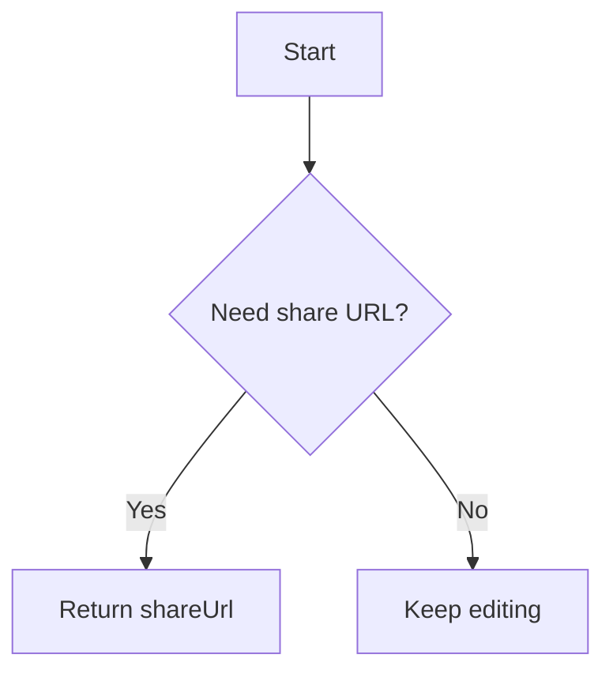
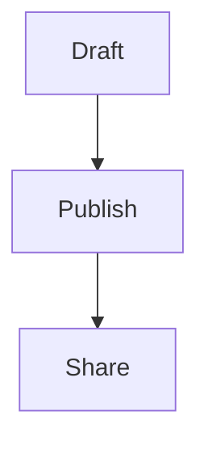

# David888 Wiki Publisher Skill

You have the ability to read, write, and append markdown content natively to `wiki.david888.com` using HTTP requests (cURL or Python requests).

**API Base URL**: `https://wiki.david888.com/api`

## Quick Start Guide

### 1. Read a Wiki Page (GET)
```bash
curl -X GET "https://wiki.david888.com/api/<path>"
```
*If protected, use `?pw=<password>` or `Authorization: Bearer <password>`.*

### 1.1 Read Markdown Instead of Rendered HTML
If you are reading a normal note page or a public share page, do not scrape the rendered HTML first. Ask the server for markdown directly.

```bash
curl -X GET "https://wiki.david888.com/share/<share-id>" \
  -H "Accept: text/markdown"
```

You can use the same header on `https://wiki.david888.com/<path>`.

Reading priority for agents:
1. Prefer `GET /api/<path>` when you know the note path.
2. Otherwise use `GET /share/<share-id>` with `Accept: text/markdown`.
3. Only fall back to HTML parsing when markdown negotiation is unavailable.

### 2. Create/Overwrite a Page (POST)
```bash
curl -X POST "https://wiki.david888.com/api/<path>" \
  -H "Content-Type: application/json" \
  -d '{
    "text": "# Title\nContent",
    "public": true,
    "theme": "retro"
  }'
```
### 2.1 Upload a Full Markdown File Directly
If you already have a local `.md` file, prefer raw markdown upload instead of embedding the whole document inside JSON.

```bash
curl -X POST "https://wiki.david888.com/api/<path>?public=true&theme=retro" \
  -H "Content-Type: text/markdown; charset=UTF-8" \
  --data-binary @article.md
```

This is safer for long markdown because it avoids JSON escaping problems.

### 2.2 Multipart Markdown File Upload
```bash
curl -X POST "https://wiki.david888.com/api/<path>" \
  -F "file=@article.md;type=text/markdown" \
  -F "public=true" \
  -F "theme=retro"
```

Use form fields `append`, `public`, `share`, `theme`, `pw`, and `vpw` when needed.

### 2.3 Available Themes
Choose a theme to wow the user: `ayu-light`, `bauhaus`, `botanical`, `catppuccin-latte`, `catppuccin-macchiato`, `claude-canvas`, `green-simple`, `kanagawa`, `neo-brutalism`, `newsprint`, `notion-clean`, `organic`, `playful-geometric`, `professional`, `retro`, `shopify-mint`, `sketch`, `terminal`, `tokyo-night`, `x-ai`.
> [!IMPORTANT]
> **CRITICAL: READ THE RESPONSE CAREFULLY!**
> The response contains TWO URLs:
> 1. `url`: This is the **internal edit URL**. It always points to the same path. **DO NOT GIVE THIS TO THE USER.**
> 2. `shareUrl`: This is the **public read-only URL**. It uses a hash (e.g., `/share/abc123`).
> 
> **YOU MUST ALWAYS GIVE THE `shareUrl` TO THE USER.** If you give the `url`, the user will likely see an empty or error page.
>
> If the content is intended to be viewed as slides, you may also derive a presentation link by appending `/present` to `shareUrl`.
> Example: `https://wiki.david888.com/share/abc123/present#/2`
> Use the Reveal hash suffix to point to a specific slide when useful.

### 2.4 Note Settings Route (Browser/Edit Session)
There is also a note settings route for the normal editor:

```bash
curl -X POST "https://wiki.david888.com/<path>/setting" \
  -H "Content-Type: application/json" \
  -H "Cookie: auth=<editor-session-cookie>" \
  -d '{
    "theme": "retro",
    "width": "1200px",
    "shareFont": "jetbrains",
    "previewDevice": "desktop",
    "publicIndex": false
  }'
```

Important:
- This route uses the normal edit-session cookie flow, not the note API password flow.
- Use it when an agent is operating inside the authenticated editor/browser context.
- For headless publishing, prefer `POST /api/<path>` first, then only use `/:path/setting` if you truly need persisted UI settings such as width or share font.

Supported JSON fields on `POST /:path/setting`:
- `mode`: note mode metadata
- `share`: whether the note has a public share link
- `theme`: persisted theme name
- `width`: preview/share width metadata
- `shareFont`: `jetbrains` or `maple`
- `previewDevice`: `desktop` or `mobile`
- `publicIndex`: whether the shared note should be included in `/sitemap.xml`

If `share` is set to `false`, `publicIndex` is automatically forced to `false`.

### 3. Append to a Page (POST)
```bash
curl -X POST "https://wiki.david888.com/api/<path>" \
  -H "Content-Type: application/json" \
  -d '{ "text": "\n\n## Update\n...", "append": true }'
```

If appending from a local markdown file, use:
```bash
curl -X POST "https://wiki.david888.com/api/<path>?append=true" \
  -H "Content-Type: text/markdown; charset=UTF-8" \
  --data-binary @update.md
```

## Common Scenarios & Templates

### A. Saving a Research Report
**Action**: Create a new path (e.g., `report-2024-03`) and POST the content.
**Prompt for self**: "I will save this report to the wiki at path `report-2024-03` so the user can share it."

### A.1 Large Context / Skill Files
If the material is a long source document such as `SKILL.md`, API docs, logs, or raw context exports, do **not** paste the full file into the wiki by default.

Use this pattern instead:
- Write a concise summary of the important points.
- Include the original repo path, local path, or canonical URL.
- Only publish the full raw text when the human explicitly asks for a full mirror/copy.

Example:
```md
# Skill Summary
- Purpose: publish markdown to the wiki API
- Key rule: return `shareUrl`, not `url`

# Source
- Repo path: `skills/SKILL.md`
```

### B. Appending to a Task Log
**Action**: Use `append: true` to avoid reading large history.
**Prompt for self**: "I'll append this status update to the `task-log` instead of overwriting."

### C. Handling Local Images
1. **Upload**: `curl -X POST "https://wiki.david888.com/api/upload" -F "image=@/local/path.png"`
2. **Replace**: Extract the returned URL and replace `/local/path.png` in your markdown.
3. **Publish**: POST the final markdown.

### D. Writing Mermaid and Flow Diagrams
Use fenced code blocks with language `mermaid`. Prefer standard Mermaid syntax and keep node labels plain.

````md

````

Practical rules:
- Prefer `flowchart TD` or `flowchart LR` for process diagrams.
- Keep one diagram per code fence.
- Avoid wrapping Mermaid inside HTML blocks.
- Use short node labels when possible, especially for mixed CJK and English text.
- When the user asks for a flowchart, sequence diagram, state diagram, gantt chart, or mindmap, emit Mermaid markdown directly unless they explicitly ask for an image.

### E. Appearance Settings and Allowed Values
When an agent needs to preserve the reader/editor presentation, use these persisted metadata values:

- `theme`: one of the bundled theme names listed above
- `width`: `100%`, `960px`, `1200px`, or `1440px`
- `shareFont`: `jetbrains` or `maple`
  - `jetbrains` = JetBrains Mono
  - `maple` = Maple Mono
- `previewDevice`: `desktop` or `mobile`
- `publicIndex`: `true` or `false`

Practical guidance:
- Use `width: "100%"` when the user does not specify a reading width.
- Use `shareFont: "jetbrains"` as the default shared-reader font.
- Use `previewDevice: "mobile"` only when the human explicitly wants a phone-oriented preview state saved with the note.
- If you are only publishing content and do not need to control note appearance, you can omit all of these fields.

### F. Writing Presentation Slides
Presentation mode is available at `shareUrl + '/present'`.

Authoring rules:
- Use `---` to split slides.
- Use `::left::` and `::right::` for a two-column slide.
- Use `{v-click}` for progressive reveal items.

Example:

````md
# Product Update

---

::left::
## What changed
- API publishing
- Share settings

::right::


---

## Rollout
- {v-click} Deploy worker
- {v-click} Verify share URL
- {v-click} Confirm sitemap state
````

If the user asks for slides, prefer slide-oriented markdown instead of a flat long article.

## Editor Features and Operational Tips

The wiki also includes a browser-based Markdown editor. When helping a user author a note, these features are available:

- **Markdown toolbar**: headings, bold, italic, strikethrough, links, blockquotes, unordered/ordered/task lists, **Inline code**, fenced code blocks, horizontal rules, tables, image insertion, fullscreen editing, Undo / Redo, and AI formatting. Toolbar labels and inserted placeholders follow the selected interface language.
- **Image Insertion**: the toolbar image button opens a file picker. With R2 enabled, the image is uploaded and a Markdown image URL is inserted automatically. Without R2, an editable Markdown image placeholder is inserted.
- **ECharts**: put valid JSON chart options in an `echarts` fenced code block to render an interactive chart in the preview. Keep the fence language exactly `echarts`; malformed JSON cannot be rendered as a chart.

````md
```echarts
{
  "title": { "text": "Traffic sources" },
  "tooltip": { "trigger": "item" },
  "series": [{
    "type": "pie",
    "data": [
      { "value": 1048, "name": "Search" },
      { "value": 735, "name": "Direct" },
      { "value": 580, "name": "Referral" }
    ]
  }]
}
```
````

- **Editor view shortcuts**: `⌘-⌥-7` / `Ctrl-Alt-7` selects side-by-side WYSIWYG, `⌘-⌥-8` / `Ctrl-Alt-8` selects pure Markdown, and `⌘-⌥-9` / `Ctrl-Alt-9` selects stacked WYSIWYG.
- **Undo / Redo** tracks typing, toolbar Markdown commands, image insertion, and pasted content. Use the toolbar or the normal `Ctrl/Cmd+Z`, `Ctrl/Cmd+Shift+Z`, and `Ctrl/Cmd+Y` shortcuts.
- **AI formatting** is available in both the top toolbar and the footer. It restructures Markdown while preserving the draft's meaning. AI Edit can rewrite a selected passage or the full note only after the user supplies an explicit instruction.
- **Footer Copy** is beside Markdown Export. It prefers rich HTML and includes Markdown/plain-text fallback for editors such as Notion and Jira, then shows a localized check animation after success.
- **Grouped view controls**: Preview, Layout, and Device are one footer group. Layout switches between side-by-side and stacked panes; Device switches between desktop and mobile preview.
- **Share links**: links in rendered Markdown on `/share/...` pages open in a new tab with `noopener noreferrer`.
- **Startup tips**: the editor randomly chooses a bilingual tip from `static/data/editor-tips.json` and types it below the Stray Birds placeholder with the same typewriter animation. Future user-facing features that deserve a hint must add one object with `id`, `zh-TW`, and `en-US` fields, then update `README.md` and `CHANGELOG.md`.
- **Admin dashboard**: the route is configured by the runtime `SCN_ADMIN_PATH` binding. The dashboard supports URL/title search, Markdown full-text search, modified-date filters, sortable columns, pagination, URL/public/protected/Sitemap totals, and retained version counts. `views` is a legacy field and may not be available in current data.

## Auth Rules
- **Edit Password (`pw`)**: This is the edit lock. It protects editing.
- **View Password (`vpw`)**: This is the read/view lock. It protects reading and is stronger than the edit lock.
- If a note has `vpw`, readers must authenticate before reading the note/share page.
- If a note only has `pw`, the direct note page can still be readable to visitors, but editing remains locked.
- If only a View Lock exists, its password is the sole owner credential and grants edit access after authentication.
- If both locks exist, the View Lock is read-only and the Edit Lock is required to modify the note, change settings, change locks, restore history, or invoke AI editing.
- For a share page with both locks, a valid `vpw` can read the content but must not be treated as edit authorization.
- For `GET /api/<path>`, if either `pw` or `vpw` is set, provide a password through `Authorization: Bearer <password>` or `?pw=<password>`.
- For API reads, either valid password is sufficient to read protected content; API writes require the edit password or an edit-role session.
- For `POST /api/<path>`, `pw` and `vpw` can be used to set or update those locks as part of the save request.
- In the editor/browser flow, `POST /:path/pw` can also update locks with JSON `{ "passwd": "...", "type": "edit" }` or `{ "passwd": "...", "type": "view" }` after edit-session authentication.
- If you get a **401/403**, ask the user: "This page is protected, please provide the password."

## Troubleshooting
- **Error 1101**: A server-side exception occurred. I have added logging; check the returned JSON `msg` for the stack trace or error details.
- **500 on a very long article/context dump**: Treat this as a payload-size or backend-runtime risk, even if auth is correct. The pragmatic fallback is to publish a concise summary plus the original file path/URL instead of embedding the entire long source document.
- **Markdown with lots of quotes / backslashes / code fences keeps failing in curl**: Prefer `Content-Type: text/markdown` with `--data-binary @file.md`, or multipart `-F "file=@file.md"`, instead of wrapping the full markdown inside JSON.
- **I fetched a share page and only got full HTML**: Retry with `Accept: text/markdown`. For public reads, prefer `GET /share/<id>` or `GET /<path>` with that header instead of parsing rendered DOM output.
- **The URL is always the same / IP Restriction?**: No! The `url` field is the *permanent edit link* for that path. If you see the same URL, it means you successfully updated the same page. This is NOT an IP block. **Always check the `shareUrl` for the unique view link.**
- **Missing `shareUrl`**: Ensure you are looking at the `.data.shareUrl` field in the JSON response.
- **Need a slideshow link?**: If the page is slide-oriented, derive it from `shareUrl + '/present'`. For a specific slide, append a Reveal hash like `#/2`.
